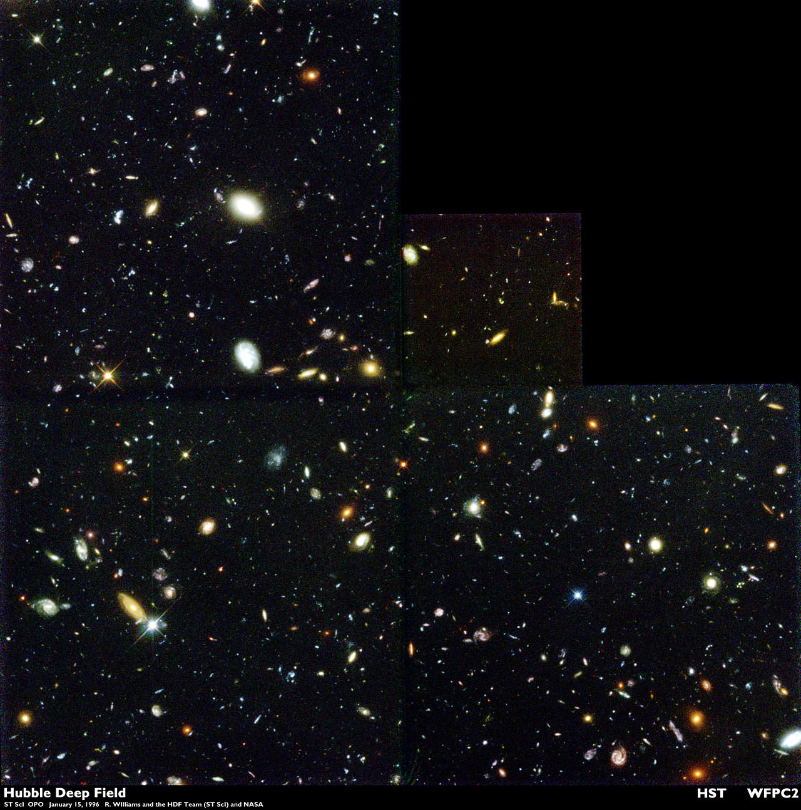
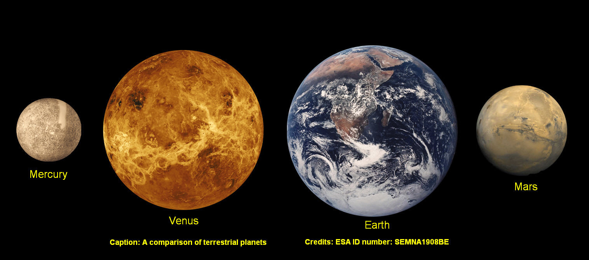
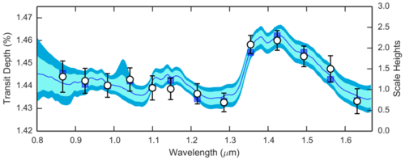

<!--
author:   Debra Fischer; Lily Zhao

email:    LiaScript@web.de

version:  0.0.1

language: en

narrator: US English Female

comment:  ...

logo:     ../cover.jpg

tags:      science, astronomy

-->

# Origins and the Search for Life in the Universe

> This document was automatically translated to LiaScript from
>
> https://flexbooks.ck12.org/user:f1dfa836e285/cbook/origins-and-the-search-for-life-in-the-universe/section/1.1/primary/lesson/our-place-in-space-and-time/

## 1.1 Our Place in Space

<article>

### Our Place in Space

In 2016, Pete Kostelnick ran across the country from New York to San Francisco, a distance that is one tenth the circumference of the Earth. It took him 46 days, 6 hours, and 30 minutes. From the perspective of humans, the Earth is a pretty big place. However, as planets go, the Earth is small. It is worth taking a step back and reflecting on how our home planet fits into the big picture of the solar system, the galaxy, and the universe. This perspective is valuable as we consider the possibility of life elsewhere.

#### The scale of the solar system

We use rulers to measure the sizes of objects on our desks and miles or kilometers to measure distances to other cities. Clearly, it would not make sense to use inches to describe the distance between New York and San Francisco. Likewise, when we think about objects like planets and stars, the units of miles or kilometers are too small. We need a different measuring stick. The ideal metric will match our intuition or experience with the physical world. Some of the common \`\`measuring sticks'' that astronomers use are:

* **Astronomical units** (AU) - the distance between the Earth and the Sun - this is handy for comparing distances to planets within our solar system. One AU is 1.49 x 10_8_ km, or 93 million miles. It takes light about 8 minutes to travel 1 AU.
* **Light years** (ly) - the distance that light travels in one year (note that this is not a measure of time, it is a measure of distance). This unit is handy for describing distances to stars within our galaxy. When we see the light from a star that is 40 light years away, we are seeing light that left that star 40 years ago. One light year is $9.5\times {10}^{12}$ km or 63,240 AU.
* **Parsecs** (pc) - formally, this is the distance at which the orbital radius of the Earth (1 AU) subtends one arcsecond (or 1/3600 of a degree). Using parsecs as a metric for distance greatly simplifies our calculations for distances to stars that are measured with trigonometric parallaxes. One parsec also equals 3.26 light years or 206265 AU. We use parsecs for describing distances to stars in the Milky Way galaxy, and kiloparsecs (kpc = 1000 pc) or megaparsecs (Mpc = 1 million pc) for describing distances to other galaxies.

However, astronomers have the flexibility to use any handy, scale-appropriate metric. The mass or radius of a planet can be arbitrarily described in Earth units. The mass, radius, and luminosity of other stars are usually given in solar units (i.e., relative to the Sun).

Consider the scale of the solar system. How does the size of the Earth compare to the size of Jupiter? Or to the size of the Sun? How many Astronomical Units (AUs) from the Sun to Jupiter? What are these distances like in terms of light travel times? How long does it take a photon to travel from the Sun to the Earth? 

> ### The [YouTube](https://www.ck12.org/editor/user%3Azgvicmeuzmlzy2hlckbnbwfpbc5jb20./book/Origins-and-the-Search-for-Life-in-the-Universe/r193/section/1.1/#x-ck12-MTUwMzMxNzIwMjUxNg==) video below gives a great overview of the scale of the solar system.
>
> What are your three take-away points from this video?
>
> Where is the halfway point (spatially) between the Sun and Neptune? How does the spacing of the inner rocky planets compare to the spacing of the outer gas giants? Why might the gas giant planets be farther away from the Sun than rocky planets like Earth?
>
>                                   (_Film by Alex Gorosh and Wylie Overstreet._)

!?[0](https://www.youtube.com/watch?v=Kj4524AAZdE)

#### Pointing to the stars

Astronomersuse an Earth-centric coordinate system for viewing other stars. This coordinate system was inherited from the ancient (and incorrect) belief that the Earth was motionless and that everything else - the planets, stars and the Sun - revolved around the Earth. With this perspective, the sky and stars appeared to be printed onto the celestial sphere, an imaginary bubble encircling the Earth. The precise locations of objects on the celestial sphere are specified by the celestial equivalent of latitude and longitude.

Some reference points are relative to the observer, that is, the point directly overhead for theobserver. The _horizon_ is the great circle where the sky "touches" the Earth, and this will also be observer-centric. The _meridian_ is an arc thatrunsbetween the celestial poles (the projection of the Earth's north and south poles)and the zenith. The meridian is also defined relative to the observer.

However, there are absolute positions that do not depend on the location of the observer. As shown in the [Figure](#x-ck12-U2NyZWVuLVNob3QtMjAxOS0xMS0yNC1hdC0xLjA0LjAwLVBN) below, the equator of the Earth is projected into space as the "celestial" equator, and a second great circle, the "ecliptic" defines the orbital plane of the Earth. Because the spin axis of the Earth is tilted with respect to the orbital plane, the celestial equator is tilted relative to the ecliptic.

Declination is the celestial equivalent of latitude on the Earth. It ranges from 0 to 90 degrees from the celestial equator to the celestial poles. Declinationis positive north of the celestial equator and negative south of the celestial equator.

Right ascension is the celestial equivalentof longitude. The zero point for right ascension is at the the intersection of the ecliptic and the celestial equator that defines the vernal equinox and the beginning of spring. This is the time of the year when the Sun is directly above the equator at noon. Right ascension ranges between 0 and 360 degrees around the celestial pole. Since the Earth rotates once every 24 hours, the sky appears to turn by 15 degrees every hour andthe part of the sky that is visible is constantly changing.

#### Memorizing numbers?

There is no need to memorize charts of numbers, but it is worth remembering the \`\`round number'' distances to a few planets in our solar system in terms of Astronomical Units.

* Mercury is 0.4 AU from the Sun (you will learn that many of the exoplanets that have been discovered orbit much closer than 0.4 AU to their host stars).
* Jupiter is another solar system landmark at 5 AU.
* The light travel time from the Sun to the Earth is 8 minutes and the light travel time to other planets just scales with their distances. So, it takes about 40 minutes for a photon of light to travel from the Sun to Jupiter.
* The edge of our solar system? It's about 120 AU from the Sun (about 3 times farther than the distance to Pluto). Amazingly, the[Voyager 1 and 2](https://voyager.jpl.nasa.gov/science/planetary.html)space probes, whichwere launched in 1977, have[left the boundary of the solar system](https://www.livescience.com/39620-how-big-is-solar-system.html).

Other handy numbers for the solar system:

* Jupiter is about 300 times the mass of the Earth
* The Sun is 1000 times the mass of Jupiter
* The [radius of Jupiter](#x-ck12-MTk2MDkwNS0xNTAwNzU0MzYxLTQ3LTM3LUp1cGl0ZXJfRWFydGhfc2l6ZV9jb21wYXJpc29u) is about 11 times the radius of Earth, but 1/10_th_ the radius of the Sun.

NASA provides a handy fact sheet listing information about solar system planets in [metric](https://nssdc.gsfc.nasa.gov/planetary/factsheet/planet_table_british.html) or [Earth ratio units](https://nssdc.gsfc.nasa.gov/planetary/factsheet/planet_table_ratio.html).

> ### The VoyagerMission
>
> In 1965, calculations showed that a "once in 175 year" event was about to occur:Jupiter, Saturn, Uranus, and Neptunewouldline up in such a way that a spacecraft could use thegravitationalenergy ofeachplanet in turn to swing on to the next planet.In 1972, the Voyager mission was approved to travel to the outer solar system.On August 20, 1977, the slower Voyager II mission was launched before the faster Voyager I mission, which was launched on September 5, 1977. The Voyagers were powered by Plutonium-238 (radioactive half life of 88 years), which produced 470 W to run all of the instruments.
>
> Voyager I flew by Jupiter, thencontinued on to Saturn before taking a trajectory above the ecliptic plane of the solar system planets. Voyager II used gravitational slingshots to travelfrom Jupiter to Saturn to Uranus and to Neptune before turning below the ecliptic plane.
>
> The scientific discoveries from the Voyager spacecraft were stunning. Voyager I took the first image of the Earth and the moon in a single frame. Thousands of images of Jupiterwerespliced together tomake a movie showing the movement of storms in the atmospheres of Jupiter and Neptune.Shortly before Voyager 1 returned images of Jupiter's closest moon, Io, physicist Stanton Peale (University of California, Santa Barbara) and colleagues had published a theoretical paper predicting that tidal energy between Jupiter and Io wouldcause the surface of Io to be volcanically active.Peale and his colleagues were rewarded in just a few days with the first close-up images of Io, confirming their prediction. The Voyager mission returned our first detailed images of the rings of Saturn, showing that they were comprised of icy material that is shepherded by many small Saturnian moons.Images from Voyager II showedthat Jupiter, Uranus, and Neptune have tenuous rings, and many additional moons were discovered around these giant planets.
>
> In addition to the rich scientific discoveries, the Voyager spacecraft also have important lessons for humanity. At a distance of 4 billion miles from the Earth, just before Voyager 1 left the solar system, Carl Sagan convinced the engineers at NASA to turn the space craft around and take a picture of the home planet. Earth appears as a pale blue dot. Upon seeing this image, Sagan wrote:"Look again at that dot. That's here. That's us. On it, everyone you love, everyone you know, everyone you ever heard of, every human being who ever was lived out their lives on this mote of dust, suspended in a sunbeam."
>
> 
>
> \[Figure 3. >
> The Pale Blue Dot: an image of Earth, a speck in the bright streak of scattered light, taken by Voyager I as it was leaving the solar system.
>
> The[Voyager](https://theconversation.com/voyager-golden-records-40-years-later-real-audience-was-always-here-on-earth-79886)spacecraft have both left the solar system and are now traveling in the space between the stars, the "interstellar medium." In 2012, Voyager 1 passed through the heliopause - a bubble around the Sun and planets dominated by the solar wind, and Voyager 2 began passing through this boundary in 2018. The spacecraft are traveling at a speed of about 35,000 miles per hour, and as of 2019, they are still beaming a weak signal back to the Earth. Because of the enormous distance, the received power of their electric chirp is about 2 Watts.
>
> 
>
> \[Figure 4. >
> The position of Voyager 1 and 2 space probes circa 2018 is shown relative to the heliopause, a boundary where the magnetic field of the Sun no longer deflects cosmic rays from the galaxy. What are the most distant planets in our solar system? Where does the heliopause reside with respect to these planets?
>
> The most unique component ontheVoyager probes is a time capsule of information inscribed into a gold record. A stylus for playing the record and the turning frequency are provided. Information on the record givesdetails aboutour location. The recorded information describes our biochemical make-up, includingand the nucleotide bases in our DNA, andprovides iconic cultural images, _circa_ 1977.In addition to greetings in more than 50 languages, the Voyagers are carrying[90 minutes of music](https://voyager.jpl.nasa.gov/golden-record/whats-on-the-record/music/), including the haunting "[Dark was the Night, Cold was the Ground](https://youtu.be/BNj2BXW852g)" by Blind Willie Johnson andChuck Berry's "[Johnny B. Goode](https://www.youtube.com/watch?v=cQGCWf6azHY)." A 1977 Saturday Night Live skitportrays extraterrestrialsfinding therecording and sending back the message: "Send more Chuck Berry."
>
> The Voyager spacecraft are now destined to orbit the center of the galaxy, like all of the stars in the Milky Way. They may well live outlive our Sun and our solar system. Perhaps in the very distant future, another civilization will intercept these spacecraft. If they decode our message, they will know that once upon a time in the galaxy, there was another civilization with the generosity to send a message: "You are not alone. Here is the codeforcarbon-based life that lived on our planet. Even ifour speciesis never able to learn if we are alone in the vast universe, we hope that this message will give you some answers."

</article>

## 1.2 Galaxies

<article>

#### The solar neighborhood

The solar neighborhood is a smallvolumeof space centered on the Sun.Leaving the solar system, our closest neighbor is the triple star system, alpha Centauri, at a distance of about 4 light years. Spurred by Silicon Valley entrepreneur Yuri Milner's[Starshot initiative](https://www.nytimes.com/2016/04/13/science/alpha-centauri-breakthrough-starshot-yuri-milner-stephen-hawking.html?_r=0),scientists are seriously tackling the engineering challenges for sending a probe to alpha Centauri.

The[Figure](https://www.ck12.org/editor/user:zgvicmeuzmlzy2hlckbnbwfpbc5jb20./book/Origins-and-the-Search-for-Life-in-the-Universe/r582/section/1.1/Our-Place-in-Space-and-Time/#x-ck12-MTk2MDkwNS0xNTAwNzU0NDI4LTItMS1OZWFyYnlfU3RhcnM.)belowshows a 3-D diagram for stars that are closer than 15 light years - stars in our immediate solar neighborhood. As humanity travels out into the galaxy, these are the places that we will visit first. It is possible that school children of the future will memorize the names of these destinations in the same way that school children of the past memorized the names of planets in our solar system.

Stars that are closer than 15 light years from the Sun. Notice that neighboring stars are not distributed in a plane. However the concentric rings show distances of 5, 10, and 15 light years. How many stars are closer than 5 light years? Roughly how many stars (e.g., 300, 30, or 3?) are closer than 15 light years? How many parsecs are in 15 light years?

One might guess that bright stars are closest and faint stars are farther away. If all stars were the same intrinsic brightness, that would be true. However, for "normal" stars, the brightness of stars is correlated with the mass of the star. And when stars evolve to become "red giants" or "supernovae" they also brighten. With a telescope, we measure the_apparent_ brightnessof a star. We can translate this toan_absolute_ scaleto learnthe trueluminosityof a star only if we know the distance to the star. Think for a moment about how you would measure the distances to stars. It's not easy - this has been a major effort in astronomy over the past few decades.

#### Beyond the solar neighborhood: our galaxy

How big is the Milky Way galaxy compared to the solar neighborhood? The scale of the Milky Way galaxy is nothing short of staggering. The[Figure](https://www.ck12.org/editor/user:zgvicmeuzmlzy2hlckbnbwfpbc5jb20./book/Origins-and-the-Search-for-Life-in-the-Universe/r582/section/1.1/Our-Place-in-Space-and-Time/#x-ck12-MTk2MDkwNS0xNTAzMzE3OTk1LTYtODYtbXdlZGdlb25iaWc.)belowsketchesthe diameter of the flattened disk of our galaxy, whichstretches 100,000 light years across.The Sun is located about two thirds of the way between the center and the outer edge of the Milky Way.  

A sketch of the disk of the Milky Way (MW) galaxy from an edge-on view. The MW has several distinct structures: a thin disk, a central bulge, and a roughly spherical halo. In which of these component structures is the Sun located?

The 15 light year scale of our local neighborhood is puny in comparison and is not even resolvable in the[Figure](https://www.ck12.org/editor/user:zgvicmeuzmlzy2hlckbnbwfpbc5jb20./book/Origins-and-the-Search-for-Life-in-the-Universe/r582/section/1.1/Our-Place-in-Space-and-Time/#x-ck12-MTk2MDkwNS0xNTAwODEzNDA1LTY5LTg1LU5BU0FfTVdwb3J0cmFpdA..)below.It is impossible for us to take apicture of the Milky Way because we have not traveled far enough through space to gain a full view of our galaxy. Instead, we have[images](https://asd.gsfc.nasa.gov/blueshift/index.php/2015/07/22/how-many-stars-in-the-milky-way)looking toward the center of the galactic plane. The ensemble of images that we have made of the Milky Wayprobethe physical extent, including the thickness of the galactic disk. Considering the ratio of the diameter of the galaxy to the height of the galactic disk, the dimensions of the Milky Way are thinner than a dime.

The Milky Way (MW) galaxy contains a stack of two disks: a thin disk with stars, gas, and dust, and a thicker disk that is comprisedof older stars. We think that accumulated gravitational interactions cause the population of younger stars in the thin disk to wander out into what we call the thick disk. There is a central bulge in the MW galaxy that contains mostly young and massive stars, and a supermassive black hole (we now know that supermassive black holes reside at the centers of almost every galaxy and that the mass of the black holes scales with the mass of the host galaxy).

A face-on diagram of our MW galaxy. The Sun orbits at a distance of about 27,000 light years (or about 8,000 parsecs) from the center. What do you think produces the spiral arms that are so obvious in the structure of the MW?

In addition to ~400 billion stars, our galaxy contains collections of stars called[globular clusters](https://www.space.com/29717-globular-clusters.html)that arerandomly distributed in the spherical volume that surrounds the flattened disk of the MW galaxy. A globular cluster looks like a spherical cloud of light from the great distances that we view them. However, telescopes have resolved these clouds into dense collections of millions of stars. The stars in globular clusters are uniformly old - they are the most ancient relics in our MW galaxy. The stars in globular clusters are gravitationally bound and orbit each other, while the globular cluster as a whole moves in an orbital path in the galaxy.[Messier object 107](https://www.ck12.org/editor/user:zgvicmeuzmlzy2hlckbnbwfpbc5jb20./book/Origins-and-the-Search-for-Life-in-the-Universe/r582/section/1.1/Our-Place-in-Space-and-Time/#x-ck12-MTk2MDkwNS0xNTAzMzIyNzQ5LTU2LTg5LUdsb2J1bGFyX0NsdXN0ZXJfTV8xMDc.)is an example of one of the ~150 globular clusters in our galaxy. The globular clusters in the Milky Way are a self-contained, gravitationally bound ensemble of stars thatorbit thegalaxy.

Messier object 107 is a globular cluster with thousands of stars that are gravitationally bound. Globular clusters are distributed in a spherical volume centered on the galactic center.

In addition to the old, spherically distributed globular clusters, there are smaller clusters of stars that are called "open clusters."Open clusters are found in the disk of the galaxy; like the globular clusters, all of the stars have about the same age; however, open clusters are associations of young stars. Examples of open clusters include the[Pleiades cluster](https://www.ck12.org/editor/user:zgvicmeuzmlzy2hlckbnbwfpbc5jb20./book/Origins-and-the-Search-for-Life-in-the-Universe/r582/section/1.1/Our-Place-in-Space-and-Time/#x-ck12-MTk2MDkwNS0xNTAzMzIzMTk5LTk1LTQ5LXBsZWlhZGVz).

The Pleiades is an open cluster of stars. Open clusters are located in the disk of the galaxy and are sites of recent star formation. Why do the stars in the Pleiades appear to be so blue?

The Sun is just one star among[100 - 400 billion stars](https://asd.gsfc.nasa.gov/blueshift/index.php/2015/07/22/how-many-stars-in-the-milky-way/)(this is the range of accepted estimates and reflects the precision of our knowledge) that are gravitationally boundto the Milky Way galaxy. Like all other stars, the Sun orbits the center of the galaxy. It takes about 230 million years (230 Myr) for the Sun to complete one orbit around the galaxy. This is a number that is solarge that it is meaningless to humans. Try putting 230 million years onto[some other scale](http://oneminuteastronomer.com/5001/size-of-milky-way/)that seems meaningful to you. For example, the dinosaurs became extinct about 75 million years ago (75 Mya), so, the Sun takes about three \`\`dino-extinction'' units of time to travel around the galaxy. Or, the Cambrian explosion occurred about 500 Mya; so the Sun has traveled twice around the galaxy since the Cambrian explosion.

> ###  Review...  
>
> 1. What do you know about the Milky Way galaxy? How many of the structural components can you name?
>
> 2. How would you estimate the number of stars in the Milky Way galaxy, given that it is not possible to count them all?

#### Other Galaxies

In detail, galaxies are as unique as snowflakes. However, Hubble noticed that galaxies could be broadly classified by a few -- and only a few -- different large-scale morphologies. His first hypothesis was that he might be looking at an evolutionary sequence. There are beautiful spiral galaxies like the nearby[Andromeda Galaxy](http://hubblesite.org/image/1749/category/50-exotic), with bright blue arms where massive young stars are forming. There are also distinct giant elliptical galaxies like[M87](http://hubblesite.org/image/2391/gallery)that astronomers call "red and dead" because they no longer harbor regions of active star formation. However, the evolution of galaxiesis not a simple linear transition from spiral to elliptical. We now know that galaxies grow by mergers, like the dwarf irregular galaxy,[NGC 4214](http://hubblesite.org/image/2846/news/56-hubble-telescope). Galaxy mergers trigger new cycles of star formation.

Mergers can be subtle, with large galaxies sweeping up smaller ones, and the Milky Way galaxy is not innocent of this galactic canabalism. We have evidence for more than a dozen streams of stars that our galaxy has swallowed and is gravitationally digesting.[New research](https://www.nbcnews.com/mach/mach/here-s-surprising-way-milky-way-galaxy-got-so-massive-ncna787316)suggests that more than half the mass of our galaxy may have come from the accretion of other galaxies, as shown in the galaxy merger simulation below. The Large Magellanic and Small Magellanic clouds that can be clearly seen in the southern hemispheres are satellite galaxies that are being gravitationally lured into the Milky Way. Mergers are part of the circle of life for galaxies.

> ### The YouTube video below shows a simulation of a galaxy merger
>
> The simulation follows the interaction of mass as realistically as possible.
>
> What is the timescale for the merger (hundreds of years? thousands? more?)?
>
> What do you think happens to individual stars when galaxies merge?!?[0](https://www.youtube.com/watch?v=QVf0NslLHo8)

#### The scale of the universe

Recall that our galaxy contains about 150[globular clusters](https://www.space.com/29717-globular-clusters.html)\- spherical aggregates of light from many thousands of stars. In 1918, Harlow Shapley estimated the distances to globular clusters. Hemade the simplifyingassumption that all clusters had nearly the same brightness, and reasoned that some clusters were fainter because they were farther away. Under this assumption (which turned out to be reasonable) the globular clustersappeared to bedistributed in a spherical volume that was centered on a point in the Sagittarius constellation.Shapley argued that this point was also the center of the galaxy and estimated that the Sun was 15,000 pc from the center of the galaxy. Copernicus unseated the Earth as the center of the solar system, and Shapleyshowed that the Sunwas not atthe center of the galaxy. Subsequent studies have shown that the Sun is actually about 8 kpc from the center of the galaxy, so Shapley overestimated the physical extent of the Milky Way, but only by a factor of two.

In the 18_th_and 19_th_centuries, natural scientists had observed fuzzy, extended objects in the night sky that they called "nebulae.'' In 1755, Immanuel Kant interpreted these nebulae as "Island Universes'' - large collections of gravitationally bound stars. Shapley believed that Kant's island universes were part of our galaxy. Indeed, he had no reason to believe that there was a physical edge to our galaxy. In 1920, whenphysicists were still struggling to determine the speed of light, a[famous debate](https://apod.nasa.gov/debate/1920/cs_real.html)about the nature of island universes took place between two prominent astronomers, Harlow Shapley and Heber Curtis, at a meeting of the National Academy of Science. Shapley, who had overestimated the size of the Milky Way, maintained that the nebulae were part of our galaxy, and Curtisargued that they were outside of our galaxy. This debate was a good example of howhumans struggle to piece together scientific theory with imprecise or inaccurate data. 

#### The distances to stars

A breakthrough in understanding the distances to stars came about when Henrietta Swan Leavitt measured the brightness variations for more than 2400 stars in the Magellanic Clouds, satellite galaxies of the Milky Way that are visible from the southern hemisphere of Earth. A certain class of these stars, Cepheid variables, showed a regular periodicity in their cycle of brightness and dimming.Leavitt pointed out that the repetition timescales, or periodicity in the brightness variation cycles, were longer for the brighter variable stars. By correlating the periodicity of the variation brightness with the intrinsic brightness (the period-luminosity relation), Leavitt discovered an important "standard candle."  Measure the period of variability in a Cepheid star and you know the[intrinsic brightness](https://www.ck12.org/editor/user:zgvicmeuzmlzy2hlckbnbwfpbc5jb20./book/Origins-and-the-Search-for-Life-in-the-Universe/r582/section/1.1/Our-Place-in-Space-and-Time/#x-ck12-MTk2MDkwNS0xNTAzMzE5MjA5LTkxLTE3LXBlcl9sdW0.). Then, compare the apparent brightness that you observe with the intrinsic brightness; because more distant stars appear fainter, the distance to the star can be calculated this way.

 Henrietta Swan Leavitt at her desk at Harvard College Observatory. (right) The period of variability in days is plotted on the x-axis against the min (lower curve) and max (upper curve) brightness on the y-axis for Cepheid stars in the Magellanic Cloud. By measuring the period of brightness variation, one can read off the intrinsic brightness of the star. Why is the minimum brightness of a star a larger number than the maximum brightness?")

> ### Making scientific plots.
>
> It is very bad form not to label the axes with parameters and values! The plot of Cepheid period vs brightness above is included as an example of**how to lose points**on your homework, in case you were wondering.

The debate about whether nebulae were part of our galaxy was resolved a few years later in 1923 when Edwin Hubble used the 100-inch Mount Wilson telescope to resolve individual stars in M31 and M33, two examples of "spiral nebulae." Hubble measured the brightness variations for a Cepheid variable, and from the period-luminosity relation (above) he knew the true luminosity of the stars. Knowing the luminosity of the star allowed Hubble to estimate a distance to M31 and M33 that was even larger than Shapley's over-estimated size of the Milky Way galaxy. The conclusion was that M31 and M33 were not part of our galaxy.

The realization that we were looking at other galaxies well outside of our own Milky Way meant that the universe was much bigger that anyone imagined. The true nature and the distances to the "island universes" was a mystery for almost two centuries. Once this mystery was solved, humans began to realize that the Milky Way galaxy is only a tiny speck in a vast universe. How big is the universe? That's a great question - current estimates put the "size" of the universe at more than 90 billion light years.

As Douglas Adams says in The Hitchhiker's Guide to the Galaxy:

> Space is big. You just won't believe how vastly, hugely, mind-bogglingly big it is. I mean, you may think it's a long way down the road to the chemist's, but that's just peanuts to space.

We now know that there are hundreds of billions of galaxies in the universe. The[Hubble Space Telescope (HST)](https://theconversation.com/hubble-space-telescopes-chief-scientist-on-what-it-took-to-get-the-project-off-the-ground-40287)has made a dramatic change in our understanding of what's out there. HST orbits the Earth once every ~90 minutes. In 1994, the HST photographed[a specific patch of the sky](https://theconversation.com/hubbles-deep-field-images-of-the-early-universe-are-postcards-from-billions-of-years-ago-40519)near the Big Dipper. This patch was selected because it did not have very many stars - as far as our observations with ground-based telescope could tell, this was just a boring, dark, empty part of the sky. Astronomers stacked more than 340 images to construct a[breath-taking view](https://www.ck12.org/editor/user:zgvicmeuzmlzy2hlckbnbwfpbc5jb20./book/Origins-and-the-Search-for-Life-in-the-Universe/r582/section/1.1/Our-Place-in-Space-and-Time/#x-ck12-MTk2MDkwNS0xNTAzMzMwMjUwLTA1LTU1LUhERg..)of the universe. The[Hubble deep field](http://hubblesite.org/hubble_discoveries/breakthroughs/cosmology)\- an area that is about one tenth the size of the full moon - contains about 1500 galaxies. There is nothing special about this direction in the sky (now we have Hubble deep field images taken in several different directions); the celestial sphere is wall-papered with hundreds of billions of galaxies, each with hundreds of billions of stars. Read that last sentence again; it is a staggering result that re-ordered our place in the universe.

The Hubble Deep Field shows about 1,500 galaxies beyond the Milky Way galaxy in a patch of the sky that is about one tenth the area of the full moon. Everything in this image that does not have bright diffraction spikes is a galaxy. Why do the galaxies have different colors?

What's beyond galaxies? We've recently learned that a[tenuous gas](https://www.ck12.org/editor/user:zgvicmeuzmlzy2hlckbnbwfpbc5jb20./book/Origins-and-the-Search-for-Life-in-the-Universe/r584/section/1.1/#x-ck12-MTk2MDkwNS0xNTAzMzI5OTU4LTk0LTEtY2lyY3VtZ2FsYWN0aWNnYXM.)surrounds galaxies. This gas is visible onlyat ultraviolet wavelengths, so it couldn't be observed from the surface of Earth (where the atmosphere blocks out UV light).

What's beyond galaxies? A lot! This image shows some galaxies in a visible band image on the right. On the left, an ultraviolet (UV) image shows an incredible amount of circumgalactic gas. The mass of the circumgalactic material exceeds the mass of all the stars in the galaxies.

### We are newcomers (our place in time)

The universe came into existence 13.7 billion years ago (Gya). This is a number that is beyond the comprehension of mere mortals, so Carl Sagancleverly re-scaled the cosmic timeline to one calendar year. At midnight on January 1, the Big Bang occurs and it is now Dec 31 and the clock is about to tick over to the new year. On this scale, 37.5 million years whiz by every day and 26048 years click by each minute. The[cosmic calendar](https://www.ck12.org/editor/user%3Azgvicmeuzmlzy2hlckbnbwfpbc5jb20./book/Origins-and-the-Search-for-Life-in-the-Universe/r582/section/1.1/Our-Place-in-Space-and-Time/#x-ck12-MTk2MDkwNS0xNTAzMzE5Nzk1LTg2LTk2LUNvc21pY19DYWxlbmRhcg..)helps us to visualize the vast expanse of time that has passed since the Big Bang. When do we humans arrive on the scene on this cosmic calendar?

The 13.7 Gyr since the Big Bang to this moment in time is rescaled to a calendar year. This allows for an intuitive sense about the scale of time. (This image is the original work of Eric Fisk. How old was the Milky Way galaxy when the Sun came into existence? How long did the dinosaurs persist on the cosmic calendar?

> ###  Working with BIG numbers: powers of ten
>
> The numbers involved in understanding science in general and astronomy in particular are staggering. To simplify calculations, you will want to work with scientific notation. A good review of**_order of magnitude estimates_**is given in this 4-minute[TED-Ed](https://ed.ted.com/lessons/michael-mitchell-a-clever-way-to-estimate-enormous-numbers)presentation.

### Olbers Paradox

One of the most important ways to make progress in science (and life) is to rule out things that cannot be true. Those humans who can extract information from what seems like a vacuum to everyone else have changed the course of science. As Sherlock Holmes more eloquently stated:

> Once you eliminate the impossible, whatever remains, no matter how improbable, must be the truth.

> ### Think about it...  
>
> Can we deduce anything about the physical extent of the universe just by noticing that the night sky is dark?

The question of why the night sky was dark was discussed by the 15th century mathematician Thomas Digges and the 16th century astronomer Johannes Kepler. However, the paradox of why the night sky is dark and not as bright as the Sun is generally attributed to 19th century German amateur astronomer Heinreich Olbers, who stated that if the universe was: (1) infinite in both size and age, (2) uniform, and (3) not expanding, then the night sky would glow with a constant brightness, similar to the brightness of the Sun.

Here is Olbers' thought experiment: if you move the Sun twice as far away, it is fainter by a factor of four. However, its angular size has also decreased by a factor of four, so that the number of photons per unit area has stayed constant. In an infinite universe, every bit of the sky would have a star somewhere along our line of site. Given an infinite age and a static universe, the light from even the most distant stars would have reached us. If all other stars were as bright as the Sun, then the night sky should be as bright as the Sun. Many possible resolutions have been offered for Olbers' paradox. Perhaps:

* our Sun is special (humanity's favorite go-to explanation)
* there is obscuring dust in the universe
* the universe is finite in size or the distribution of stars is not uniform
* the universe is finite in age and the light from distant stars has not yet reached us
* the universe is expanding so that the light is red-shifted and no longer visible to us.

Each of these explanations has profound implications for the universe. In particular, if the universe is finite in age, this implies that it had a beginning! Let's put the resolution to Olbers' paradox on hold for a moment, and look at the evidence that emerged in the 20_th_century.

</article>

## 1.3 An Expanding Universe

<article>

> ### The big picture  
>
> The universe started with a Big Bang. It is striking that the nearly uniform hot plasma that appeared after the Big Bang now has pockets of highly structured complexity, including creatures who are self-aware and have reconstructed the birth of the universe, a story that unraveled without witnesses. How did we figure all of this out?

#### Hubble's Law

In 1929, Edwin Hubble published a now-famous paper in the Publications of the National Academy of Science titled, "A Relation between Distance and Radial Velocity in Extragalactic Nebulae.'' As mentioned in the previous chapter, this work showed that M31 and M33 were beyond the known boundaries of our galaxy. In this paper he included a [Table of data](#x-ck12-MTk2MDkwNS0xNTAwNzc5ODIxLTg2LTc3LUh1YmJsZV90YWJsZTE5Mjk.)showing distances, _r_, and radial velocities, _v_, to a couple of dozen "extragalactic nebulae,'' objects that we now understand to be other galaxies.

The "radial'' velocity is the component of velocity along our line of sight to an object. We defer a discussion of how the galactic velocities were measured to the chapter on spectroscopy, but for now, trust us... measuring radial velocities of galaxies is bread-and-butter astronomy.

Hubble sorted the galaxies by distance and immediately noticed a correlation: the more distant galaxies generally had larger radial velocities than closer galaxies. It was also clear that most galaxies - especially those at large distances - are moving away from us (by convention, positive velocities recede from us and negative velocities approach us). A few scientists of the day had already predicted this result as a critical test for a Big Bang.

Hubble plotted up his dataand derived the best-fit linear [velocity-distance relation](#x-ck12-MTk2MDkwNS0xNTAwNzgwNzI5LTgzLTE0LUh1YmJsZV9wbG90). There is some scatter in Hubble's diagram. Some of this was the result of errors in the data, particularly the distances to galaxies. However, our Milky Way is one of a few dozen galaxies in what we call the Local Group. Galaxies in clusters are gravitationally bound and have orbital velocities that are larger than velocities from the expansion of the universe. Some of the velocities of galaxies in the Local Group (like the Andromeda Galaxy) are directed toward us -- those galaxies have negative velocities. Hubble's law really applies onlyto distant galaxies beyond the Local Group.

The speed with which galaxies are moving apart is called the recession speed. Let's think about what this linear relation between distance and recession speed means. Imagine that Galaxy A is initially at a distance_d_, and Galaxy B is initially at a distance _2d_. Now, let enough time pass so that Galaxy A is at a distance _2d_. If the expansion of space is constant everywhere, then Galaxy B will have moved to a distance _4d_ in that same time interval. Speed is distance divided by time; since Galaxy B travels _twice the distance_ of Galaxy A in the same time interval, it must be traveling at _twice the speed_. When the expansion of the universe is constant, distance is proportional to recession velocity.

> ###  Think about it  
>
> Can you think of how it might be possible to deduce the age of the universe from Hubble's data?

At first glance, it is tempting to conclude that the universe is expanding away from _**us**_ \- that _**we**_ are the center of the universe. In fact, there is nothing special about our place in the universe. From the perspective of observers in every galaxy, most other galaxies seem to be receding. Indeed, alien astronomers in other galaxies have probably already published these same results, showing the relation between the distance and velocity of other galaxies. Like Hubble, they will know that they are not at the center of the universe.  

The linear relationship between distance and recession velocity in Hubble's diagram (above) is expressed by a simple equation:

$v={H}_{0} \,d$ \[Eqn 1. The astute reader willimmediately recognizethis as the equation of a straight line:  Here, _H0_ is the slope of the line and the y-intercept is zero. This equation says that the recession velocity of a galaxy is proportional to its distance. The constant of proportionality, _H_0, is called Hubble's constant. Mathematically, it is the slope of the line in the [velocity-distance relation](#x-ck12-MTk2MDkwNS0xNTAwNzgwNzI5LTgzLTE0LUh1YmJsZV9wbG90).The units of _H0_ are physically meaningful: they have units of speed per distance (typically, km/s per megaparsec, Mpc). Assuming that Hubble's constant is really constant (i.e., not changing over time), then once this value is determined, you can measure the velocity of a galaxy (with spectroscopy) to derive its distance. Galaxies with larger velocities are farther away. So, Equation 1 is a powerful way to estimate distances to other galaxies. But, keep in mind the chicken and egg problem - we had to measure velocities and distances for some galaxies to derive the Hubble relationship. Once that was done, wewere able to lean on the linear model to find distances to other galaxies.

[The Hubble constant](http://hubblesite.org/hubble_discoveries/breakthroughs/cosmology) tells us something rather surprising. The units of 1/_H_0, (or _distance / velocity_) are time, and this "time'' is none other than the age of the universe. It is incredible that we can calculate the slope of the line in Hubble's data and solve for the age of the universe. The only rookie mistake has to do with the units - make sure that the speed (distance per time - usually km/s) and distance (usually Mpc) are converted to the same units so that distance really cancels out. And then, you will want to convert to more useful units than seconds: years or billions of years.

So, to recap, Edwin Hubble measured distances to the nearest galaxies, proving that they were outside of the Milky Way. He measured the velocities of other galaxies and found a correlation between distance and recession speed, providing observational evidence that the universe is expanding, and yielding an estimate for the age of the universe. _This work provided a resolution to Olbers' paradox_: the universe is not infinitely old (we can calculate its age), and because it is expanding, the light from stars in the most distant galaxies has been redshifted out of the optical bandpass (a concept we will discuss more in later chapters). Hubble's work changed our perspective of our place in the universe, and astronomers honored his contributions by naming a spaceobservatoryafter him: the Hubble Space Telescope (HST) has beena workhorse telescopefor the community since the mid-1990's.

We started with a presentation of Edwin Hubble's observations of the expanding universe because it was intuitively easy to understand. However, the Belgian priest George Lemaitre deserves a lot of credit for pioneering modern cosmology. In 1927, two years before Hubble's famous paper, Lemaitre published a paper with the rather wordy title: "A homogeneous universe of constant mass and growing radius accounting for the radial velocity of extragalactic nebulae." We now know Lemaitre's model as "Hubble's law" but it was Lemaitre who worked out the theory of the expanding universe with pencil and paper, based on Einstein's theory of general relativity. He proposed that the recession velocity of galaxies (extragalactic nebulae) could be explained by this expansion, and he derived the first estimate for the rate of expansion, which is now known as the Hubble constant, _H_0. Lemaitre gets extra credit for persisting in the face of a harsh critic; Einstein himself reportedly told him: "Sir, your calculations are correct, but your physics is atrocious." In the 1930's the idea that the universe was expanding was an extraordinary claim, and it would require extraordinary evidence (to borrow a phrase from Carl Sagan) before this theory was accepted.

#### The Cosmic Microwave Background Radiation

Thirty years later, a surprising observation further cemented the idea that the universe started with a Big Bang and has been expanding ever since. Bell Telephone Labs in New Jersey had built a sensitive [radio antenna](#x-ck12-MTk2MDkwNS0xNTAzMzI2NDY1LTI4LTM3LWJlbGxob3Ju)designed to send signals across long distances. The antenna became obsolete when telecommunication satellites were launched in 1962. Two Bell Lab employees with backgrounds in radio astronomy, Arno Penzias and Robert Wilson, realized that the antenna would be an excellent radio telescope if it were used as a receiver instead of a transmitter. As soon as they began using the telescope, they picked up background noise, like static in a radio, with a specific wavelength of 7.35 centimeters. No matter where they pointed the antenna, they measured the same signal. The isotropy of the signal suggested that the source was extragalactic; but what was causing it?

Meanwhile, just down the road from Bell Labs at Princeton University, four cosmologists (astrophysicists who study the origin of the universe) were thinking about observational tests that could support their theories about the early universe. They reasoned that if the matter-dominated universe started with a Big Bang, it must have been accompanied by a tremendous burst of high energy radiation. As the universe expanded and cooled, that primordial energy would have stretched to longer-wavelength, lower-energy radiation. This radiation should permeate the entire universe so that today it would be a low-energy isotropic cosmic background radiation. The Princeton astrophysicists had already drafted a paper predicting that the cosmic background radiation should be detectable today at microwave energies. The Princeton and Bell Labs scientists worked collaboratively and published side-by-side papers presenting the theory and the observations: "The Cosmic Background Radiation" by Dicke, Peebles, Roll and Wilkinson and "A Measurement of Excess Antenna Temperature at 4080 Megacycles per Second" by Penzias and Wilson. The cosmic microwave background (CMB) radiation has traveled for almost the entire history of the universe. We are immersed in the CMB today - there are about 400 photons from the CMB in every cubic centimeter of the space around us.

> ###  A rose by any other name...
>
> What is the difference between radiation with 7.35 cm wavelengths, radiation with 4080 Megacycle per second frequency, radiation with a characteristic temperature of 2.73 Kelvin, and microwave radiation?

The discovery of the cosmic microwave background radiation by Penzias and Wilson was so transformational that it earned them a Nobel prize in physics in 1978. It also motivated the launch of not one, not two, but three space satellites to refine measurements of the CMB. Each new mission provided higher spatial resolution and more precise information about the energy fluctuations in the CMB. The first of these satellites, the [Cosmic Background Explorer](https://science.nasa.gov/missions/cobe) (COBE) was launched by NASA in 1989 to map the microwave background of the universe. The COBE mission measured energy of the CMB radiation and showed that it was consistent with a blackbody (more about this later, but a blackbody emits a distribution of energy that is characteristic of its temperature) radiating with a peak temperature of 2.73 Kelvin.

The fact that the universe has approximately the same temperature in all directions is profoundly important. It implies that the entire universe was once in thermal contact - the entire universe sprang into existence from a tiny point. Importantly, there are also very subtle deviations from this uniform temperature and that fact is equally profound. This suggests thatthere were small fluctuations in the [spatial map of the CMB](#x-ck12-MTk2MDkwNS0xNTAzMzI2NzU1LTU5LTI1LTYtMTctQ09CRS1XTUFQLVBsYW5jaw..) temperaturethat are linked to slight density variations (1 part in 100,000) in the early universe. These density variations were the seeds for the large scale structure of the "normal" matter in the universe: galaxies, galaxy clusters, and vast empty voids. The anisotropy of the CMB is important enough to re-emphasize: if the universe had been perfectly homogenous and smooth, it would not be possible for galaxies, stars, or us to exist today.

, nine years of operation by the NASA WMAP satellite (middle) and the ESA Planck mission. The image uses a color scale to show tiny temperature fluctuations in the spectrum of the cosmic background radiation. These temperature fluctuations are the result of differences in the density of matter that seeded the cosmic web of galaxy clusters and dark matter throughout the universe. What are the differences in the data product from these three missions? What is the (profound) significance of the fact that the CMB is the same ~2.73 degrees in every direction?")

COBE was the precursor for a second NASA mission called the [Wilkinson Microwave Anisotropy Probe](https://map.gsfc.nasa.gov) (WMAP). The [map of the sky from WMAP](#x-ck12-MTk2MDkwNS0xNTAzMzI2NzU1LTU5LTI1LTYtMTctQ09CRS1XTUFQLVBsYW5jaw..) obviously has higher spatial resolution, but it also provided a more precise resolution of temperature variations. By fitting models of expansion to the WMAP image, astronomers were able to nail down the age of the universe as 13.77 billion years, and they quantified the composition of the universe: ordinary atoms (4.6%), dark matter (24%), and dark energy (71.4%).

The European Space Agency (ESA) launched [Planck](http://sci.esa.int/planck/53104-cosmic-structure), the third major space probe to study the CMB. Planck provided the [most precise image](#x-ck12-MTk2MDkwNS0xNTAzMzI2NzU1LTU5LTI1LTYtMTctQ09CRS1XTUFQLVBsYW5jaw..) ever of the distribution of matter in the universe on large and small scales. The data from the ESA Planck mission provided a more precise measurement of the age and composition of the universe and showed that the first stars formed 370,000 years after the Big Bang - later than previous estimates. Planck also derived an independent measurement of the Hubble constant, _H0_ = 67, which disagrees with measurements derived from the recession velocity of galaxies. This suggests that either astronomers are [missing some physics in their cosmological models or the data have as-yet unrecognized measurement uncertainties](http://www.sciencemag.org/news/2017/03/recharged-debate-over-speed-expansion-universe-could-lead-new-physics).

The Hubble measurement was so important that it has been re-examined by several astronomers, including [Wendy Freedman](#x-ck12-MTk2MDkwNS0xNTAzMzI3MTI2LTAxLTk0LVdlbmR5RnJlZWRtYW4.) and her colleagues in 2001. Compare the range of distances and recession velocities from [their work](#x-ck12-MTk2MDkwNS0xNTAwODE4MTUwLTIxLTk1LUZyZWVkbWFuMjAwMQ..), reproduced below, with the [original Hubble data](#x-ck12-MTk2MDkwNS0xNTAwNzgwNzI5LTgzLTE0LUh1YmJsZV9wbG90). The exact value for the Hubble constant, H0, is still a topic of [active](http://www.sciencemag.org/news/2017/03/recharged-debate-over-speed-expansion-universe-could-lead-new-physics) research and intense debate.

> ###  Question
>
> What existed before the Big Bang? No one knows - maybe a quantum soup of energy. What triggereda Big Bang where a matter-dominated universe emerged? No one knows. There is quite a bit about our universe that we don't understand. But we do know that the universe is expanding. We know that the background temperature of the universe is the same in all directions, supporting the idea that all of the material in the universe was in thermal contact 14 Byr ago. And we know that there were tiny deviations from that singular temperature that point to density variations that gave rise to stars, galaxies, planets, and life.

#### The Early Universe

Astrophysicists have used observations of the expanding universe and the CMB radiation along with standard models of physics to extrapolate back to roughly 10_\-43_ seconds after the birth of the universe. We do not yet have physical data to tell us what existed before that time, and standard models of physics cannot describe this era. But, it seems likely that the universe existed in a state of extremely high pure energy. Quantum energy fluctuations would have transformed this pure energy into particles with mass. The problem is that those particles should have emerged in equal measures of matter and antimatter: quarks and anti-quarks, electrons and anti-electrons (or positrons). When a matter and antimatter particle come into contact, they destroy each other, producing electromagnetic radiation with the same energy that corresponds to the mass of the particle. The universe might have existed for a very long time before the Big Bang, bubbling back and forth with some equilibrium between pure energy and particle-antiparticle constituents. However, as far as we can tell (and luckily for us), the antimatter counterparts are missing from our universe today except when they are briefly created in particle accelerators. Indeed, understanding what happens to [anti-matter](https://www.newscientist.com/round-up/antimatter-mysteries) is one of the key research questions of physicists working now at the CERN Large Hadron Collider.

Immediately after the Big Bang, the cosmic clock began ticking and all of space popped into existence with a temperature of about 10 billion degrees and with unimaginable pressure. At this stage, the universe was a soup of fundamental particles: electrons, protons, neutrons, and quarks. As the seconds ticked by, protons fused together to form the nuclei of helium and lithium atoms.

The nuclei for all of the hydrogen atoms and most of the helium and lithium atoms that exist in the universe today were formed in the first three minutes after the Big Bang. After three minutes, the universe had expanded and cooled so that the conditions for nuclear fusion no longer existed. The cosmic web of space and time continued to expand and cool, and after 300,000 years, the temperature of the universe was about 3000 Kelvin, cool enough for electrons to pair with the atomic nuclei and form the first three elements in the Periodic Table. As the universe expanded, the density of energy decreased. The number of photons is approximately constant, and the energy of a photon is defined by its wavelength. So in a universe where the energy density has decreased, the wavelength of light stretched from the highest energy gamma rays at the time of the Big Bang, to the low energy microwaves that make up the CMB today. 

, radiation (energy), dark matter, and dark energy. Since we don't know what dark matter or dark energy are, how would you characterize our ignorance about the universe? How can energy and mass be mathematically related as "stuff" in the universe?")

The density variations that we see in the CMB maps provided the seeds for structure. As higher density pockets began to collapse over the 300,000 years, the first stars formed, and on larger scales, over millions of years, the first galaxies formed. Our model of the CMB allows us to create a model of the earliest moments of the universe that ends with the structure of the universe as we know it today. The CMB observations also help to constrain the fractional mass and energy constituents of the universe. We are in the strange position of knowing that most of the universeis comprised of mass and energy that we can't really describe - we simply call it "dark matter" and "dark energy."

In Caleb Scharf's well-written book "Gravity's Engines," he discusses the idea of a "fair sample of the universe." Imagine that you have a giant bag that contains a representative and proportional sample of all the mass-energy "stuff" in the universe. Shake the bag so that everything is well mixed and then scoop out some of this stuff. What would you be holding? Hydrogen? Photons? Exotic particles like neutrinos? It's a good bet that you would have scooped out dark energy (this is a thought experiment - dark energy is not something that can actually be scooped up) with perhaps a smattering of dark matter. As the [pie chart](#x-ck12-MTk2MDkwNS0xNTAzMzI3NTc5LTU1LTk2LXBpZTI.) aboveshows, something like 73% of the universe is comprised of dark energy, and dark matter makes up another 23%. If you study chemistry, you are studying less than 0.4% of the stuff in the universe.It turns out that the part of the universe that we encounter in our lives is rare stuff.

There are cross checks for the beginning-to-end model that is derived from the [CMB](#x-ck12-MTk2MDkwNS0xNTAzMzI3ODY5LTUxLTE4LUVyYXMtdW5pdmVyc2U.): it must also agree with the cosmological models that are derived from observations that [look back](#x-ck12-MTk2MDkwNS0xNTAzMzI1OTE5LTM1LTU2LUh1YmJsZUxvb2tzQmFjaw..) from the present time. In other words, we can start with the CMB observations and model the evolution of the universe forward in time. Or we can start with observations of the local, present-day universe and observe more distant galaxies (i.e., look backward in time) to calculate the Hubble constant and the expansion of the universe. Those two methods: "from the beginning to the present time" and "from the present time to the beginning" should have predictions and postdictions that match.

The agreement is good to about 10%, but when we account for all of the physics that we think we understand, that agreement should be much better. In other words, there is a cosmological [controversy](https://www.forbes.com/sites/startswithabang/2018/06/22/why-cosmologys-expanding-universe-controversy-is-an-even-bigger-problem-than-you-realize/#2d9c54232381).The CMBmodelpredicts a universewithtoo little matter to match observations today. The resolution to this disagreement is that the [Hubble Constant appears to be changing](https://www.forbes.com/sites/startswithabang/2018/06/29/surprise-the-hubble-constant-changes-over-time/#2176af339c9a) over time. Looking back to a time when the universe was half its current age, the expansion rate was slower - about 80% of the current rate.

#### Dark Matter and Dark Energy

In discussing the Big Bang and the expansion of the universe, we focused on the formation and evolution of the stuff that we can see. But, as noted above, astronomers have learned that there is more -- so much more -- to the universe. We just don't know what it is. The existence of dark matter was first predicted by Fritz Zwicky - a Swiss physicist working at the California Institute of Technology, who was by all accounts both a prescient thinker, and quite a [character](http://discovermagazine.com/2009/jan/30-the-father-of-dark-matter-still-gets-no-respect). Zwicky obtained photographs of the Coma galaxy cluster and calculated the gravitational mass that must be keeping the cluster bound together -- that calculation suggested that the cluster mass was 400 times greater than the luminous material. His results were not widely accepted at the time.

Then, in the 1960s, [Vera Rubin](http://www.npr.org/sections/thetwo-way/2016/12/26/507022497/vera-rubin-who-confirmed-existence-of-dark-matter-dies-at-88) and Kent Ford studied the velocities of stars in spiral galaxies and found that the stars at the outer edges of the galaxy were moving as fast as the stars closer to the center. That observation does not fit with Newtonian physics unless one invents the idea that there is "dark matter" - material that cannot be seen but that exerts a gravitational effect on objects that we do see. Rubin proposed that a spherical distribution of dark matter existed in galaxies - an idea that was initially viewed with great skepticism.

The existence of dark matter was also observed in elliptical galaxies. Sandy Faber and Robert Jackson measured a correlation between the orbital speeds of stars in elliptical galaxies and the mass of the galaxy. Faber and Lin later helped to lift the curtain on the properties of dark matter, ruling out fast-moving neutrinos and concluding that dark matter could still be another type of slow-moving sub-atomic particle. Many candidates for "dark matter" have been proposed, from free-floating planets to weaking interacting massive particles (WIMPS). WIMPS are winning out as the favored candidate for dark matter, but we have not detected them yet. If WIMPS are the answer, their discovery may await detection with a clever new instrument with higher precision. Zwicky deserves credit for proposing the existence of dark matter. [Rubin](#x-ck12-MTk2MDkwNS0xNTAzMzI4MDg5LTcxLTc4LXJ1Ymlu)and [Faber](#x-ck12-MTk2MDkwNS0xNTAzMzI4Nzg4LTY3LTQ3LWZhYmVyLW9iYW1h)obtained confirming data that convinced the astronomical community that there really was more to the universe than just the stuff that we see.

We know that the universe is expanding, but is the expansion constant? Was it faster in the past, and decelerating now? Or was it expanding more slowly in the beginning, but now the expansion rate is accelerating? The second possibility, a decelerating universe, would mean that the universe is headed for a big crunch. The third possibility -- an accelerating expansion -- is only possible if there is a mysterious energy driving the expansion. A "mysterious energy source" seems the least likely; yet that is what the empirical evidence suggests. The expansion rate of the universe is increasing and we have no idea why. Astronomers refer to the mysterious energy source that is accelerating the expansion of the universe as "dark energy."

#### The Future Universe: Expanding Out of Sight

The expansion of the universe is accelerating and [most of the universe is disappearing](https://www.forbes.com/sites/startswithabang/2018/08/17/the-universe-is-disappearing-and-theres-nothing-we-can-do-to-stop-it/#64ac770e560e).We can currentlyobserve light that has been traveling for less than14 billion years. However, the expansion of the universe has carried those distant galaxies away from us during this 14 billion year timespan. As a result, the universe is larger than 14 billion light years in size. Current models of the universe estimate that the universe is 90 billion light years across.

The expansion rate of the universe is so fast that light leaving a galaxy that is more than 14 billion light years away will never catch up to us.Those distant galaxies have disappeared from the observable universe.The size of the observable universe is 14 billion light years but theradius of the actual universe is about 45 billion light years;we have lost the ability to see 97%of the galaxies in the universe.

> ### The Missing Universe
>
> Assume that the universe is spherically shaped. If the density of galaxies is constant throughout the entire universe, then we can calculate the fraction of galaxies that reside in the "observable" universe as the ratio of a sphere with a radius of 14 billion light years to a spherical volume with a radius of 45 billion light years:
>
>          $\frac{{V}_{observable}}{{V}_{total}} = \frac{\frac{4}{3}\pi {(14)}^{3}}{\frac{4}{3}\pi {(45)}^{3}} = 0.03 = 3\%$
>
> Only 3% of the galaxies in the universe are possible to observe. The other 97% have receded from our view.

The accelerating expansion of the universe means that the fraction of the universe that is unobservableto usin the future will continue to increase. Our local cluster of galaxies will remain gravitationally bound with the Milky Way. However, the rest of the universe is disappearing from sight.

</article>

## 2.1 Electromagnetic Radiation

<article>

A keystep inconsidering the question of life on planets is to understand their energy sources, including energy from the host stars. The energy from stars is powered by nucleosynthesis, the fusion of light elements to form heavier elements (e.g., hydrogen fusion to form helium). A by-product of fusion is the emission of electromagnetic waves, or photon packets of energy. Wewant to understand how electromagneticenergy varies from star to star,to ultimately understand the impact forlife on a planet. In other words, to know the planet, we need to know the star.

#### Background: the Electromagnetic Spectrum

You may knowthat a changing electric field will produce a magnetic field. A popular science demonstration in the elementary grades is to [wrap a pencil or a nail](https://carnegiestemgirls.org/2017/08/23/make-an-electromagnet/) in a spiral fashion with a wire. When the ends of the wires are connected to the positive and negative poles of a battery, a magnetic field is created. It is critical to wind the wire because that produces a changing direction for the current.

An electromagnetic (**EM**) wave consists of two perpendicular fields: an electric field and a magnetic field, as shown in the[Figure](#x-ck12-MTk2MDkwNS0xNTAwMTM0NDY0LTMzLTEwLUVNLVBsYW5lLVdhdmVz)below. The changing electric fieldspawnsa changing magnetic field; the changing magnetic field spawns a changing electric field, and voila - the system self-propagates, sailing through space like a thought without a thinker. The electric and magnetic fields are themselves perpendicular to the direction that the wave travels.

The wavelength,$\lambda$, of the EM wave is measured as the distance from peak to peak. Visible light is one type of electromagnetic radiation with wavelengths that range from about 400 to 700 nanometers (blue and red light respectively)and is part of the [electromagnetic spectrum](#x-ck12-MTk2MDkwNS0xNTAwMTM2ODY1LTM5LTM0LUVNX1NwZWN0cnVtX1Byb3BlcnRpZXNfZWRpdA..).The energy of EM radiation scales inversely with wavelength: the shorter the wavelength, the higher the energy. The frequency $\nu,$ of EM radiation tells you how many waves go by a particular point each second; the longer the wavelength, the shorter the frequency.

One constant is thatall electromagneticwaves travel at the speed of light (c = $3\times {10}^{8}$ m/s). All EM radiation obeysthe mathematical relationship - wavelength times frequency equals the speed of light:

 $\lambda\, \nu = c$  (Eqn 1)

The only difference between red light and blue light is the wavelength (and consequently the energy) of the EM wave. Our brains are tuned to distinguish different wavelengths of light as aphenomenon that we call "color." Likewise, the only difference between radio waves, visible light and X rays is wavelength and hence the energy of the EM wave. Given the broad wavelength range of the EM spectrum, it would seem that our eyes are not very good detectors. Through natural selection and human evolution, the wavelengths of energy that we call visible light coincide with the peak energy emitted from the surface of the Sun and the energy that passes through our atmosphere.

What is the source of energy in the Sun? Nuclear fusion reactions in the cores of starsemit very high energy EM photons - typically gamma rays. The gamma ray photons would travel forever except that the cores of stars are very dense andthey interact with that material. Sometimes the gamma ray is scattered and sometimes it is absorbed and re-emitted. Energy must be conserved; however, almost every interaction of EM radiation with matter (the electrons and atoms in the cores of stars) will result in a loss of energy for the incoming photon.Some of that energy can go to accelerating electrons. Or after absorption of the photon by an atom, the higher energy photon (${E}_{in}$) can be emitted as two lower energy photons.Because ofthe interaction of energy (high energy gamma rays from the core of the star) with matter, gamma rays ultimately emerge aslower energy lightfrom the surface of the star. In the case of the Sun, the distribution of emerging EM radiation peaks at visible wavelengths.

There are several [good online reviews](https://imagine.gsfc.nasa.gov/science/toolbox/emspectrum1.html) of the [physics](http://hyperphysics.phy-astr.gsu.edu/hbase/ems1.html) of EM radiation and you should read through these if you need some additional background material or a refresher. NASA also maintains annice sitedescribing the [electromagnetic spectrum](https://science.nasa.gov/ems).

#### Thermodynamics and blackbody radiation

If an object is warmer than its surroundings, it will try to lose that extra energy and come into thermodynamic equilibrium with its surroundings. A glowing ember of coal cools by radiating energy until it reaches the same temperature as its environment. Ice melts because the energy of the warmer surrounding airraises the temperature of the ice. The laws of thermodynamics are strictly enforced, and stars are one of nature's most powerful energy sources. An object in thermal equilibrium (by definition) is not warming up or cooling down - it maintains a constant temperature.

Hypothetical bodiesin thermal equilibrium are historically called "black bodies" becausethey do not reflect any light. However, a blackbody will emit a spectrum of light. For example, humans emit light at infrared wavelengths ("heat"). With this simplistic assumption, stars can be considered to approximate a black body: they are in thermal equilibrium, they do not reflect light; they emit a spectrum of light that is reasonably well-described byPlanck's equation below for a black body:

       ${B}_{\lambda}=\frac{8\pi hc }{\lambda^5 ({e}^{\frac{hc}{\lambda k T}}-1)}$  (Eqn 2)

In equation (2):

* $B_\lambda$is the energy of the body at various wavelengths
* $\lambda$is the wavelength
* $h = 6.626 \times 10^{-34} \ {\rm m^2 kg / s}$is Plancks constant
* $k=1.3806 \times 10^{-23} \ {\rm m^2 kg \ s^{-2} K^{-1}}$is the Boltzmann constant
* $c=2.99 \times 10^8 \ {\rm m / s}$is the speed of light
* $T$is the temperature of the object

. The top curve assumes a temperature of 7000 K. The middle curve is 6000 K. The bottom curve is 5000 K.")

Using equation (2), [thermal energy curves](#x-ck12-MTk2MDkwNS0xNTM1MDA4NDExLTAxLTY0LUJCX2N1cnZlcw..) have been calculated for three temperatures: 7000K, 6000K, and 5000K.For reference, the Sun has a temperature of about 5800 K, so these are energy distributions representative of a slightly warmer (more massive) star than the Sun and a slightly cooler (less massive) star. There are a few things to notice about these energy distributions:

1.  All of these bodies emit EM radiation with a _**distribution**_ of photon energies, not photons with a single energy.
2.  The hottest object (blue curve) has the most intense signal and the peak of that curve is shifted to slightly shorter wavelengths.
3.  The other curves are all nested under the blue curve. That is, the intensity of energy (flux is the luminosity per unit area) emitted by the 6000 K object (gold curve) is less than the intensity of the 7000 K object and the intensity of the 5000 K object (red curve) is lower than the two hotter objects. This calculationimplicitly assumes that all 3 objectsarethe same size. However, if the coolerobject is an evolved red giant star, it will have an expanded radius - in this case, the shape of the curve will be the same as indicated by Eqn (2), but the intensity willscale upand could be greater than the flux of the hotter stars because the size of the star is larger.
4.  The numbers at the peak of each curve indicate the wavelength where the peak flux occurs. The hotter staremitsthe maximum amount ofenergy at bluer wavelengths than the cooler stars.

All objects with thermal energy radiate a spectrum of energy with different intensity (strength) at different wavelengths given by equation (2). The [shape of the blackbody curve](http://astro.unl.edu/naap/blackbody/spectra.html) is determined by the temperature of the blackbody.

#### Wien's Law

Wien's law relates thecharacteristic temperature of a blackbody to the wavelengthwhere the peak energy is emitted:

$\lambda_{max} = \frac{2.898 \times 10^6 [K \cdot nm]}{T [K]}$  (Eqn 3)

Equation (3) says that if you know the temperature of an object, you can predict the peak wavelength (or color) of the object. Conversely, if you measure the peak wavelength, you can derive the blackbody temperature of the object with Wien's law.

#### Flux and Luminosity

Luminosity is the total amount of energy that an object (like a star) puts out each second. It has dimensional units of energy per second. In the same way that a 100 W bulb will always put out 100 Watts whether we are standing close or farther away, the luminosity of a star does not depend on our distance from it.

However, astronomers do not measure luminosity; they measure flux: the luminosity that is intercepted by a detector such as a photographic plate or a digital camera. If you imagine a spherical surface - a bubble - around a star, then the luminosity is the integrated (total) light from the surface of that bubble. The flux, which is the luminosity per unit area, decreases as the surface area of the spherical volume increases. This is the same phenomenon that happens with expanding balloons. The balloon has a certain amount of material, usually latex or rubber. Analogous to luminosity, that amount of material is constant, no matter how much air is in the balloon. However, as the balloon expands, that constant amount of material is stretched over a larger surface area. The walls of the balloon get thinner and the amount of material per unit area decreases. The luminosity of a star is constant. The flux that we measure depends on whether we are "up close" or far away from the star.

#### Stefan-Boltzmann Law

An object in thermal equilibrium maintains a constant temperature - it neither warms up nor cools down. The Stefan-Boltzmann lawrelates theflux that is radiated by a blackbody to the equilibrium temperature of that body.

$F=\sigma \ T^4 \ {\rm J \ m^{-2} s^{-1}}$ (Eqn 4)

In this equation:

* $F$is the radiated energy per unit area per unit time (the flux)
* $\sigma = 5.67 \times 10^{-8} \ {\rm J \ s^{-1}  m^{-2} \ K^{-4}}$is the Stefan-Boltzmann constant
* $T$is the equilibrium temperature of the object in degrees Kelvin;

We can relate the luminosity of a star to the flux and therefore to the temperature of the star at a particular distance, _r_:

$L=F  4 \pi r^2=\sigma T^4  4 \pi r^2$   (Eqn 5)

We get to choose "r" for the particular situation we are investigating. We might want "r" to be the radius of the star - in this case we would be defining the temperature at the surface of the star. Or we might want "r" to be the orbit of the Earth - in this case, we would be solving for the temperature from solar radiation at the distance of the Earth. In both of those cases (_r_ = the radius of the star; _r_ = the orbit of the Earth), if we integrate (or "add up") the flux on the surface of a sphere at that distance, the total equals the luminosity of the star.

> ### Luminosity, flux, temperature and radius
>
> Equation (5) tells us that if the temperature of the star doubles, the luminosity increases by a factor of 16 (2\*2\*2\*2). If the radius of a star doubles but the temperature stays the same, the luminosity increases by a factor of four. If the radius increases by a factor of two and the temperature decreases by a factor of two, how does the luminosity of the star change according to equation 5?

</article>

## 2.2 Stellar Spectra

<article>

In 1835, the French philosopher Auguste Comte predicted that we would never know anything about the chemical composition of stars. He could not have been more wrong.Fraunhofer was already beginning to discover the phenomenon of spectroscopy, and it has turned out to be an extraordinarily powerful technique in astronomy. It has been said (by Harvard astronomer Andrea Dupree in her prize lecture at the AAS meeting in January 2020) that if a picture is worth a thousand words, a spectrum is worth a thousand pictures. With spectroscopy we can trace velocities and we know the composition of stars throughout the galaxy and beyond with exquisite detail. This powerful technique was also used to detect the first planets orbiting other stars.

#### Spectroscopy

Light is the manifestation of pure energy. It travels at a constant speed in a vacuum. However, there are small wavelength-dependent differences in the speed of light passing through a medium like water or glass. As a result, when white light passes through a prism, it produces a rainbow of color: red, orange, yellow, green, blue, indigo, violet (the notorious ROY G BIV). This apparition of light is called a continuum (or "continuous") spectrum. To the eye, the wavelengths line up as a [continuous](#x-ck12-MTk2MDkwNS0xNTM1NDY1MDk4LTIyLTM4LWNvbnRpbnVvdXMtc3BlY3RydW0tMTAyNHgzNjI.), uninterrupted sequence. Since our brain interprets different wavelengths of light (in the visible spectrum) as color, we see a familiar, colorful rainbow.

When light from the Sun passes through a prism, it casts a rainbow of light as well. However, if the intensity of the rainbow is strong enough and if the dispersion is high enough, narrow dark lines, like those shown in the[Figure](#x-ck12-MTk2MDkwNS0xNTM1NDY2MDU4LTY1LTMtQ29udGludW91cy1TcGVjdHJ1bS1Wcy1MaW5lLVNwZWN0cnVtLTEwMjR4MzMy)below, can be observed. Light of all wavelengths should be emitted from the Sun - we should see a continuum spectrum. So, why are there dark lines of missing light?What happened to those wavelengths of light?

Let us startthe story by tracing the origin of light from the Sun.As we discuss in the next chapter,energy is produced from fusion reactions in the cores of stars. Initially, that energy does not have a continuous spectrum. Most of the radiation from fusion reactionsis in the form of high energy gamma rays that human eyes cannot even see. However (as noted in the previous chapter), as those gamma photons leave the core of the Sun, they interact with atoms, or "matter," in the Sun. In some cases, the photons are briefly absorbed by atoms and re-emitted in a random direction. In other cases, the photons simply scatter. Both of these interactions between photons and matter can result in energy loss for the photon.

In fact,energy is always conserved during interactions with matter.Energy seems to change because two or more lower energy photons can be emittedin place of thehigher energy photon that is absorbed.The sum of the energy from the outgoing photons equals the energy of the incoming photons.

 ${E}_{initial}=\sum_{i=0}^{n}{{E}_{i}+{E}_{i+1}...{E}_{n}}$ \[Eqn 1. The energy of a photon is given by $E=h \nu$(where$h$= Planck's constant and $\nu$equals the frequency of the photon). The energy of one photon decreasesonly ifone or more additionalphotons are emitted. This process of going from a fewer number of high energy photons to a larger number of lower energy photons is called thermalization.

 for energy from the core of the Sun to emerge from the photosphere.")

There are billions of interactions between photons and atoms inside the Sun. As a result, acontinuumof EM radiationemerges just below the photosphere of the Sun. The photosphere is defined as the layer we "see" - where most of the photons in the photosphereescapeand finally begin their journey through space.

We approximate the energy of a star as a blackbody; however, thecontinuum spectrum is modified as it leaves the photosphere of the star. In this way, a stellar spectrum deviates from a true blackbody spectrum. Because the photosphere is cooler than the inner part of the star, atoms in the photosphere absorb specific wavelengths of light with energies that correspond exactly to the energy required to move an electron from one quantum mechanical state to another.

The atomis oftendiagrammed as a Bohr model with the positively charged protons and neutral neutrons in the nucleus. The number of electrons is equal to the number of protons in an electrically neutral atom._As we will note again when we discuss the chemistry of life, this is a simplification of the fascinatingnature of electrons and atoms, butthe Bohr modelis conceptually useful_. In the lowest energy state, the electrons will fill the orbital shells according to the rules of quantum mechanics.

It seemsreasonable that the electronswould not move down to an already filled shell in the atom, but what preventsan electron from moving up to a higher energy shell? It just needs some energy to make that transition. If a passing photon has an energy that is _exactly equal_ to the energy difference between any two orbital shells, there is some statistical probability that the atom will absorb the photon, pushing the electron to a higher energy state. That requirement for photon energy is strict with one exception. Photons with enough energy may completely remove an electron, ionizing the atom andleaving any extra energy in the form of kinetic energy for the atom or electron. But, for generating stellar spectra, the photons of interest haveanenergy that is matched to the energy difference between one or more orbital shells in the Bohr model.

Energetically, the process of absorbing a photon is similar to the action of tossing a ball into the air - the ball gains potential energy but then drops back to the ground. Like the tossed ball, the electron will jump up to a higher orbital shell, but thendrop back down to the lower energy state. What happens to the energy when electronsfall back to a lower energy state? The atom loses energy and aphoton is emitted. If the electron jumps up one level and drops down to its original level, then the emitted photon has the same energy as the absorbed photon. If the energy of the incoming photon was great enough to push the electron up several energy levels, then a cascade of photons can be emitted as the electrondrops through a sequence of orbital shells. 

 way to visualize the transition of electrons between energy levels an an atom.")

If the photon is re-emitted,why are there dark lines in the continuum spectrum? Whenan atom releases the absorbed energy (either as a single photon with the same energy as the absorbed photon or as a cascade of lower energy photons), that energy is emitted in a random direction. The direction of the photon has been changed so that the continuum spectrum is now missing photons at those specific wavelengths of light. This appears as a dark "absorption" line imposed upon a brightcontinuum spectrum.

The spectrum from a so-called blackbody in thermal equilibrium is initially a continuum spectrum. If the light from the black body passes through a cooler gas, photons with energy$E=h \nu$will be absorbed if and only ifthe photon energy corresponds exactly to the energy spacing between atomic quantum levels. This processsuperimposes an absorption spectrum on the blackbody (or continuum) spectrum.

There is a third possibility. If electrons are already in an excited state without a background of blackbody energy, say in a heated gas, then the electrons can spontaneously lose energy and cascade down to lower energy levels, releasing photons with energy$h \nu$, where that emitted photon energy is exactly the same as the energy spacing of the atomic quantum levels. This physical process produces an emission spectrum with bright lines at specific wavelengths or energies. These three types of spectra: continuum, absorption, and emission aresummarized in the [Figure](#x-ck12-c3BlY3Ryb3Njb3B5)below.

__ a continuum spectrum, (2) an absorption spectrum - when light passes through a cooler gas and is absorbed as electrons are pumped up to a higher energy state, or (3) an emission spectrum - when electrons are already in a higher energy state, say in a hot gas, and cascade down, emitting specific wavelengths of light.")

__

 a continuum spectrum, (2) an absorption spectrum - when light passes through a cooler gas and is absorbed as electrons are pumped up to a higher energy state, or (3) an emission spectrum - when electrons are already in a higher energy state, say in a hot gas, and cascade down, emitting specific wavelengths of light.")

Most spectra of stars are so-called absorption spectra superimposed on continuum spectra. The process of absorptionis possiblebecause the "blackbody"photons pass through a cooler layer of gas where the electrons are in a lower energy state. This condition istypical for stars. If the photosphere were hotter than deeper layers, then the electrons would already be pumped up to higher energy state and the atoms would not bein a state where they couldabsorb the emerging photons.The absorption lines in a stellar spectrum represent a deviation from a hypothetical black body, but theblackbody lawis still a useful construct for characterizing stellar temperatures.

Spectral absorption and emission lines were described above as if they were infinitesimally thin lines - exact energies. Quantum mechanics is more complex. Absorption and emission lines are slightly broadened by a number of effects. The Heisenberg uncertainty principle enforces some energy uncertainty in the electron. The rotation of the star will produce Doppler shifts that broadenabsorption lines. Gases in the atmosphere of the starmay be cooler than the plasma deep in the star, but at temperatures of a few thousand degrees, there is still turbulence, and collisions change the energy of the atoms and therefore the energy of the absorption or emission lines. It is also the case that the ability of a spectrograph to disperse light (the spectral resolution of the instrument) may not be high enough, causing blending of atomic lines. A very high resolution [spectrum](#x-ck12-c3VuX3NwZWM.) of the Sun is shown below.

 to about 700 nm (red, top). Superimposed on the continuum spectrum are thousands of absorption lines where atoms like hydrogen, sodium, calcium, iron, etc grab light emerging from the core of the star. Some lines are relatively narrow and others are broadened by physical processes in the atmosphere of the star.")

#### The Doppler effect

If there is relative motion between the observer and an object like a star, the spectrum of the star will be shifted redward or blueward. This phenomenon is called the Doppler effect. Because the universe is expanding, most galaxies are moving away from us. All stars in the Milky Way galaxy are orbiting around the center of our galaxy. From our perspective, some of these stars appear to be moving toward us and some appear to be moving away from us. In addition, we are making observations of stars from a planet that is revolving around the Sun and spinning about an axis. Everything is moving, and therefore the Doppler effect is extremely important.

The basic idea is that light is a type of wave. Try this thought experiment. Imagine that you are on a boat in the oceanbouncing with some frequency becauselarge waves rolling under the boat. If you turn on the motor and point your boat in the same direction that the waves are traveling, the waves will appear to pass by the boat with a lower frequency. It is as if the waves in the ocean stretched out or became longer. Now turn your boat around and travel in the opposite direction, riding into the waves. In this case, the waves bounce the boat with a larger frequency, as if the waves are shorter.

In the thought experiment above, the length of the waves in the ocean did not change. But your relative velocity (the boat on the waves) changed and from your perspective, this led to an "apparent" change in the length of waves. This is the Doppler effect, and the same thing happens when we measure wavelengths of light. If we are heading toward the star (or if the star is heading toward us), then weencounter the photons with a higher frequency. The photons appear to be blue\-shifted from our point of view. Conversely, if we are moving away from the star (or the star is moving away from us),we encounter the photonsfrom the starwith a lower frequency;the photons appear to be red-shifted.

Note that it is only the "line of sight" that is affected. In the thought experiment, if your boat had been driving parallel to the waves, they would have hit the boat with the same frequency.

The non-relativistic Doppler equation tells us how the wavelength will change with radial ("line of sight") velocity:

      $\frac{\delta \lambda}{\lambda}=\frac{v}{c}$   \[Eqn 2. Equation 2 says that the ratio of the change in wavelength relative to the true wavelength is equal to the ratio of the radial velocityto the speed of light. As an example, imagine that a stellar absorption line at 600 nm is shifted in the observed spectrum to 600.2 nm. Using 3e8 m/s for the speed of light, you can can calculate the relative radial velocity between you and the starto be 100,000 m/s. A good astronomer will figure out their velocity and subtract it to get the velocity of the star. So, if our orbital velocity (a combination of rotation and orbit around the Sun) is 24,000 m/s, then the actual velocity of the star is (100,000 - 24,000) = 76,000 m/s. 

#### Information content of spectra

Stellar spectra reveal many attributes of stars:

* Composition: each of those dark absorption lines can be traced to electron transitions in specific atoms. A stellar spectrum is an atomic fingerprint, revealing the elemental composition of the star.
* Temperature: approximating the flux from the star as a black body, we can fit a model to the energy distribution and determine the equilibrium temperature of the stellar photosphere - this is also called the _effective temperature_ of the star.
* Radial velocity: as the star moves along our line of site the absorption lines shift in a predictable way. Every spectral line changes its wavelength by an amount that is proportional to the radial velocity of the star. (Note: we measure only the radial velocity - i.e., the velocity of the star towards us or away from us. This is one dimension even if the velocity of the star has three dimensions.)
* Surface gravity: high gravity increases the density of atoms in the star and results in more collisions that broaden parts of the absorption lines.
* Rotation speed: as the star spins faster, the absorption lines get broader.

#### Beyond the visible wavelength range

Our human eyes and brains perceiveonly optical wavelengths of light. But, we can build instruments with detectors thatobtain spectra of stars, planets, and the universe in wavelengths beyond the visible band: the infrared, millimeter, and radio wavelengths. Lower energy photons (infrared to radio wavelengths) induce molecular bonds to vibrate or rotate. Like atomic absorption of optical photons, vibrational and rotational energies are quantized. However,these spectra can be complex because many modes of vibration and rotation exist and can couple to other oscillations in the molecule.

The bonds in molecules are weaker than the binding energy of electrons in atoms. Therefore, molecules dissociate in the photospheres of stars like the Sun but can be detected in cooler stars like M dwarfs. Moleculesare also ubiquitousin planetary atmospheres. Symmetric molecules (O2, H2, N2) tend to be spectroscopically inactive in the infrared - they do not have the capacity to absorb infrared photons. But low energy photons can resonate with the bonds of asymmetric molecules (CO2, H2O, CO), soaking up infrared light.

The Figure above shows a synthetic spectrum created for a NASA study of future missions to detect Earth-like planets. This simulation is for a relatively low-resolution instrument, so the molecular features appear to be broad and deep.The absorptionby symmetrical oxygen atoms can be detected at visible wavelengths, but low energy infrared light excites the vibrational and rotational bonds in asymmetric molecules.

</article>

## 3.1 Types of Stars

<article>

#### Spectral Types

The mass of a star determines its temperature, how long it will live, and what atomic elements can be manufactured through fusion reactions. Stellar mass is one of the most fundamental attributes of a star. Unfortunately, stellar masses are notoriously difficult to measure.

Instead of stellar mass, brightness and color are the first two measurements that astronomers made of stars. The color of a star can be determined by measuring the brightness through two filters, typically, a blue and a red filter. Color is closely correlated with the temperature of the star.Red stars may be a relatively "cool" 3000K, while blue stars are much hotter:10,000K or more.

In 1850, Fraunhofer dispersed light from the Sun and observed characteristic absorption lines. A decade later, Kirchoff and Bunsen (famous for the Bunsen burner) realized that the dark lines in the spectrum were caused by absorption of light during specific energy transitions of atoms in the atmosphere of the Sun. When other stars were observed, they sometimes had different intensities or completely different absorption lines. The absorption lines in spectra provided a quantitative tool for classifying stars.

> ### The women computers
>
> In 1890, the Directory of the Harvard College Observatory, Edward Pickering, needed a workforce to analyze and catalog the extensive photographic data that had been collected. He employed dozens of women "computers" as his assistants. He believed that these women (unappealingly referred to as "Pickering's Harem") were ideal for the job because they did excellent work and they could be paid half the salary of men. Henrietta Swan Leavitt, who classified Cepheid variable stars, and Annie Jump Cannon were two of Pickering's women computers.

The Director of the Harvard Observatory, Edward Pickering, obtained spectra for 10,000 stars.He and his staff grouped the spectra according to complexity with letters from A through Q (from the simplest looking to the most complex spectra). Director Pickering enlisted the help of Annie Jump Cannon, one of his "women computers." Cannon and Antonia Maury found a more naturalordering that merged the stellar types into the smooth continuous sequence shown in the spectral sequence [above](#x-ck12-MTk2MDkwNS0xNTMzMjUzNDg4LTQ1LTUtc3BlY3RyYWxfc2VxdWVuY2U.).But it was not clear what this classification meant - what physical processes were driving the differences in the spectra?

 was one of the "women computers" at Harvard Observatory. She developed a careful classification of stars with seven main groups: O, B, A, F, G, K, M. She was nearly deaf throughout her career. She was a suffragist and a member of the National Women's Party. In 1935, she created the Annie J. Cannon Prize for "the woman of any country, whose contributions to the science of astronomy are the most distinguished.")

[Annie Jump Cannon](#x-ck12-MTk2MDkwNS0xNTMzMjUwMjczLTM5LTk4LUFubmllSnVtcENhbm5vbg..) expanded the catalog to include more than a million stars, and she developed a new system for spectral classification with seven main groups: O, B, A, F, G, K, M and three classes of peculiar stars. As you might imagine, the original classification of stars was in the form A, B, C... but it was later realized that the bins of stars needed to be shuffled to sort them by temperature, or equivalently color, to have a measurable parameter. Each spectral type is further subdivided from 0 to 9 (increasing numbers moving toward the next cooler spectral type). Our Sun is a G2 star.

  

\[Figure 3\]The following Table outlines the distinguishing characteristics ofdifferent spectral types of stars.

Characteristics of different spectral types for normal (hydrogen-burning) main sequence stars. Which stars have the shortest lifetimes? Which stars are most common? What is the spectral type of the Sun? How does the brightness of an O-type star compare to the brightness of an M-dwarf?

High mass stars are hotter and more luminous than low mass stars. You can see this from the data [above](#x-ck12-MTk2MDkwNS0xNTAzMzMyNjY5LTk3LTQ5LXNwZWN0eXBl): the temperature of stars is directly tied to their color: higher mass, hot stars are blue while lower mass, cooler stars are red. The color differences are subtle, but can still be distinguished by eye when looking at stars in the night sky. The use of filters or spectroscopy allows the color differences to be easily quantified.

The lifetime of the hydrogen-burning phase for a star depends on two factors: how much hydrogen exists and the rate of hydrogen fusion. For massive O-type stars, there is 100 times more hydrogen fuel than for stars like the Sun. However, the rate of fusion is so high thatthe O-type stars burn through this fuel in a million years. In comparison, stars like the Sun will burn hydrogen for about 10 billion years. And the lowest mass Mdwarf stars will burn hydrogen for more than 100 billion years (since the galaxy is only 13.7 Gyr old, there are no Mdwarf stars that have depleted all of their hydrogen).

Sometimes, stars form in [pairs or small groups](https://www.space.com/22509-binary-stars.html) instead of single stars. If we can map out the orbits of the stars, we can use the equation for gravitational force to derive their masses. For main sequence stars with measured masses, astronomers were able to derive a correlation between color (or equivalently temperature or spectral type) and stellar mass. Piecing together all of this information was a triumph that launched the field of astrophysics -- a study of the physical processes of stars. 

#### Luminosity Class

Stars have both a spectral type (OBAFGKM) and a luminosity class (I, II, III, IV, V). Spectral type is directly tied to the temperature (or equivalently, the color) of a star. The energy output of a star (luminosity) is directly tied to _both_temperature and size. Therefore, two stars can have the same temperature, but they can have different luminosities if their radii are different. The radius of a star is constant while it is burning hydrogen - this is the "main sequence" or luminosity class V for a star. When hydrogen is depleted from the core in a star that is similar in mass to the Sun, the core of the star collapses, but the outer envelope expands so that overall, the radius of the star increases. Now, the star evolves across the subgiant branch (luminosity class IV) and the surface temperature cools as the star expands. Even as the outer envelope of the star is increasing, the core of the star is collapsing; when the pressure is high enough in the core,helium fusion begins and the starenters the giant phase (luminosity class III).Stars that are more massive than the Sun will evolve from class V to giants (class III) or supergiants (class II or class I) depending on their mass. 

There are also subdwarfs (luminosity class VI) and white dwarfs (luminosity class VII) but by convention, those luminosity classes are not often used. Instead, those stars are usually just called "subdwarfs" or "white dwarfs."

> ### YouTube video: spectral classification
>
> Watch the video below to review star formation, spectral types, luminosity classes, and stellar evolution. What is the difference between stellar classes and luminosity classes (I, II, III, IV and V)? What is the spectral type and luminosity class of our Sun?

!?[0](https://www.youtube.com/watch?v=uRGZFJ98hlg)

#### Distances to the stars

InChapter 1.1 "Pointing to the stars" we discussed the celestial coordinates of right ascension and declination. This coordinate system treated the sky as a two-dimensional projection on the celestial sphere. However, there is an additional coordinate: the distances to stars (very few stars are Cepheid variables).

We need to know distances to stars to be able to derive the intrinsic luminosity of the star that is listed in [Table](#x-ck12-MTk2MDkwNS0xNTAzMzMyNjY5LTk3LTQ5LXNwZWN0eXBl) above.Two stars with equal luminosity can have different apparent brightnesses because they are at different distances. Conversely, if we know the distance to a star, we can work backwards and calculate the intrinsic luminosity. Trigonometry is used to measure the distances to nearby stars. To understand how this works, hold up something like a pencil at a distance of just a few inches from your nose. Now, hold up another pencil at the greatest distance that you can reach (as demonstrated by [Tyler](#x-ck12-MTk2MDkwNS0xNTAzMzMyODc3LTA0LTM1LXR5bGVyX3BhcmFsbGF4LWRlbW8.), below). If you wink your eyes (left then right), you'll see that the pencil that is closest to your face appears to have a much larger shift (right to left) than the distant pencil.

We use the same principle to measure distances to stars. Stars that are close to us will have larger parallaxes than more distant stars. Winking our eyes won't work for this measurement because the baseline (the distance between our eyes) is too small. Instead, we use the baseline of the Earth's orbit to see apparent position of the foreground stars jump relative to the background stars.

The [parallax sketch](#x-ck12-MTk2MDkwNS0xNTAzMzMyOTgxLTQ3LTg1LXBhcmFsbGF4) illustrates the (very exaggerated) geometry for measuring the parallax (trigonometric distances) to stars. Notice the triangle subtended by the parallax angle (with vertices at the Sun, the Earth in July, and a nearby star). Because the distance to even nearby stars is so enormous, the parallax angle is tiny and the hypotenuse of this angle is essentially the same as the distance from the Sun to the star. This condition is called the small angle approximation.Sine and tangent functions can also be represented by[Taylor-Maclaurin](https://en.wikipedia.org/wiki/Taylor_series) expansions where the higher order terms drop out for small angles.When $\theta$is a small angle:

   $\sin{\theta }\sim \tan{\theta }\sim \theta$

The baseline for this measurement is always 1 AU. However, the parallax angle measured by our telescope and the distance to various stars will be different.

 $\theta =\frac{1\,AU}{d}$  \[Eqn 1. $\theta$is the parallax angle in units of arcseconds (identified as "p'' in the [parallax sketch](#x-ck12-MTk2MDkwNS0xNTAzMzMyOTgxLTQ3LTg1LXBhcmFsbGF4) above) and _**d**_ is the distance from the Earth Sun to the star in units of parsecs.

#### What is a parsec?

By definition:

 ${360}^{\circ}=2\pi {\rm \, radians}$.

So 1 radian = 57.2959 degrees = 3437.75 arcminutes = 206265 arcseconds.

For convenience, a new unit called a "parsec'' was defined such that 1 parsec = 206265 AU and subtends the physical length of 1 AU with an angle of one arcsecond (1") as shown in the[Figure](#x-ck12-MTk2MDkwNS0xNTAzMzMzNTEzLTgtMjQtYXJjc2Vj)below.

")

 ${\theta }^{}=\frac{1. {\rm AU}}{206265\,{\rm AU}}=\frac{1. {\rm AU}}{1\,{\rm parsec}}$   \[Eqn 2. Parallaxes have been measured for millions of stars using space missions like _Hipparcos_. If you need to know the distance to a star and the parallax for that star has been measured, then equation 2 is what you need. What is a parsec in other units?

$1\,{\rm parsec}=206265\,{\rm AU}=3\times {10}^{13}\,{\rm kilometers}=3.26\,ly$  \[Eqn 3. In equation 3, 3.26 light years is the distance that light travels in 3.26 years. A light year may sound like a measure of time, but it is a distance. To instill a little awe, light could travel a distance equivalent to 7 times around the equator of the Earth in just one second. A light second is an incredible distance. A light year is conceptually almost impossible to grasp.

#### Apparent and Absolute Magnitudes

Astronomers classify the brightness of stars with a [magnitude system](http://earthsky.org/astronomy-essentials/what-is-stellar-magnitude). This system dates back to the Greek scientist Hipparchus, who calledthe brightest stars "first magnitude" stars. The faintest type of stars that Hipparchus could see were "sixth magnitude" stars. Unfortunately for astronomy students today, this scale was based on the sensitivity of the human eye. It turns out that a 6_th_ magnitude star is 100 times fainter than a 1_st_ magnitude star. Another way of saying this is that a$\Delta m$of 5 magnitudes corresponds to a brightness difference of 100 (or $\Delta m$of 1 corresponds to a brightness difference of 2.512). You also need to remember that brighter stars have smaller magnitudes.

The _**apparent magnitude, m,**_ tells us how bright an object appears to be. The apparent magnitude is the quantity that an astronomercan easily measure with a telescope. However, two objects may have the same intrinsic brightness (luminosity), but one star may appear to be fainter than the other because it is farther away. 

It is the_**absolute magnitude, M,**_that can compare the true brightness of stars. The absolute magnitude is the brightness thata star would be if it were located at a distance of 10 parsecs.

$M=m-5\log\left(\frac{d}{10}\right)$  \[Eqn 4. where d is in parsecs. As a reality check, plug d=10 pc into equation 4. This says that the apparent magnitude is equal to the absolute magnitude at d=10 pc, since${\log}_{10}\left(1\right)=0$.

If d &lt; 10 pc, then the absolute brightness must be dimmer than the apparent brightness (the star appears brighter because it is closer than 10 pc). If d &gt; 10 pc then the absolute magnitude is brighter (smaller) than the apparent magnitude.

Like luminosity (the energy that a star emits), the absolute magnitude is a measure of the true intrinsic brightness and can be used to compare one star to another. By definition, the effect of distance has been eliminated (all stars are conceptually at 10 parsecs). The trick is to figure out what the luminosity or the absolute magnitude is... because all stars are not lined up at a distance of 10 parsecs. Thanks to trigonometric parallaxes, the distances to nearby stars is the easier parameter to measure. We can then solve for the absolute magnitude (or luminosity).

#### Sorting the Stars: H-R Diagrams

Humanslike to sort andcomparethings because this helps us to make sense of our environment. After astronomers were able to determine distances and calculate the intrinsic brightness (absolute magnitudes) of stars, they were able to sort them in a meaningful way. The [Hertzprung-Russell](#x-ck12-MTk2MDkwNS0xNTAzNTU4NjI5LTI4LTk1LUhSMQ..) (H-R) diagram organizes different groups of stars. Cutting diagonally across the schematic H-R diagram are the "main sequence" stars. To anthropomorphizea bit, all of these stars are in their normal adult years, steadily burning hydrogen in their cores.

> ### The H-R diagram
>
> Locate the Sun on the H-R diagram. What is the absolute magnitude of the Sun? What is the spectral type and temperature?

All of the known stars closer than 200 parsecs are shown in the [Figure](#x-ck12-MTk2MDkwNS0xNTAzNTU4Njg5LTA1LTQ4LUhpcHBfSFI.) below. The data for this plot were drawn from data cataloged from the Hipparcos satellite, which measured parallaxes (equivalently, distances) for 118,000 stars. Stellar distances and the measured apparent brightness at visible wavelengths, _mV,_ were used to calculate the absolutemagnitude of each star:

$$
d=\frac{1}{{\rm parallax}} \\
{M}_{V}={m}_{V}-5{\log}_{10}\left(d\right)+5
$$

     \[Eqn 5. The added constant of +5 in Eqn 5 comes from applying one of the rules of logarithms to Eqn 4:

$\log\left(\frac{a}{b}\right)=\log\left(a\right)-\log\left(b\right)$

 and a subgiant (IV) and giant (III) branches. There are a few white dwarfs, but why are there no class I or class II stars in this plot? How do you think the structure in this diagram would change if the y-axis was "apparent" magnitude instead of "absolute" magnitude?")

</article>

## 3.2 Assembling the Periodic Table

<article>

> ### Overview
>
> Following the Big Bang, the only atomic elements that existed in the early universe were hydrogen, helium, and lithium. All other elements in the Periodic Table were formed later in the cores of stars. Since we need those other elements to form planets and life, we consider the process of star and planet formation and nucleosynthesis in this chapter.

####   
Nucleosynthesis

Nucleosynthesis is the process of synthesizing heavier elements from lighter elements. In the Sun and other stars, the most common atom is hydrogen. It is possible for hydrogen nuclei (protons) to overcome the strong electrostatic repulsive forces because of the enormous temperature and pressure in the core of a star.The energy output of the Sun is 3.8 x 10_26_ Joules per second (the energy per second is the luminosity of the Sun). This energy comes from the fusion of hydrogen into helium in the core of the Sun.

#### H-fusion: the p-p chain

The exact pathway for nucleosynthesis is very temperature-dependent. In a star like the Sun (or less massive than the Sun), the process is proton-proton (or p-p) fusion and follows the steps outlined in the[Figure](#x-ck12-MTk2MDkwNS0xNTAzNDI4MzM1LTc2LTU4LXByb2Z1cw..) below. 

> ###  How many hydrogen nuclei are needed to produce a helium nucleus?
>
> A few things to know.
>
> First: Recall that the hydrogen nucleus is simply a proton, and the helium nucleus (also called an alpha particle) has two protons and two neutrons.
>
> Second: protons and neutrons are not fundamental particles, they are comprised of a soup of quarks, anti-quarks, gluons\- their nature, a fascinating tale of quantum mechanics, is being explored a particle acceleratorslike the Large Hadron Collider ([LHC](https://home.cern/topics/large-hadron-collider)).Protons have two "Up" and one "Down" quark, while neutrons have one "Up" and two "Down" quarks. By using a bit of energy to transmute the spin of one "Up" quark, a proton can change into a neutron. This is a statistically rare process, but there are a lot of protons and a lot of energy in the core of the Sun.
>
> Take a look at the[Figure](#x-ck12-MTk2MDkwNS0xNTAzNDI4MzM1LTc2LTU4LXByb2Z1cw..)aboveto see how many protons (a.k.a. hydrogen nuclei) are needed to build one helium nucleus. Importantly, the mass of the helium nucleus is less than the mass of the 4 protons. That mass difference is converted into the energy that is radiated by the Sun.

In the first step of p-p nucleosynthesis, a small fraction of hydrogen transforms into deuterium (an isotope of hydrogen with a neutron added to the nucleus). This is the rate-limiting step in the p-p chain because the transformation of a proton into a neutron is statistically improbable. Once deuterium is created, the rest of the p-p pathway proceeds relatively quickly.

As hydrogen fusion occurs in the Sun, most of the mass of the hydrogen is converted into an "ash" of helium. However, there is a slight difference of 0.71% between the mass of 4 protons and the mass of a helium nucleus; this fraction of the original mass is converted into energy and the mass loss rate from the Sun,$\Delta m$, can be calculated with Einstein's famous equation:

$$
E={\Delta mc}^{2} \\
E=3.8\times 10^{26} \, {\rm Joules} \\
c=3\times 10^8\,{\rm m \, s^2} \\
$$

 \[Eqn 2. The mass that is converted into energy every second is:

$\Delta m=\frac{E}{{c}^{2}}=4\times10^9. {\rm kg}=4.4\,{\rm million\, tons}$

Think about that... every second, 4.4 million tons (or 4.4 billion kg) of the mass of our Sun vanishes - it is transformed into energy that is radiated away. However, this represents only 0.71% of the mass of hydrogen that is converted into helium. How much hydrogen is being burned in the sun every second?

${m}_{H}=\frac{4\times {10}^{9}\,{\rm kg}}{0.0071}=600 \,{\rm billion \,kg}$

600 billion kg of hydrogen are used up by nucleosynthesisin the Sun every second. Should wefeel nervous? How long can our Sun last if it is burning hydrogen at this rate?

The mass of the Sun is 2 x 10_30_kilograms, and 90% of the solar mass is hydrogen. If we take thenaiveview that the rate of fusion is constant and that 100% of the mass of the Sun is used in nucleosynthesis, how long would the Sun live before the hydrogen is gone?

$\frac{2\times {10}^{30}}{6\times {10}^{11}}=3.3\times {10}^{18}\,{\rm seconds}=95 \,{\rm Gyr}$ (95 Billion years)

Of course, hydrogen fusion requires high temperatures and pressures that are only found in the core of the Sun, so the lifetime is actually shorter by about a factor of 10. But you can sleep well tonight, knowing thateven thoughthe Sun is churning out an incredible amount of energy, there is still enough fuel for another ~5 billion years.

#### H-fusion: the CNO chain

Stars that are more massive than the Sun have more gravitational pressure in their cores and hotter temperatures. Massive stars that have trace amounts of carbon, nitrogen, and oxygen (CNO)can takea more efficient path for synthesizing helium, usingCNO as catalysts to form helium nuclei ([Figure](#x-ck12-MTk2MDkwNS0xNTAzNDI5MDk5LTY5LTQtY2FyYm9uY3lj)below). The energy yield is higher and therefore more efficient: 26.72 MeV per helium nucleus instead of 25 MeV per helium nucleus with the p-p pathway. 

#### Manufacturing heavier elements

So, if hydrogen fusion is forming a helium "ash" core, how does that get us to carbon, oxygen, nitrogen, phosphorus, sulfur.... all the good stuff that we need for life? Stars on the main sequence burn only hydrogen in their cores. Elements with atomic masses greater than heliumcan be formed onlyafterthe star leaves the main sequence. After most of the hydrogen in the core has been fused to helium, hydrogen fusion slows down. This is a problem for the star because H-fusion was supporting the star against gravitational collapse. As the rate of H-fusion declines, gravity begins to win, and the core of the star collapses. This causes the pressure and temperature to increase. When the pressure and temperature are high enough,helium fusion in the core is initiated. During this gravitational collapse, the pressure and temperature of hydrogen gas in a shell surrounding the core"reignites" and begins forming helium.

The helium nucleus (a.k.a. alpha particle), with a mass number of four (2 protons, 2 neutrons) begins fusion reactions, forming carbon (mass number 12) though a "triple alpha" process. Adding another alpha particle to the nucleus of carbon yields anoxygen nucleus. For "low mass" stars($M\le \,{\rm a \,few}\,{M}_{\odot}$) this is the end of nuclear fusion reactions. Low mass stars (like the Sun)donotform most of the elements that we need for life. For this, we need high mass stars.

Massive stars are rare with relatively short lifetimes (millions rather than billions of years). But, massivestars do all of the heavy lifting when it comes to manufacturing high atomic mass elements. Like their lower mass counterparts, massive stars burn hydrogen on the main sequence. But when hydrogen fusion ends, there is a rapid succession of fusion and collapse events. When the core depletes the element it is burning in the core, gravity squeezes the star, and the next stage of core nuclear fusion along with shell burning of lighter elements begins. Close to the end of its life, the massive star has developed a [stratified, onion skin structure](#x-ck12-MTk2MDkwNS0xNTAzNTg1MzIwLTMzLTc0LW9uaW9uc2hlbGw.) with the heaviest elements in the core and surrounding shells of successively lighter elements. However, that fusionstops when iron is formed in the core. For elements with lower atomic mass than iron, fusion reactions are exothermic - they give off energy and support the star against gravity. Iron fusion is endothermic - energy is used in this reaction.

The next move belongs togravity. Once the core collapse begins, the onion shells in the core mix, and the density increases. The outer layers of the star fall in, hit the high density core, and bounce off in a fierce supernova event that blows outabout half of the material in the star. During the supernova, the shock waves generate high enough pressures to produce the heaviest elements in the Periodic Table. The final distribution ofelements has some interesting structure. The addition of alpha particles favors production ofeven-numbered atomic mass elements andleaves behind an even-odd pattern in the logarithmic [elemental abundances](#x-ck12-MTk2MDkwNS0xNTAzNTU4ODgxLTMzLTkzLWVsZW1lbnRhbF9hYnVuZGFuY2Vz). There is an obvious iron peak in the elemental abundances with higher-mass elements being increasingly rare.

The Table [below](#x-ck12-MTk2MDkwNS0xNTAzNTgzNTEzLTUyLTMtbnVjbGVhcl9yeG5z) drives home the dramatic timescales for production of heavy elements. The high mass star spends 90% of its life on the main sequence forming helium. The next stages of nucleosynthesis are increasingly rapid and the formation of elements heavier than iron occurs in a one-second flash of time.

 10 Myr lifetime of a massive star, hydrogen fusion occurs and the star is on the main sequence. The production of other heavier elements occurs on much shorter timescales.")

#### Completing the Periodic Table of Elements

Thesources for the ordered Table of Elements are summarized [below](#x-ck12-MTk2MDkwNS0xNTM0ODc5NjI3LTEzLTg4LW5ldXRyb25fc3Rhcl9tZXJnZXJfcGVyaW9kaWNfdGFibGVfODAwcHg.).All of the hydrogen that exists today was formed in the Big Bang. Most of the helium todaywas also formed in the Big Bang. However, hydrogen fusion in the cores of stars produces helium, and a small fraction of helium today is released during the explosive deaths of stars. The lithium atoms that exist today were formed by three processes: big bang nuclear fusion, the evolution of low mass stars, and cosmic ray fission (splitting) of heavier atoms. Beryllium and Boron are used up as fast as they form in the cores of stars. They are used as building blocks for heavier elements andnever make it out of the core of a star.These light elementsmust be produced outside of stars by a process of spallation, where cosmic rays cleave heavier elements. Most of the heavy elements are formed during explosive evolution of stars and Type 1a supernovae.

A new process for manufacturing the heaviest atomic elements has [recently been in the news](http://www.astronomy.com/news/2017/10/ligo-detects-a-neutron-star-merger). The Laser Interferometer Gravitational wave Observatory (LIGO) has registered tiny ripples in the space-time continuum when orbiting neutron stars or black holes undergo a collision. Orbiting neutron stars will radiate gravitational energy according to a prediction made by Einstein. As the binary stars lose energy, their orbitsshould decay until the two spiraling stellar remnants merge, triggering the release of a hypothesized gravitational wave. In August 2017, a gravitational wave and the energetic optical counterpart of a [neutron star merger](https://www.skyandtelescope.com/astronomy-news/astronomers-catch-gravitational-waves-from-colliding-neutron-stars/) were observed.

As the neutron stars smash together, some of the neutron material is liberated from the stars, losing their ultra-high density. A hot, expanding shell now contains some of theheaviest elements in the Periodic Table, and these elements experience a brief flash of nuclear fusion, producing heavy elements like lead (Pb), platinum (Pt), and gold (Au).The coded Periodic Table summarizes the important contribution of rare earth elements from neutron stars mergers.

 that form the basis of life here on Earth?")

#### Galactic Chemical Enrichment

The universe began with a Big Bang. The firststars were comprised of only hydrogen and helium, and they collected into initially small galaxies that grew by mergers. As stars ended their lives, they enriched the interstellarmedium with higher atomic mass elements. The massive stars formed all of the elements with atomic masses greater than iron during supernova explosions in the last seconds of their lives. All of these heavy elements collected into giant molecular clouds that seeded the next generation of stars, enriched in metals (astronomers refer to all elements in the Periodic Table that are not hydrogenor helium as "metals"). The galaxies act as distribution centers, recyclingthe heavy elements from dying stars into the next generation of stars. Somewhere along the path to galactic chemical enrichment, protostellar disks had enough heavy elements to build planets.

Of course, in some sense, astronomers learned all of this "backwards." The stars closest to us were observed first, and as with the Sun, we could detect the presence of small quantities of metals. The [Table below](#x-ck12-MDQ3ZmNlODdhZTI5YmZmZWRiMzFhNjcwNGQ0N2Q3YmI.-6sp) shows the mass fraction and number fraction for the most common atoms (about 70 elements have been observed altogether) in the Sun. Later, we observed stars in our galaxy that were older and more metal-poor. Naturally, we called the stars like our Sun "Population I" stars and the metal-poor stars "Population II" stars. One of the holy grails in astronomy is the search for "Population III" stars - the oldest stars in the universe.

|     |     |     |
| --- | --- | --- |
| __**Element**__  **Element** | **Percentage of total number of atoms** | **Percentage of total mass** |
| Hydrogen | 91.2 | 71.0 |
| Helium | 8.7 | 27.1 |
| Oxygen | 0.078 | 0.97 |
| Carbon | 0.043 | 0.4 |
| Nitrogen | 0.0088 | 0.096 |
| Silicon | 0.0045 | 0.099 |
| Magnesium | 0.0038 | 0.076 |
| Neon | 0.0035 | 0.058 |
| Iron | 0.0030 | 0.14 |
| Sulfur | 0.0015 | 0.04 |

Learning things backwards is common in science. We make observations and develop theories. In many cases, we are observing the end state of objects, and we have to reconstruct their origins. That is one of the important ways that science works. So, when our understanding and scientific theories change, it is cause for celebration, not a reason to dismiss the value of science.

</article>

## 3.3 Stellar Evolution

<article>

#### Stellar evolution of high mass stars: the top 0.1%

Our world has risen from the ashes of massive stars. Those massive stars are rare: they make up just0.1% of all stars. The synthesis ofheavyelementsoccursduring the final 10% of the lifetime ofthesestars.Except for hydrogen,theatomsin our bodies were all formed by nucleosynthesis in stars. Without those stars, or specifically without the death of those stars, we would not have the material needed to build planets and needed for prebiotic and biological chemistry.

It bears repeating that the the mass of the star is what drives the rate of fusion reactions and therefore the evolution of a star.The definition of "high mass" is generally taken to be a few times the mass of the Sun. Theevolutionarypathis determined by the mass of the star; stars that are less than a few times the mass of the Sun are by far the most common. These lower mass stars take the high road in the[Figure](https://www.ck12.org/editor/user%3Azgvicmeuzmlzy2hlckbnbwfpbc5jb20./book/Origins-and-the-Search-for-Life-in-the-Universe/r577/section/3.2/Star-Formation-JW-Demo/#x-ck12-MTk2MDkwNS0xNTAzNjY1OTE1LTg1LTM5LXN0ZWxsYXJfZXZvbA..)below and end their lives as compact white dwarfs, roughly the size of the Earth. Higher mass stars follow the lower path in the [Figure](#x-ck12-MTU3NzE5OTI4OTA1NA..) below and end their lives as exotic neutron stars or black holes. 

The evolution and final state of a star are largely determined by the initial mass of the star. What will happen to our Sun after it is no longer able to carry out nucleosynthesis?

#### Stellar evolution of stars: the bottom 99.9%

Roughly99.9% of the starsare AFGKM spectral type stars. These stars fuse hydrogen in their cores on the main sequence and then evolve into red giants when the hydrogen is depleted. The red giant stars puff off about half of their mass (hydrogen enriched with helium, and trace metals like carbon, nitrogen, and oxygen), polluting the interstellar medium like an industrial chimney stack. As the outerenvelope of thered giant (confusingly called a planetary nebula because astronomers were originallyuncertainabout these objects)mixwith the interstellar medium,the core of the remnantred giantcollapses. If the core mass is less than 1.4 solar masses, it becomes a white dwarf. This is the ultimate fate of our Sun.

#### White dwarfs

A white dwarf is about the size of the Earth, and it is an incredibly dense object - one teaspoon of white dwarf material weighs several tons. Nuclear fusion is no longer taking place in the white dwarf (except for a short period of hydrogen fusion on the surface).Now, electron degeneracysupports the white dwarf against further gravitational collapse. This supporting pressurearises from the quantum mechanical nature of electrons.Once the lowest spin energy state is occupied by an electron, the Pauli exclusion principle tells us that another electron cannot have that same spin energy state; the other electrons are forced into higher and higher (faster moving) energy states. As long as the mass of the remnant white dwarf is less than about 1.4 times the mass of the Sun, electron degeneracy can support it against further collapse.

#### Stellar evolution of stars: thetop0.1%

As fragments of the cold molecular cloud begin to contract and form stars,hundreds to thousands ofstars are born; however, only about 0.1% of the newborn stars will have enough mass to become O or B type stars. These massive stars contract quickly and carry outhydrogen fusion at a furious pace for 1 or 2 million years. At that point they have burned through their endowment of hydrogen. The core collapses until helium fusion begins and the outer shell expands, forming a red super giant star. As described above, there are several cycles of fuel depletion, contraction, and re-ignition as the core of the red super giant develops an onion layer structure, with stratified shell burning of different elements. Once the core contains iron, the star collapses again, but iron fusion does not produce energy and cannot support the star against gravitational collapse. The core of the star now hits a fork in the road:

* if the core mass isbetween 1.4 and 3 solar masses, then the star becomes a neutron star
* if the core is greater than 3 solar masses, then the star becomes a black hole.

Betelgeuse is a red super giant star that is 12 - 20 times the mass of the Sun with a radius that is almost 900 times the radius of the Sun. Betelgeuse would sweep out almost to Jupiter if it were the center of our solar system. The star can be seen in the Orion constellation - at the shoulder of the famed hunter.

This star has been in the news lately, because astronomers noticed that this red super giantstarted dimming in October 2019. Is this pre-super-nova behavior that might be typical of other stars? Or normal variable star behavior? We have a ring-side seat to watch the evolution of this star, but it is impossible to know ifwe will see thishappen next week, or over the next severalthousandyears. Because Betelgeuse is 640 light years away, it is possible that the star has already gone super nova and we just haven't gotten the memo yet.

!?[0](https://www.youtube.com/watch?v=FosDJOVaKFc)

#### Neutron stars

When the mass of the remnant core is greater than 1.4 times the mass of the Sun, electron degeneracy can no longer support the core against gravitational collapse. As the core collapses, electrons and protons squeeze together to form neutrons with a densitysimilar toan atomic nucleus. The neutrons exert a resisting pressure to gravitational collapse that is similar to that of electrons. Objects supported by neutron degeneracy are called neutron stars. They are far more compact and far more dense than white dwarfs. The diameter of a neutron star is about the size of San Francisco, measuring roughly10 kilometers (or about6 miles);a teaspoon of neutron star material would weigh a billion tons. Neutron degeneracy can support a star against further collapse as long as the total mass of the remnant is less than 2 or 3 times the mass of the Sun.

As the remnant core collapses into a neutron star, it spins up, conserving angular momentum. Neutron stars can rotate hundreds of times per second with a narrow beam of electromagnetic radiationthat spins with the star like a lighthouse. If the Earth happens to reside in the path of this beam of light, we see the neutron star as a rapidly blinking source - a pulsar. Of course, most of the time, the synchrotron beam will not be so favorably aligned. Pulsars were theoretically predicted going back to the 1930's. In 1968,[Jocelyn Bell](https://www.ck12.org/editor/user%3Azgvicmeuzmlzy2hlckbnbwfpbc5jb20./book/Origins-and-the-Search-for-Life-in-the-Universe/r577/section/3.2/Star-Formation-JW-Demo/#x-ck12-MTk2MDkwNS0xNTAzNzcyMzEyLTkzLTI2LUpvY2VseW5CZWxs)observedradio emissionpulsesthat confirmed the existence of neutron stars.

In 1967, the Irish astronomer, Jocelyn Bell, used radio telescope observations to measure periodic pulses from neutron stars. Why are the dishes of radio telescopes made from meshes rather than mirrors?

#### Black holes

Electron degeneracy can support astellar core (or white dwarf)against collapse if the total mass is less than 1.4 Msun. Neutron degeneracy can support against collapse if the remnant stellar core is between 1.4 and 2-3 Msun. If the mass of the remnant stellar core is greater than about 3 time the mass of the Sun, there is nothing that can stop the collapse, and a black hole is formed. Nothing escapes the black hole - not even light - so it is very difficult to find these stellar ghosts. But there are about a dozen candidate black holes in binary star systems where the second star is still visible. We can measure the orbit of the visible star and deduce the presence of a massive, but invisible star, and in some cases we can see gas being funneled off the visible star and heated up to tens of millions of degrees as it spirals onto an accretion disk around something that cannot be seen. If it walks like a duck and it quacks like a duck....

#### Type Ia Supernovae

About half of stars like the Sun are members of binary systems - a gravitationally bound pair of stars.The fraction of binary systems is even higher for stars that are more massive than the Sun. This has interesting implications, especially if one star in a gravitationally bound system is more massive than the other. The more massive star in a binary system has a shorter lifetime - it will evolve first. Let's say that themore massivestar is originally 2 MSun, it evolves through the red giant phase and ends upas a white dwarf with a mass of1.3 MSun(below the 1.4 Msun[Chandrasekhar limit](http://www.pbs.org/wgbh/nova/blogs/physics/2012/01/the-chandrasekhar-limit-the-threshold-that-makes-life-possible/)). Now, a billion years later, the other star (with a mass of 1.5 Msun) in the binary system goes through a red giant phase. As that star expands, it begins to dump some of its outer envelope onto the white dwarf. If the white dwarf crosses over the Chandrasekhar limit, it cannot be supported by electron degeneracy and it begins to collapse into a neutron star. During this process, the outermost shell of the white dwarf is blown off in a Type 1a supernova. 

The supernova explosion of a single massive star (called a Type II) supernova canexhibita wide range of brightnesses. However, a Type 1a supernova is a carefully regulated process - mass from the evolving binary companion is funneled onto the white dwarf, and when the white dwarf hits the magic limit of about 1.4 Msun, the Type 1a supernova occurs. It's always the same physical process, so it is always the same brightness. A Type 1a supernova is a very bright standard candle.

> ### The[YouTube](https://www.ck12.org/editor/user%3Azgvicmeuzmlzy2hlckbnbwfpbc5jb20./book/Origins-and-the-Search-for-Life-in-the-Universe/r577/section/3.2/Star-Formation-JW-Demo/#x-ck12-MTUwMzc3MTc3MTQxMw..)videobelow isa TedX talk about stellar evolution by Dame Jocelyn Bell Burnell
>
> What fraction of stars will end up as neutron stars or black holes? How might you estimate the total number of neutron stars or black holes in our galaxy?!?[0](https://www.youtube.com/watch?v=UBCM0oJR8F4)

</article>

## 3.4 The Cosmic Distance Ladder

<article>

### From Parallaxes to Hubble's Law

How do we know distances to objects in space? No method for determining distances works at all scales. The analogy with a [ladder](#x-ck12-MTk2MDkwNS0xNTAzNzgwODk5LTA5LTI1LWRpc3RhbmNlX2xhZGRlcg..) is that we have different steps that allow us to bridge one method for measuring distancesto the next one. First we find distances to the closest objects. Then we use information about those nearby objects to infer distances to more distant objects.

* For the closest objects, the moon or Venus, we can use radar ranging. This allowed scientists to figure out the distance to the Sun. Once we know the distance to the Sun, we can figure out how much energy is being emitted each second (i.e., the "luminosity") in the following way: the Sun emits equal amounts of energy in all directions. We can use a photon counter to determine how much light is being emitted at various wavelengths. Each photon has an energy: $E=h\nu$and luminosity, $L$, is the total energy per wavelength per second. Next, we have to determine what fraction of energy is intercepted by the photon counter; this will scale as the area of a spherical shell centered on the Sun with a radius equal to the Earth-Sun distance:
    * ${L}_{\odot}={L}_{collector}\cdot \frac{4\pi R^2}{A_{collector}}$
    * where${L}_{\odot}$is the luminosity of the Sun
    * ${L}_{collector}$is the energy per second intercepted by the photon collector
    * $R$is the distance from the Sun to the collector (on Earth)
* For stars inourpartof the Milky Way galaxy, we can use trigonometric parallax measurementsto determine distances. Once we know the distance, we can measure the energy per second with a photon counting device and use this to calculate the luminosity of the stars. This helped us to understand that stars with different types of spectra have different luminosities. As soon as that correlation was established we could turn this around to take the next step on the distance ladder.
* For stars that are farther away inour galaxy, we can obtain spectratoderive spectraltypes and luminosity classes. Once we have the spectral type, we also know the true luminosity of the star, ${L}_{\ast }$,from our work on the previous rung of the distance ladder. Now, we measure the apparent brightness with our photon-counter and flip the equation above and use${L}_{\ast }$to calculate R (distance).The apparent brightness will be fainterwhen the object is farther away.This is an example of a _**standard candle**_- we know the intrinsic brightness of an object (a star in this case) and usethe difference between the intrinsic brightness and the apparent brightness toestimate the distance.
* Cepheid variables: Henrietta Leavitt discovered a relationship between periodicity in the brightness variations of Cepheid stars and their true luminosity (described in Chapter 1.1). Cepheids are another example of a **_standard candle_** that allowed us to derive distances to nearby galaxies.
* The Tully-Fisher relation found that the faster a galaxy is spinning, the brighter it is. Like the Faber-Jackson relation for estimating distances to galaxies, the technique allows astronomers to relate an observation (here, the spin rate of a galaxy) that is reasonably easy to make to the distance to that object.
* A Type Ia supernovae is acarefully regulated process - mass froman evolving binary companion is funneled ontoa white dwarf. When the white dwarf accretes enough mass to hits theChandrasekhar limit of about 1.4 Msun,a Type 1a supernova occurs and the white dwarf evolves into a neutron star. A Type Ia supernova is always the same physical process, so it is always the same brightness. Type 1a supernovae are lucky eventsthat providevery bright standard candles.
* Redshift - Hubble found a relation between the redshift of a galaxy and its distance. In this case, a spectrum is obtained and the measured shift of spectral lines is the redshift that reveals the velocity of a galaxy. If spectral lines are shifted toward redder wavelengths, the galaxy is moving away from us; if spectral lines are shifted toward bluer wavelengths, the galaxy has a component of radial velocity that is coming toward us.The precision of redshift measurements has been improved (e.g., by Freedman et al.) and shown to be a reliable distance indicator at the largest scales in our universe.

</article>

## 4.1 Star Formation

<article>

#### Background: thelaw ofgravity

The story of star formation begins with gravity.Aristotle believed that the movement of objectsdepends on their nature (earth, water, air, fire) and theirintrinsic gravitas (heaviness). More than a millennium passedbefore Galileo and then Isaac Newton improved the physical description of gravity.In 1687, Newton published his Universal Law of Gravity, apredictive and mathematicaldescription of gravitational forces that appears in mostphysics textbooks:

 $F=\frac{GMm}{{d}^{2}}$ \[Eqn 1. This equation tells us that the gravitational force is proportional to the mass **_M_** of the attracting body and inversely proportional to the square of the distance between the attracting body and a particle with mass **_m_**. Double the mass, _**M**_, and the gravitational force is doubled. Double the distance, _**d**_, and the gravitational force drops by a factor of four.

Considerthe example of a ball tossed into the air in the [Figure](#x-ck12-U2NyZWVuLVNob3QtMjAxOS0xMC0xMy1hdC0xMi4xMy41NS1QTQ..) below. In this example, the ball is at a maximum height and is just about to reverse it's upward trajectory before falling back to the Earth. The gravitational force is between the Earth with mass$M_\oplus$and the ball with mass m. The distance used in Eqn 1 must be calculated between the center of the Earth and theheight of the ball:$d=\left(R_\oplus + h\right).$The gravitational force between the Earth and the ball is:

$F_{grav}=\frac{GM_\oplus m_{ball}}{{(R_\oplus + h)}^{2}}$

At every point in it's trajectory, the ball has gravitational potential energy. That potential energy can do work, increasing the velocity (the kinetic energy) of the ball as it falls back toward the Earth. Because the ball stops at the surface of the Earth, the gravitational potential energy is relative to the Earth surface and proportional to the height of the ball relative to the surface of the Earth:$U=mgh$.

> ### Gravity and General Relativity
>
> In 1915, Einstein published his General Theory of Relativity, treating gravity as a warping of the space-time continuum and anattributeof mass rather than a fundamental force. Einstein's description of gravityemploysmathematically sophisticated metric tensors,while Newtonian gravity uses more commonly accessible algebra or calculus. On the scales that humans are accustomed to working with (and certainly for the physics included in this course), general relativity converges to the Newtonian description,so wearejustified indefaulting to the Newtonian description of gravity.

#### Star Formation

Spiral galaxies like the Milky Waycontain about 1000giant molecular clouds (GMCs), all located in the mid-planeof the galaxy. The GMCs are among the largest objects in galaxies with physicaldimensionsspanning3 - 300 parsecs. It takes about100 million years for the GMCs to dissipate. GMCsaccumulate a massthat is roughly100,000 times the mass of the Sun and are produced when aging stars shed their outer layers as red giants or supernovae.GMCs are comprised ofhydrogen (mostly H2, hence the "molecular" cloud), helium and other gases as well as dust particles. Ultimately, this concentration of gas and dust collapses to form hundreds of thousands new stars and planets.

At first, the density of the GMC is low and the gravitational force is not strong enough to overcome the random thermal motion of molecules. It is likely that a shock wave - perhaps from the evolution of a nearby stars - compresses gas locally in the GMC. If the compressed regions reach a critical density, then gravity takes over. Look at Eqn (1) to understand why this is a runaway process: collapse means that the mean distance between particles is decreasing and this (decreasing _d_) results in an increase in the gravitational force. Increasing the gravitational force increases the collapse, which further increases the strength of the gravitational force, and so on.

The collapse of acritically dense region in the GMC does not produce a single star. Instead, the gas cloud fragments and smaller, denser clouds begin to collapse to form thousands of stars. Initially, the cloud is transparent to radiation, and the gravitational collapse proceeds quickly.As the cloud fragment contracts, the density and the collision rate between particles increase so that the core of the cloud begins to heat up. Gravitational potential energy is doing work at this stage, and some of the gravitational potential energy is emitted as infrared energy.As the density of the core is increasing, it becomes more opaque, trapping thermal energy in the core. At this point, the core of the cloud is a protostar with a temperature of a few thousand degrees, embedded in an obscuring shroud of cooler gas. [Images](#x-ck12-MTk2MDkwNS0xNTAzMzMwNzQ4LTQ0LTUyLTMwZG9y) of a star-forming region at visible and infrared wavelengths show different features. The infrared wavelengths of light penetrate the cooler gas and dust, allowing us to see the embedded protostars.

 and an infrared image (bottom). Arrows in the bottom image indicate the location of two bright protostars. Why can't the protostars be seen in in the visible light image?")

Star formation is a very inefficient process. Giant molecular clouds can churn out thousands of stars, but only a small fraction of the cloud (less than 10%) ends up in these stars. Once the stars form, the gas and dust is cleared out and, on timescales of tens of millions of years, gravitational interactions begin to kick stars out of the cluster -- the cluster begins to dissipate.

When a protostar is contracting, there are two physical forces at work: gravity, which tries to collapse the protostar, and the kinetic energy of colliding particles, which resists contraction. Initially, gravity wins this battle. The protostar continues to contract and the density, temperature, and pressure in the core continue to build. As the star contracts, angular momentum is conserved and the star spins up. Kinetic energy is released as increasingly strong polar winds and turbulence in the plasma of the protostar spawn magnetic fields. Young [protostars](#x-ck12-MTk2MDkwNS0xNTAzMzMwODQxLTEtNzItb3Jpb25fcHJvcGx5ZA..) in the Orion nebula are shown below. These objects are beginning to clear the dark cloud of gas and dus,t and the infrared light of the star, which is beginning to burn deuterium, shines through.  

When the temperature in the core of the protostar climbs to 10 million K, the inward pressure overcomes electrostatic repulsion between the hydrogen nuclei (protons) and hydrogen fuses to form helium. With the onset of hydrogen fusion, the protostar becomes a bonafide star. The rate of hydrogen fusion continues to increase until the core generates enough energy to stabilize the gravitational collapse. If the star expands too much, then the gravitational pressure decreases, and hydrogen fusion rate slows down a bit. This self-regulating process acts like a thermostat to keep the star in balance. When the amount of energy that is being produced by hydrogen fusion is equal and opposite to the gravitational potential energy of the star, we say that the star is in hydrostatic equilibrium. These are the two defining characteristics of this "main sequence" star: hydrogen fusion in the core and hydrostatic equilibrium between the energy production from fusion reactions and gravity.  

#### The role of massive stars in star-forming regions

The mass of the star determinesits future evolution. More massive protostars collapse more quickly. Gravity is running the star formation show, and as the mass increases, the gravitational force increases. More massive stars contain more hydrogen, but the rate of hydrogen fusion (also called "hydrogen burning") is so much faster in high mass stars that they have much shorter lifetimes.

At the end of the life cycle of a star, nuclear fusion can no longer support the star against gravity. The star begins to collapse. As the outermost layers of the star fall in, they bounce off a dense wall of imploding material, and the heavy elements inside the star are expelled, enriching the interstellar medium. Stars that are about the mass of the Sun will puff off a shell of material into a nebula containing atomic elements from hydrogen up to iron. This material is eventually swept up into molecular clouds and incorporated in the next generation of star formation. The subsequent generation of stars inherits a larger fraction of heavy elements that allows them to build planets and living organisms. Stars that are significantly more massive than the Sun have a more violent ending in a supernova explosion.

Images of the star-forming region in the Serpens constellation show spectacular dust structures called "the [Pillars of Creation](https://jekko.com/2015/01/15/8-facts-pillars-creation-will-make-brighter/)." New stars are being formed inside these structures. However, there are some rare stars that are about 80 times the mass of the Sun, and the giant molecular dust cloud is being [sculpted](#x-ck12-MTk2MDkwNS0xNTAzMzMxMTEyLTAtNjQtcGlsbGFycw..) by the high energy radiation of these stars.  

#### Can you hear me now?

The velocity of dust in the surface of the pillars has been measured and indicates that these structures are experiencing significant mass loss. The shapes we see in the image above would have changed significantly in the 7000 years that it has taken their light to travel to us. Indeed, it is very likely that one of the massive stars in the region has already "gone supernova" and blown the pillars away completely. However, it will take manyyearsbefore weget an update that revises our picture.

#### Spiral arms and young stars

It is interesting to map out the location of star formation. Stars are distributed nearly uniformly in the disks of spiral galaxies, but you would never know it looking at the compositeimage ofthe [Whirlpool galaxy](#x-ck12-MTk2MDkwNS0xNTAzMzMxMzU3LTQzLTU3LW01MQ..). The bright spiral arms are regions of enhanced density where new star formation is triggered. Because the massive stars are the most luminous, they light up the arms during their relatively short lives and are never seen far from the molecular clouds.The youngest stars are born in clusters located along the spiral arms of the galaxy and the giant molecular clouds are seen as dark dust lanes along the trailing edge of the spiral arms. Thespiral density waves that cause turbulence and large scale coherent structure are observedonly in flattened galaxies but the forcing mechanism that causes the spiral density waves is complicated and still controversial.

#### Star Formation in Open Clusters

Recallthat open clusters are fundamentally different from globular clusters. Globular clusters are among the oldest objects in the Milky Way galaxy and are distributed in a spherical volume above and below the galactic plane. Open clusters areconcentrated in the thin disk of our galaxy. They consist of agroup of hundreds of stars (compared to many thousands of stars in globular clusters). Because open clusters are smaller, they are not as tightly bound by gravity and they tend to have an irregular morphology. Open clusters arethe product of new star formationfrom giant molecular clouds.Because open clusters contain short-livedmassive stars, the most visible starsin open clusters appearbright and blue. The most luminous stars in the old globular clusters are red giants and that stellar population lends an orange cast to the cluster.

 and the open cluster (right)?")

The collapse of molecular clouds is triggered in the leading edge of spiral arms in galaxies where the dust and gas is compressed.Young bright stars in open clusterslight up the arms of spiral galaxies, like sparkling diamonds. Open clusters last for a few hundred million years. Ultimately, their stars slowly disperse because of random velocities. The Sun must have formed in an open cluster of stars, but 4.5 Gyr is a long time. All of the sibling stars of the Sun have long left the nest. In contrast, globular clusters do not disperse because of the larger self-gravity of the group.

#### Best Friends Forever: Binary Stars

Our Sun is a loner - a single star. However, roughly half of the stars in our galaxy are gravitationally bound to anotherstar. Suchstars are called "binary" stars and they can have orbital periods as short asan houror as long as thousands of years. Remarkably, a series of papers in the 1990's showed that the fraction of binary star systems depends on the spectral type of the stars. TheO and B type stars are exceedingly rare. However, roughly75% of thesemassive stars are gravitationally bound in binary star systems.In contrast,about 60% of stars like our Sun have a gravitationally-bound stellar buddy andonly 40% ofthe smallest stars - the low mass M dwarfs - have binary stellar companions. 

</article>

## 4.2 Planet Formation

<article>

Protostars spin up as they are contracting. Look again at the[protostars in Orion](https://www.ck12.org/editor/user%3Azgvicmeuzmlzy2hlckbnbwfpbc5jb20./book/Origins-and-the-Search-for-Life-in-the-Universe/r573/section/4.1/Star-Formation/#x-ck12-MTk2MDkwNS0xNTAzMzMwODQxLTEtNzItb3Jpb25fcHJvcGx5ZA..).The flattened dark rings are a consequence of gravity and conservation of angular momentum andcontainthe leftover debris from star formation.Remarkably, star formation theorists expected that stars would form flattened protoplanetary disks, long beforeastronomers were able to obtainthese images.Planetary bodies are thought to form through a method called core accretion. Dust grains accrete to form rocky aggregates called planetesimals that range from kilometer size to the size of Earth's moon. Planetesimals interact with each other through gravity, colliding and building up to form planetary embryos that are Moon- to Mars-sized bodies.

Scientific theory has to agree with existing observations and the only example of a known planetary system in the 1980s was our own solar system. Any theory about how the planets formed had to explain some basic observations:

1.  All of the planetsrevolve around the Sun in the same direction, and most of their moonsorbit their planets in that same direction; the rotation ("spin") of the Sun has the same direction as the orbital rotation of planets. 
2.  The orbital planes of the planets are inclined by less than six degrees withrespect to each other. In other words, planetary orbits are nearly co-planar.
3.  There are two types of planets: small rocky planets reside in the inner part of the planetary disk and gas giants in the outer part of the disk.
4.  The solar system contains largenumbers of asteroids and comets that have specific distributions in the disk.
5.  There is some randomness in the solar system that a good model should accommodate: e.g., the spin axes of some planets are not well aligned with the spin axis of the Sun or the orbital plane; some planets have moons while others do not.

The solar nebula theory assumed that the same material that makes up the Sun was uniformly present throughout the[protoplanetary disk](https://www.ck12.org/editor/user%3Azgvicmeuzmlzy2hlckbnbwfpbc5jb20./book/Origins-and-the-Search-for-Life-in-the-Universe/r573/section/4.1/Star-Formation/#x-ck12-MTk2MDkwNS0xNTAzMzMxODc2LTQ0LTg2LXBwZA..). Because material close to the star will be hotter, there are[differences in temperature](https://www.ck12.org/editor/user%3Azgvicmeuzmlzy2hlckbnbwfpbc5jb20./book/Origins-and-the-Search-for-Life-in-the-Universe/r573/section/4.1/Star-Formation/#x-ck12-MTk2MDkwNS0xNTAzMzMxOTM1LTA2LTE5LWZyb3N0bGluZQ..)and pressure in the protoplanetary disk. As a result, condensation of refractory elements (metals and silicates) into to grains and pebbles mainly occurs in the hydrogen-depleted inner part of the disk. Volatile elements (ices, waters and gases) would not survive in the inner disk because it is too hot there, but at larger distances, beyond the so-called frost line (roughly the location of Mars), the volatiles could be incorporated into low-density gas-rich planets like Jupiter. The solar nebula model posited that grains in the disk began to aggregate into larger bolder-sized objects called planetesimals. As the planetesimals plowed through the disk, they accreted more mass.

Artistic impression of the protoplanetary disk. Accretion of particles through collisions led to the formation of planetesimals, which then grew into planets. How does this model accommodate the existence of the two types of planets in our solar system?

This cartoon sketch of the protoplanetary disk illustrates that rocks and metals condense in the inner part of the disk where the temperatures are high. What is the approximate distance to the frost line in our solar system?

The solar nebula model helps toexplain why planets should be expected toorbit in the same direction as the spin of the star - conservation of angular momentum results in a disk, and since planets accrete in this disk, they will inherit that same rotation. The planetary orbitswould also be constrained to the plane of the protoplanetary disk, explaining the co-planarity that is observed in the solar system.

The solar nebula model rather neatly explains the two types of planets we have: rocky planets are built from refractory material that can survive at the higher temperatures closer to the Sun, while hydrogen-dominated gas giant planets would necessarily form in the cool outer reaches of the disk. The large number of asteroids and comets? Those are left over crumbs that were not swept up into a planet or the central star. The random features that we observe, such as the tilt of Uranus, could be the result of collisions during the planet-building phase. The solar nebula model enjoyed widespread acceptance. The real test for this theory would happen when exoplanets were discovered: would they show the same attributes listed above for our solar system?

One unusual attribute of the Earth is that for our size, we have a very big moon. Our moon is similar in size to the moons of Jupiter, even though Jupiter is ~300 times the mass of the Earth. Such a large moon-to-Earth mass ratio results in ocean tides. Through conservation ofangular momentum, the gravitational tug of the tides thatcausethe orbit of the moonto expandalso slowsthe spin of the Earth. The Moon is slowly drifting away from the Earth and by tidal interactions, the spin of the Earth is decreasing - good news for those of us who need more hours in the day.Reversing the arrow of time, this means that long ago, the moon was much closer to the Earth, and the Earth used to complete one day-night spin on its axis in roughly 5 hours. Therewouldhave been shorter lectures when the day was only 2.5 hours long.

The leading theory for the formation of the moon is that it formed when a Mars-sized object collided with a glancing blow to the Earth. The early solar system would have had a lot of debris that was not swept up in planet formation, so at first blush, this is plausible.This model for the formation of the moon is further supported bytwo quantitative lines of evidence. First, the Moon is compositionally the same as the Earth mantle. In particular the isotopic fractions of oxygen are the same on the Earth and the moon. Thissuggests that the collisionmusthave occurred some tens of millions of years after the Earth formed, after iron and other heavy elements were already settling into the core. 

One of the conundrums with the impact theory for the formation of the moon was that we were only able toestablish a lowerlimit in time for the collision. Because time was needed for differentiation of heavy elements, the collisionlikely happenedabout 50 Myr after the formation of the Earth... but,couldthe moon-forming impact haveoccurred 200 Myr after the formation of the Earth? This turns out to be an important consideration for the origin of life on Earth. The energy from the moon-forming collision would have melted the surface of the Earth, raising the temperature to about 2000 K andsterilizingthe surface of the planet.In a paper published in 2017, researchers[describe](https://www.space.com/35291-moon-age-pinned-down.html)how they have dated the age of the Moon using zircon crystals. This give an extremely precise age of 4.5 Gyr (with an uncertainty of only$\pm$10 Myr). Since the age of the Earth is about 4.56 Gyr, this finding supports the theory that a moon-forming collision occurred 60 Myr after the formation of the Earth. This is an exciting result because it allows us to calculate a cooling time for the Earth that is needed in estimating the earliest times for the rise of life on the planet.

> ### Current ideas about the evolution of the moon are nicely explained in the[YouTube video](https://www.ck12.org/editor/user%3Azgvicmeuzmlzy2hlckbnbwfpbc5jb20./book/Origins-and-the-Search-for-Life-in-the-Universe/r573/section/4.1/Star-Formation/#x-ck12-MTUwMzMzMjI1Mzc1NQ..)below. Watch this and then answer the questions below.
>
> What was the Late Heavy Bombardment? What evidence does the moon present for this event?
>
> When did volcanic activity on the moon end?
>
> Is the smoother surface of the moon geologically younger or older than the cratered surface?!?[0](https://www.youtube.com/watch?v=r1iG9BmNols)

Astronomers speculatethat planet formation mightbe hamperedby the presence of a second star. If a binary star system has a short orbital period, then the protoplanetary disk willbe truncated, limiting planet formation around either or both stars. However, one of the surprises in the past 20 years is that planet formation is incredibly robust. In the case of the shortest-period binary stars, astronomers have found planets circlingoutside of thebinary star orbits. For binary star systemswithorbital periods of many years, planets have been found orbiting one or both stars individually. Therefore, itseems a good betthat planets exist in orbits around the three alpha Centauri stars, the likely first destination for space probes that venture out beyond our solar system, and indeed a planet has been discovered orbiting Proxima Centauri.

</article>

## 5.1 Our Home Planet

<article>

The most basic measurements of the Earth are its size, mass, and density. The ancient Greeks knew that the Earth had a [spherical shape](https://www.popsci.com/10-ways-you-can-prove-earth-is-round) when Aristotle observed the circular shadow of the Earth during a lunar eclipse. [Eratosthenes of Cyrene](https://www.khanacademy.org/partner-content/big-history-project/solar-system-and-earth/knowing-solar-system-earth/a/eratosthenes-of-cyrene)obtaineda first measurement of the radius of the Earth that was within20% of the value that we can measure today. Once the radius of the Earth $\left(R_\oplus\right)$is known, think about what else can be done! For example, the distance and the radius of the mooncan be estimated too, by measuring the angular radius $\left(\alpha\right)$of Earth during a lunar eclipse ([Figure](#x-ck12-MTk2MDkwNS0xNTM1MjAwMjM1LTA4LTYwLWRfbW9vbg..)below).

It is possible that ancient Greeks might have also calculated the density of rocks, about $3 \ g/cm^3$. Then, assuming a constant density, they could have estimated the mass for the Earth.This would have been off by a factor of about twosince the interior of the Earth is compressed and has a higher density than surface rocks. These kind ofcalculations are often called "order of magnitude" estimates, and factor of two is a great start when nothing is known before. With density $\left(\rho\right)$and radius $\left(R\right)$,it is easy to calculate the mass$\left(M\right)$of a spherical body:

$\rho = \frac{M}{V}=\frac{M}{\frac{4}{3}\pi {R}^{3}}$

By the early 18th century (and with the benefit of insights from Isaac Newton about the laws of gravity) Henry Cavendish had weighed the Earth in his lab by cleverly measuring the acceleration of gravity. Cavendish calculated a bulk density for the Earth of $5.48\ g \ cm^{-3}$, very close to the current value of $5.515\ g \ cm^{-3}$. 

> ### Order of Magnitude estimates
>
> The ancient Greeks are a great role model forthose whohave a hard time believing that the radius, mass, and density of the Earth or the distance to the mooncan be determined with basic high-school mathematics. Undaunted and armed with a basic understanding of elementary mathematics, they devised simple experiments that gave surprisingly accurate estimates. Before you decide that something is unknowable, pause and think about whether there is a way to make a reasonable estimate, even within a factor of 10 (an "order of magnitude). This will make you a powerful problem\-solver in science, business, and life.

#### Earths interior

We can estimate whether the Earth is hollow, is uniform in density, or contains a higher density core by measuring a physical propertycalled the moment of inertia. Based on this measurement, we know that the Earth has a dense core but the Moon does not.

Almost everything else we know about the interior of the Earth comes from seismic waves. Seismic waves carry the energy from events like earthquakes or volcanic eruptions. Seismic waves compress the elastic interior of the Earth like sound waves compress the air. The speed of seismic waves depends on the depth and density of medium. The fastest moving P-waves compress material in the direction that they travel. They are the first to arrive at seismic stations and travel through the core of the Earth. Sheering S-waves are slower and do not propagate through liquid material; they are blocked by the liquid core of the Earth. Slower still, R-waves ripple along the surface of the Earth. They arrive last at the seismic stations but have the potential to do the most damage.Avisualization of seismic activity from the 2013 Pakistan earthquake (video below.... wait for it!) recorded at seismic stations in the U.S., shows the arrival of P- and S-waves and the more damaging up-down motion from surface waves.

!?[0](https://www.youtube.com/watch?v=v91QUDxSZ70)

Seismic waves reveal the bulk density structure of the Earth, as depicted in the[Figure](#x-ck12-MTk2MDkwNS0xNTM1MTY1Mjg4LTI3LTU5LVNjcmVlbi1TaG90LTIwMTgtMDgtMjQtYXQtMTAuMzcuNTUtUE0.)below. The core is about half the radius of the Earth and is comprised of an inner core that is about the size of the moon,surrounded by a molten iron core. Thethick rocky mantle wraps around the core and extends for the other half of the Earth radius. The outer shell is a thin crust of low density rock called the lithosphere.

Some information about the chemical composition of the mantle comes from surface rocks, especially volcanic rock. The mantle is primarily made up of magnesium, iron, silicon, and oxygen. The layered structure of the Earth is a result of differentiation - a process where heavy elements sink into the core. Chemically, the core is believe to be made up primarily of iron, with some nickel and light elementslike sulfur that dissolve easily in thesemolten metals. The inner core is solid because it is under so much pressure.

If you could put the Earth into a giant blender and re-mixeverything,you would have an Earth-mass blobthat is chemically similar to meteoritesin the asteroid belt. This is because the objects in the asteroid belt are planetary building blocks that were left behind, not swept up into a planet. During the formation process, theaccretionof these objects to form the Earthdelivereda tremendous amount of energy that would have melted theinterior core and mantle and triggered the settling of heavy elements. The friction of material falling toward the core delivered another dose of heat - a positive feedback that hastened the differentiation and layering of the Earth. A final source of internal energy that heats the Earth is radioactive decay of heavy elements. Abouthalf of the heat that exists in the interior of the Earth is left over from collisions during formation of the planet. The rest of the internal heat that exists today comes from radioactive decay.

#### A global magnetic field

The core of the Earth has a temperature similar to the surface of the Sun.Themolteniron core has a turbulent fluid motion that generates electrical currents and spawns a global magnetic field that extendsthousands of miles above the surface of the planet. This magnetic field plays an important role in protecting the atmosphereby deflecting charged particles that make up the solar wind ([Figure](#x-ck12-MTk2MDkwNS0xNTM1MTY3NzkyLTkyLTc4LWFydGljbGUtMjU0NTQ2NS0xQUZGNzEwQTAwMDAwNTc4LTc5M182MzR4MzA1)below). 

Conducting currents in the liquid iron core tend to align, forming a dipole (N-S) magnetic field.However, there is some chaotic randomness in the fluid flows that can twist the currents. When this reaches a critical threshold, the magnetic field of the Earth will reverse. Today the north geographic pole of the Earth is a south magnetic pole but that pole wanders and has weakened by about 15% over the past 200 years. There is evidence in the geologic record from magnetic minerals that many magnetic pole reversals have occurred in the past and some scientists believe that the [magnetic fields are beginning to collapse and flip again](http://www.dailymail.co.uk/sciencetech/article-2545465/Forget-global-warming-worry-MAGNETOSPHERE-Earths-magnetic-field-collapsing-affect-climate-wipe-power-grids.html). Earth's magnetic field Life has existed on our planet for billions of years, and no correlation has been found between mass extinctions and magnetic pole reversals. The risk to life during a magnetic pole reversal may be modest, but the risk to power grids that modern humans depend upon will be more substantial.

#### Plate Tectonics

An importantproperty of Earth is that it has plate tectonics. While Venus and Mars are likely to have mantle convection, Earth is the only planet in our solar system known to have plate tectonics. Geological evidence suggests that plate tectonics began operating on the Earthabout 3.8 Gya.The upper rocky layerof the Earth is dividedinto about twelve major tectonic plates that float on top of the convecting mantle. The distribution ofthese plates affect global climate because continental crust has a higher albedo than ocean water.Continental crust was thought to have a maximum extent between 1.6 - 2.7 Gya, causing ice ages and high rates for burial of organic material in the early and late Proterozoic.

Plate tectonics provide a mechanism for circulating material between the surface of the planet and Earth's interior. Subduction zones form at boundaries where one edge of an approaching plate moves under another. Theserecycling zonesarecritical for life on our planet. They are part of a negative feedback loop that stabilizes our climatethanks to chemical interactions between surface rocks and the atmosphere.Rainremoves carbon dioxide from the atmosphere and stores it as calcium carbonate in surface rocks through a weathering process. Carbon-enriched rocks are then transported into the deep mantle along thesubduction zones,removing excess CO2 from the atmosphere. The flow of material goes the other way as well; some elements are transported from the mantle to the surface of the planet.

#### Earth's Atmosphere

Reflect upon the image in [Figure](#x-ck12-MTk2MDkwNS0xNTM1MzY5NzUyLTY2LTMxLU1lcmN1cnlWZW51c0VhcnRoTWFycw..)abovethat compares Mercury, Venus, Earth and Mars. What are the properties of Earth that were fundamental to the emergence of life? Life requires an inventory of chemicals for self-assembly. Life requires energy to carry out metabolic processes. And life - as we know it - requires water. The veneer of oceans of water is one important attribute that is unique to the Earth. Water should be a ubiquitous molecule throughout the universe. However, Mercury and Venus are too close to the Sun. Any water that those planets might have had in the past has been lost.The surface of Mars suggests that it had a water-rich past, but Mars is small and would not have been able maintain a gravitational hold on its atmosphere.

#### Earth Oceans

One distinguishing characteristic of Earth is the oceans of water. The oceans on Earth are relatively shallow with an average depth of about 7 km. Water also cycles through the upper crust of the Earth (about 20% relative to the volume of water in the oceans). And the deep interior may contain several oceans of water.

Earths oceans are thought to be so critical for the emergence of life on Earth that a motto at NASA is "Follow the water." Where did our oceans come from? The planetesimalsthat would have formed Earth should have been water-depleted as they were baked by the energy of the Sun. But, we know that the planet formation is more complex,leaving the possibility thatwater-rich pebbles were streaming in from the outer solar system and accreting on inner planets.

Ask a geologist and most will say that the oceans were outgassed from the Earth mantle. Ask an astronomer and many will suggest that the delivery of water was an afterthought to planet formation. Comets have been proposed as a possible source of Earth's oceans.In the early solar system, collisions of comets with the surface of the Earth would have been common enough to deliver several oceans of water. An important clue is the fraction of deuterium (hydrogen with a neutron) to hydrogen - the "D/H" ratio. The value in Earth's oceans is similar to the D/H measured in meteorites. However,the D/H ratio measured in comets is smaller that terrestrial or meteoritic values and this seems to argue against comets as the source for Earth's oceans. A better source for water with the correct D/H ratio would be asteroids beyond 2 times the Earth-Sun distance. The origin of Earth's oceans remains a mystery for now.

#### The rise of oxygen

The Earth is also unique in harboring an oxygen-rich atmosphere, but there are two key lines of evidence showing that it wasnt always this way. Oxygen is the third most abundant element in the universe. It is an aggressive element that is chemically reactive with other atoms or molecules. Free oxygen would have destroyed nascent organic molecules, so the fact that prebiotic molecules survived and life exists todayimplies that the oxygen levels were very low on early Earth.

The second line of evidence comes from the geologic record. Radiometric techniques are very good at dating rocks on the surface of the Earth and the oldest rocks contain minerals that reveal the chemical constituents of the early atmosphere. We know that there was somecarbon dioxide in the atmosphere because rocky outcroppings that date back 3 Gya contain carbonates that form when carbon dioxide reacts with silicate rocks. Various iron oxides are also found; however, these would only formed if there was a less than a 1% trace of oxygen in the atmosphere.

The bulk of the early Earth atmosphere probably consisted of inert neon and nitrogen. The abundance of primordial neon is higher than nitrogen, yet nitrogen atoms in our atmosphere today outnumber neon by 60,000 to 1. The Earth seems to have lost its endowment of neon and one theory is that the entire first atmosphere of the Earth was blown away during the Late Heavy Bombardment, the time when the surface of the Earth was battered by swarms of meteorites. Later, the atmosphere could have been replenished by volcanic activity, which would have been more frequent when the Earth mantle was hotter. Volcanoes spew out gases (a process called outgassing) that consist of sulphur, nitrogen, carbon dioxide and almost no neon, methane, ammonia or oxygen.

The first traces of oxygen appeared when ultraviolet radiation from the Sun dissociated watermolecules. The lighter hydrogen was able to escape while heavier oxygen was gravitationally bound to the planet and interacted with iron sediments. This process dehydrated the surfaces of Venus and Mars. On the surface of Venus, oxygen coupled with carbon to form a ${CO}_{2}$\-rich atmosphere and that greenhouse gas resulted in a runaway warming of the planet that further accelerated the evaporation and dissociation of water molecules. On Mars, the remaining tenuous atmosphere is also made up of carbon dioxide. In his book "Oxygen,"Nick Lane posits that it was life itself that saved Earth from loss of ocean waters.

In the same way that the history of Earths atmosphere is written into the geologic record, the evolution of life is written into the genetic record. The first appearance of life dates back tobetween3 - 4 Gya - shortly after the end of the Late Heavy Bombardment. These first microorganisms, called archea, were anaerobic; they thrived in the absence of oxygen, probably deep in the oceans near thermal vents where chemical gradients could be used as an energy source. Oxygen would have been poisonous for these anaerobic microbes. But natural selection is a power driver of evolutionary change and around 2.7 Gya, a mutation in the genetic code of anaerobes in the upper layer of the oceans selected for a hardy new organism called cyanobacteria. The remarkable adaptation of cyanobacteria was that they could use energy from the Sun to carry out metabolic processes through oxygenic photosynthesis. The cyanobacteria took up free CO2and began releasing oxygen. This new evolutionary pathway was so efficient that there was an explosion in the population of cyanobacteria and theydrove anaerobic microbes deep into the oceans and began to change the atmospheric composition on Earth.

The evidence for this increase in atmospheric oxygen is also recorded in the geologic record. About 2.5 Gya, the isotopic ratio of sulfur changed, indicating that oxygen levels were starting to rise, and iron minerals showed evidence of increasing oxidation (rusting). The production of oxygen by cyanobacteria began to outpace the uptake by reactants in the crust of the Earth and free oxygen began to climb above the initial levels (less than 1%) in the Earth atmosphere. Free oxygen stops the loss of water because as dissociation occurs, oxygen atoms snap up the released hydrogen before it can escape. With todays levels of free oxygen (21%), a mere 3 million tons of water is lost each year. At this rate, only 1% of the oceans water would be lost in 4.5 billion years. We can thank cyanobacteria, which still thrive on our planet today, for producing the oxygen that we breath and for saving our oceans of water.

</article>

## 5.2 Radiometric Dating

<article>

#### Radioactive Decay

The different ages of these rocks is determined by a process known as radiometric dating. Firstdescribedin 1907 by Bertram Boltwood, this method is now widely used for dating specimens throughout geology andusesknown properties of atomic physics. All the baryonic matter that we interact with every day is made up of protons, neutrons and electrons. Protons and neutron are made up of[quarks](http://www.pbs.org/wgbh/nova/blogs/physics/2014/11/what-is-the-shape-of-a-proton/)and have three "valence" quarks ([Figure](#x-ck12-MTk2MDkwNS0xNTA0MDQzMDc2LTA3LTM4LXByb3Rvbl9uZXV0cm9u)below).Quarksare elementary particles and, as such, cannot be broken down any further. They possess intrinsic properties (some of which include charge and mass) and transfer these properties to the hadrons they make up.Hadronsis simply theterm for something composed of quarks. Hadrons come in two types:mesons, which consist of a quark and an anti-quark, and our familiarbaryons, which consist of three quarks.Quarks are studied by analyzing the way hadrons interact. As far as we have been able to tell, the electron is an elementary particle itself that cannot be broken down any further.

 to change into a proton (right)? How about for a neutron to change into a proton?")

Recall that atoms can exist as several different isotopes, which contain different numbers of neutrons in their nucleus. Not all nuclei are stable. Generally heavier isotopes with an unbalancednumber of neutrons relative to protons will undergo radioactive decay.For example, all carbon atoms have 6 protons, but additional neutrons are possible: carbon-12 and carbon-13 arestable isotopes, butcarbon-14 isan unstable isotope.The unstable isotopes (here, carbon-14) are theparent isotopeandthey spontaneously decay into a different element or isotope, known as thedaughter isotope.

There are two different types of statistically predictable spontaneous decay.The firstis known asalpha decay ([Figure](#x-ck12-MTk2MDkwNS0xNTA0MDQzMjUzLTQ4LTYzLWFscGhhX2RlY2F5)below), so named because the process emits an alpha particle(two protons and two neutrons). Alpha decay can only occur with very large nuclei. The parent isotope is left witha reduction of four in atomic mass. The loss of two protons means that the parent isotope has been converted to a lighter element in the Periodic Table.

Asecond type of spontaneous decay isbeta decay. The atomic mass (total number of protons + neutrons) remains the same, but the atomic number (number of protons) changes.A proton or neutron may change into the other by flipping thecharge of one quark. These changes are possible because protons and neutrons are not elementary particles. With${\beta }^{-}$decay, a neutron decays into a proton plus an electron (to maintain charge balance) and an electron antineutrino to carry away energy. Thischangesthe atom to a heavier element (plus one proton). An example of${\beta }^{-}$decayis the conversion of _14_C (6 protons) to _14_N (7 protons):

         $^{14}_{6}C \rightarrow ^{14}_{7}N + e^- +\nu_-$

With${\beta }^{+}$decay, the proton becomes a neutron, absorbing an electron, and the atom is changed to a lighter element (minus one proton). And example of${\beta }^{+}$decay is conversion of magnesium (12 protons) to sodium (11 protons):

         $^{23}_{12}Mg \rightarrow ^{23}_{11}Na + e^+ + \nu_e$

It is impossible to say for sure when a decay event will happen, but we can categorize the rate at which a sample of atoms will decay. If we know the amount of parent and daughter isotope, then knowing the rate of decay allows us to solve for how much time it must have taken for the parent isotope to decay into that much daughter isotope. This rate ischaracterized bythehalf-life, or the amount of time it takes for half of the parent isotope to decay into the daughter isotope.Different elements are useful fordating different age ranges. The Table below lists information for common isotopes.

#### **Half life**

Imagine a bag of microwave popcorn kernels. We can think of the popcorn kernels as unstable parent isotopes. The process of popping will symbolically represent spontaneous radioactive decay and the resulting popped popcorn will bethe daughter isotopes. Though it is impossible to say when a specific kernel of popcorn is going to pop, we know how long it takes for most of the kernels to pop. There exists a relationship between number of popped kernels and amount of time passed, known as the [radioactive half life.](http://www.pnausa.org/harmony-todd/nuclear-101-radioactive-half-life) If we know the rate at which an isotope decays, we can calculatethe age of a specimengiven the fractionof parent and daughter isotopes in the sample.

 is halved. How much of the parent isotope is left after two half-lives?")

Rates of radioactive decay can be determined in a laboratory setting. It is known that radioactive decay is an exponential process given by:

$N(t)=N(t=0)e^{\frac{-t}{t_{mean}}}$

* where$N(t)$is the amount of the parent isotope that remains,
* $N(t=0)$, or sometime also written$N_0$,is the initial amount the parent isotope that a sample started out with,
* $t$is the amount of time that has passed,
* and${t}_{mean}$=$\sqrt{2} \times t_{half}$where${t}_{half}$is the half-life of the element in question.

Solving for t, we get an equation for the amount of time that has passed:

$t=-ln\left(\frac{N}{N_0}\right)\times \sqrt{2}\times t_{half}$

As an example, let us imagine a classroom of 150 students who exhibit some very radioactive behavior. At the beginning of class, all 150 students are awake and attentive. Though we certainly hope this is never the case, suppose the students are falling asleep at an exponential rate,similar to the way that radioactive isotopes decay. After thirty minutes, half of the students have already fallen asleep! How much time has passed when only 30 students, or 20%, remain awake?

Using the equation above for time, the number of "surviving" (i.e., awake - no students were harmed in this thought experiment) 30 students is$N$, the initial 150 awake students is$N_0$, and 30 minutes was the half-life,$t_{half}$. Because the half-life is in units of minutes, the answer will also be in minutes.

$t=-ln\left(\frac{30}{150}\right)\times \sqrt{2}\times 30 \approx 68\text{ minutes}$

An hour and 8 minutes into the class, only 30 students remain awake in this completely hypothetical classroom.

In the example above was a simple case of misbehaving students. Whendating rocks,the use of manydifferent radioactive isotopes gives even more information about the age of a specimen. The choice of isotopes depends largely on what is present in the rock sample anda sensible choice, given the relative half-lives of the different isotopes. Half-livescanrangefrom fractions of a second to billions of billions of years. Elements with longer half-lives are more useful for dating older rocks. Isotopes with half-livescomparable to the age of the substance being dated areideal.

Atomic elements can also be changed by fission, which splits massive atomic elements into less massive elements. Spontaneous fission releases substantial amounts of energy. Elements can also be changed by fusion of lighter elements to form heavier elements. As discussed before, this process takes place in the cores of stars where hydrogen undergoes nuclear fusion to form helium. This process requires the input of a substantial amount of energy.

#### Statistical uncertainty

The accuracy of radiometric datingcan behard to ensure because the methoddepends on knowing both how much of the parent isotope was initially present, and how much of the daughter product is the result of decay. It is possible that the daughter isotope will preferentially escape from a sample, or a contaminating source will add more of either the parent or the daughter isotope. Returning back to the fictitious classroomexample, this wouldhappenif different students left and entered the room during the class. Then, someone observing the room an hourafter the start of classwould be uncertain about how many students were initially in the room.

There are ways toimprove accuracy. For example multiple samples can be analyzed from different locations inthe same rock in case one area suffered contamination. It is also helpful to calculate the age using several different isotopes tocheck for consistentresults. Thisoffers some insurance against potential loss of daughter isotopes since contamination or loss of daughter isotopes should behave differently. Counting accuracy is improved when there is a relatively high concentration of both the parent and daughter isotope.

Even withthe bestlaboratorypractices, radiometric dating depends inherently on the type of rock. Rocks are classified into three groups.Igneous rocksare made from molten magma or lava that solidifies into rock.Sedimentary rocksare layered rocks formed when sand and silt collect on the surface or in bodies of water and cement together to form new rock.Metamorphic rocksform when rocks undergoes intense temperature and/or pressureand transform into a different type of rock altogether. Through various processes, [different types of rocks can transform into one another](https://image.slidesharecdn.com/genvr102nc0ncgeologycmsgreg11-110715092633-phpapp02/95/genvr102-nc-0ncgeologycmsgreg11-2-728.jpg?cb=1310722175), as depicted in the[Figure](#x-ck12-MTk2MDkwNS0xNTA0MDQ0ODc2LTg3LTQzLXJvY2tjeWNsZTI.)below.

Sedimentary rocks and metamorphic rocks are notgood forradiometric dating. Sedimentary rock is made up of a conglomeration of the particles eroded from different types and ages of rock. Metamorphic rock undergoes too much change. Radiometric dating is only secure for igneous rocks that remain stable. Even so, radiometric dating of igneous rocksgives only thetime since they last melted. Radiometric data has helped date rocks that are billions of years old going back almost toalmost 4 Gya. The age of the Earth can be determined by radiometric dating of meteorites, the unprocessed specimens of planet formation.

#### Zircon crystals as timecapsules

Zircon crystals offer one of the best ways to clock events that happened millions to billions of years ago. When a zircon crystal forms, the lattice structure admits uranium, butstrongly rejects lead, which is the daughter product of radioactive decay.Therefore, the ratio of lead to uranium is a nearly perfect clock in a zircon crystal. Zircons are nearly indestructible. Other contaminants in the zircon crystal reveal information about the temperature and presence of water at the time the zircon crystal formed.

</article>

## 5.3 The Habitable Zone

<article>

One of the attributes that makes Earth a habitable planet is the presence of oceans of water. When the solar system formed, Earth and Venus were similar in size and composition, but today the surface of Venus is about 700 K, hot enough to melt lead with a staggering surface pressure that is 92 times that of Earth from the weight of a massive carbon dioxide atmosphere. Venus has 10,000 times more carbon dioxide in its atmosphere than the Earth and three times as much nitrogen. Earth stores carbon dioxide and nitrogen in surface rocks - after accounting for these geological reserves on Earth, the two planets have about the same abundance of both elements.

It is quite possible that for the first billion years, Venus had a moderate temperature atmosphere, surface water, and perhaps even life. However, because Venus is closer to the Sun, it intercepts more energy than the Earth. Liquid water would have gradually evaporated, forming a potent greenhouse gas that trapped more solar energy, leading to a positive feedback loop that further warmed the planet, driving water out of thecrust of Venus. Ultraviolet radiation dissociates water molecules into its component atoms of hydrogen and oxygen. The Venus Express spacecraft, launched in 2005 by the European Space Agency (ESA), has measured the escape of hydrogen and oxygen (roughly in a ratio of 2:1) from the upper atmosphere of Venus. Over the 4.56 billion year lifetime of the planet, Venus has lost its water. Carbon dioxide is chemically bound in the crust of Earth rocks. However, in the presence of a hot, dry Venusian climate, carbon dioxide wouldevaporate out ofthe mantle of the planet, producing the heavy CO2 atmosphere observed today. The current condition ofVenus is the fate of an Earth-like planet thatis too close toits star to retain liquid surface water.

Planets or moons that are very far away from the Sun have their reservoirs of water stored as frozen ice. If liquid water is a requirement for life, then a zone around the Sun can be defined such that it it not too hot and not too cold for liquid water to exist on the surface of a planet. This zone is called the "habitable zone." The location of the habitable zone depends on a number of factors including the luminosity of the host star, the mass of the planet, and the composition and thickness of the planet's atmosphere. For the Sun, a conservativerange for the habitable zone has been calculatedas 0.95 - 1.37 AU.

Like all stars, the Sun started out fainter, and has gradually increased in size and brightness over its lifetime. The faint, young Sun would have had habitable zone boundaries that were closer to the star and the boundaries of the habitable zone are pushed outward as the Sun evolves. Over the 4.56-billion year lifetime of the Earth, there is a narrower region that would have been a continuously habitable zone (CHZ), and this has been estimated to be 0.95 - 1.15 AU.

#### Brightness matters

The location of the habitable zone depends on the brightness of the star. For fainter stars, the habitable zone moves closer in and for brighter stars the habitable zone moves farther out. In addition, the lifetime of the star depends on its mass. Faint, low mass stars live for hundreds of billions of years while the lifetime of bright, massive stars is only millions of years long.

The seeming advantage of long lifetimes for low mass stars like M dwarfs may be tempered by other challenges. The habitable zone is so close to these stars that a year on a habitable planet around an M dwarf star is measured in (Earth) days. This proximity leads to two important issues. The first is tidal locking of the planet.We see the phenomenon of tidal locking withour moon: as the moon circles the Earth, the same hemisphere of the moon points toward the Earth. Habitable zone planets orbiting M dwarfs will likewise have one "day" side of the planet while the other side is in perpetual darkness. The rotation (spin) of the planet is gravitationally synchronized with the orbit. A second issue is thatM dwarfstypically have strong magnetic fields that producehigh velocity winds of charged particles. This stellar windwould bombard any planets in the habitable zone andcould potentiallystrip away the planet atmosphere.

 stars.")

A simple way to approximate the inner boundary of the habitable zone is to calculate the distance from the star where the temperature is equal to the boiling point of water. The outer boundary of the habitable zone is calculated as the distance from the star where the temperature would equal the freezing point of water.

Recall that$L=4\pi {r}^{2}\sigma T^4$, scaling this to values for the solar system where the distance${d}_{in}=0.95AU$for the inner boundary and ${T}_{in}=373\ K$by our definition:

     $\frac{L_*}{{L}_{\odot}}=\frac{4\pi r_{in}^2\sigma T_{in}^4}{4\pi d_{in}^2\sigma T_{in}^4}$

After cancelling all of the constants ($4, \pi, \sigma, {T}_{in}$) we can estimate the distance (in units of AU) to the inner boundary of the habitable zone for a star with luminosity${L}_{*}$:

$r_{in}=0.95 \sqrt{\frac{{L}_{*}}{{L}_{\odot}}}$ 

Similarly, we can calculate the outer boundary of the habitable zone (in units of AU) for a star ofluminosity${L}_{*}$with${d}_{out}=1.37AU$for the inner boundary and${T}_{out}=273\ K$by our definition:

$r_{out}=1.37 \sqrt{\frac{{L}_{*}}{{L}_{\odot}}}$

#### Limitations of the Habitable Zone Concept

The concept of the habitable zone helps to shape strategies in the search for life in the solar system and on planets around other worlds. It is not a definition of where life can exist because we do not yet know enough about the environmental limits for habitability. Indeed our active searches for life in the solar system do not focus on our Moon (which is in the habitable zone, but has no surface water). Instead our searchestake place on Mars, Europa (moon of Jupiter), Titan and Enceladus (moons of Saturn).

Mars is a particularly interesting site for searches of ancient or subsurface life because there is evidence that liquid water existed on Mars. Today, dry fluvial features course the surface of Mars, and sedimentation and aggregates associated with water on Earth have been discovered on the surface of Mars.These features suggest the past existenceof running rivers and lake beds on young Mars. Since the Sun would have been fainter at this time, Mars must have had effective greenhouse gases like methane in the atmosphere.

While it is understood that the concept of the habitable zone is too limiting, it is an easy and useful definition that can be applied (at least as a starting point) to planets orbiting other stars.

</article>

## 6.1 Precursor Chemistry

<article>

We know that after the Big Bang, there were onlya few elements in the Periodic Table: hydrogen, helium, and a sprinkling of lithium. We know that all of the other elementsin the Periodic Table were forged during the life and death of stars. We have used spectroscopy to identify the chemical composition of other stars, giant molecular clouds, and even the gas around and between galaxies. The elements in the Periodic Table are ubiquitous.

All of the observations we make of the universe suggestthat the laws governingchemistry and physicsin our world also operatein the same way on any other planet at any other location in our galaxy and beyond. Therefore, if wecanunderstand the origin of life on Earth, wewouldgain insights into when, where, and how lifemightarise on other worlds.

#### Chemistry to Biochemistry: CHON(PS)

Life is fantastically varied and complex. Yet, all life on Earth is largely composed almost entirely offour elements. Carbon (C), hydrogen (H), oxygen (O), and nitrogen (N) together (CHON) make up approximately 98% of all living things. It is probably not a coincidence that these elements are among the most commonin the universe (see[Figure](#x-ck12-U29sYXJTeXN0ZW1BYnVuZGFuY2Vz)below). To understand what makes CHON so favorable for life, we first consider the chemistryof these elements.

The chemical reactivity of an elementis largely dependent on thearrangement of electrons. Electrons are negatively-charged, sub-atomic particles that surround the positively chargednucleus of an atom. Electrons are organized into quantized energy levels, portrayed as shells in the Bohr model of the atom. _The truth about electrons and chemical bonding is far more complex and fascinating than implied by the Bohr model, but we adopt this simplification because it is conceptually clean and sufficient for the discussion here_. Quantum mechanical rules determine the number of electrons that can reside in eachelectron shell. Electrons in the outermost, or highest-energy level shell of an atom are valence electrons. Valence electronsaffect chemicalreactivityof an elementbecausethis determines the ease and number of chemical bonds that can form.

 hydrogen (H), carbon C), nitrogen (N), and oxygen (O). Large, black circles represent electron shells containing electrons represented by colored dots. Note that actual electron shells do not resemble circles. How many valence electrons does each element have? Do you think that electrons could move up to higher (empty) energy levels? If so, how?")

The total number of electrons in an electrically neutral atom isequal tothe number of protons (the atomic number). As the[Figure](#x-ck12-MjA1NDIyOS0xNTAzNDk4MzM1LTE4LTkxLWVsZWN0cm9ucw..)aboveshows, Hydrogen has only one electron while carbon, nitrogen, and oxygen have 6, 7, and 8 electrons respectively. According to the rules of quantum mechanics, the first electron shell can hold two electrons and the second electron shell can hold up to eight electrons.Being electrically neutral is notthe lowest energy state formany atoms. The chemistry of elements is driven by the additional stability that occurs when thevalence electron shell isfilled.

Hydrogenneeds only one electron tocompletethe first electron shell. If hydrogen simply added an electron, the atom would be negatively charged. Instead, atoms tend to share the electrons that are needed to complete their valence shell. If a shared electron is more tightly held by one atom, then the chemical bond is ionic and theresulting molecule will be polar, witha distortion in the electron cloud that makes one atom slightly more negative and the other atom slightly more positive. If sharing ofvalenceelectrons is more equitable, the bond is covalent and the molecule is non-polar. Most chemical bonds in biological organisms are covalent bonds. The[Figure](#x-ck12-MjA1NDIyOS0xNTAzNDk5Mzg2LTQ0LTEzLWNvdmFsZW50Qm9uZHM.)belowportrays atoms that are sharing their valence shells to aggregate asmolecules. Each atomremains neutral, with a completely filledouter electron shell.

Oxygen, with eight electrons, has two electrons in the first electron shell and six valence electrons in the second shell. Oxygen needs twoadditional electronstofill its outer shell and can form two single or one double bond. Double bonds are shorter and harder to break than single bonds. Because hydrogen and oxygen are so close to a full electron shell, they are chemicallyaggressive("highly reactive)in tryingto complete their shells. This property makes oxygen veryeffectivein attracting electrons from other atoms.

Nitrogen, with seven electrons, has five valence electrons. This means nitrogen can form up to three bonds: three single bonds, or a single and a double bond, or a triple bond. All thee options are commonly found throughout biochemistry. Oxygen'sability to attract electrons and nitrogen's relatively weak bonding of valenceelectrons drive many biochemical reactions. Hydrogen, with its one electron,canformbonds wherever shells need to be completed and makes up 59% of elements in life.

Carbon is socentral to organic processes that organic chemistry is sometimes defined as the study of compounds that contain carbon. With six total electrons, carbon has four valence electrons occupying its second electron shell, allowing it to form four bonds or a combination of single, double, and triple bonds. Stable bonds form elements like carbon monoxide (CO) or carbon dioxide (CO2). Carbon-carbon bonds in particular are easily made and remain very stable, allowing carbon to form the networked lattice in graphite or diamonds, or long, cyclical structures, or long, complex hydrocarbon molecules.

Carbon's ability to form four separate bonds at once allows it to acquirethe important property of chirality. Chirality is defined as the property of an object that can not be superimposed on its mirror image. The classic example, illustrated[below](#x-ck12-MjA1NDIyOS0xNTAzNDk5NDY1LTkyLTQyLWNoaXJhbGl0eQ..),occurs withyour left and right hands. When both hands are palm up, they are mirror images of one another. If you lay your hands flat on a table,it is not possible toslide one hand over the other and matchthe other hand exactly. For this reason, chirality is often also referred to as "handedness".

Carbon atoms exhibit chirality when they are simultaneously bound to four different things. In such a case, the carbon atom provides a chiral center. Chirality can have a huge impact on thereactivity of a molecule in biological systems. An example is give in the Section below, which discusses chirality in amino acids.

Phosphorus and sulfur, while much less abundant, are nonetheless essential to life as we know it, andwarrant an honorable mention with CHON(PS). Phosphorus is involved in forming the borders between cells, the back bone of DNA, and energy storage and transport in cells. Sulfur helps to ensure proteins maintain their shape and carry on important functions.

#### Alternative Biochemistries

While carbon is clearly favoredfor Earth-based organisms, other hypothetical biochemistries have been considered by biochemists. One of the mostfrequently imagined alternatives is silicon-based life. Silicon is similar to carbon in that it also has four valence electrons. However, these electrons are in silicon's third electron shell while carbon's valence electrons appear in its second electron shell. The additional shielding of valence electronsby two inner filled shells of electronsis enough to change the nature of silicon bonds. Because of the valence electrons of silicon are farther from the positively charged nucleus, silicon bonds are weaker than carbon bonds. While carbon can effectively form the complex long molecular chains necessary for life, it is rare tofind more than three silicon atomsin a single molecule. Even when they do form, compounds with multiple silicon atom have bonds that are easily disruptedby water. Thedifference in valenceshellenergy also makes it harder for silicon atoms to form double or triple bonds. Therefore, silicon molecules seldom exhibit chirality.

Because the valence electrons of silicon are more weakly held to the atom, it is easier for oxygen to bond with silicon, but it is also much harder to breakthese bonds. Once oxygen hasbonded with silicon, it takes a lot of energy to pull it away. Biological processes often require recycling elements into different organic compounds. The difficulty in breaking down silicon-oxygen molecules slowsthe reaction rates. The structure of silicon-oxygen bonds also renders many important organic molecules unfriendly for life. For instance, we exhale carbon dioxide, CO2, as part of the process that generates energy. The silicon counterpartof CO2, silicon dioxide, is a solid rather than a gas, making it much harder to dispose of than carbon dioxide. In general, silicon tends to form more solid, crystalline structures when compared to its carbon counterparts.

We should notassume thatsilicon will "never" be a good choice for biochemistry. However, the laws of chemistryseem tostrongly favor carbon-based life, especially in temperature and pressure environments found on Earth. The next time your favorite science-fiction movie portrayssilicon-based life,remember that it shouldexpel a mouth full of silicon dioxide crystals with every breath.

#### Amino Acids to Proteins

Amino acids are the building blocks of proteins, and proteinsregulate the processes that drive life.Amino acids are defined by a specific, relatively simple structure, and they are found inevery living organism on Earth. All amino acids consist of a central carbon atom forming four bonds to: (1) a hydrogen atom, (2) an amino group (-NH2), (3) a carboxyl group (-COOH), and (4) a changeable side chain ([Figure](#x-ck12-MjA1NDIyOS0xNTAzNDk5NzM0LTY3LTY4LWFtaW5vQWNpZA..)below). In organic chemistry, molecules with a carboxyl group are called carboxylic acids. This along with the amino group gives these compounds the name amino acid.

 and a carboxyl group (red), which gives them the name amino acid. Amino acids acquire different properties by hosting different side chains (green), often denoted by an R or called the R-group. This allows for the wide variety of functionality seen in proteins")

The amino and carboxyl groups allow amino acids to bond to one another through a process of dehydration with the loss ofan-OH groupand an -H atom ([Figures](#x-ck12-MjA1NDIyOS0xNTAzNTAwMjg2LTc4LTUwLU9QTjFMVw..) below).During this process, a newpeptide bond forms between the carbon and nitrogen atoms. Becausethese molecules are forged through peptide bonds, strings of amino acids attached together are called polypeptide chains. Polypeptide chains are then folded into proteins.

. These atoms are released as a molecule of water, H2O.")

The side chains give each amino acid a unique functionality.Amino acids can be positively or negatively charged, water-repellent, bulky, bent into different configurations, etc, depending on their side chains. These differences help the polypeptides fold as they formproteins, bind to specific compounds,or chemically react in different ways.

Despite the fact that more than 500 amino acids exist on Earth and despite the great variation that is observed in living organisms, life on Earth uses only 20 different amino acids to form the vast array of proteins.Proteinsregulate chemical reactions inall aspects of life. This is similar in spirit to theconcept that even though the English languages only uses 26 letters, those same letters have been used to write millions of books.

> ### Essential Amino Acids, Body Building, and You
>
> Of the 20 amino acids used by life on Earth, the human body is capable of synthesizing all but nine. These nine amino acids are known as the essential amino acids. It is important to include sources of these amino acids either from meat or plants in a healthy diet since the body has no other source for them.
>
> In fact, many products sell amino acids as supplements targeted towards endurance athletes and body builders. Scientists have been able to trace different amino acids and the role they play in muscle contraction or recovery to identify what the body needs after the coach has said "last set'" for the third set in a row. For example, glutamine is drained during intense physical activity. If the body's glutamine stores become depleted, the body begins to break down muscle cells to compensate.

#### Prolific Proteins

It is commonly said that you are what you eat, but perhaps more correctly, you are what your proteins decide to do. Proteins are the driving force behind the processes of life. Many proteins act as enzymes, which are highly specified molecules that allow complicated organic reactions to progress more easily. In most organic reactions, the molecules involved must first assume an unfavorable, intermediate configuration ([Figure](#x-ck12-MjA1NDIyOS0xNTAzNTAwNTc4LTk5LTgxLWVuenltZQ..)below) before progressing to the finished product. Enzymes bind to these starting molecules and act to stabilize the intermediary state. This makes it easier for molecules to progress to the desired final products. Enzymes are the primary catalyst for organic reactions, and they increasereaction rates for biochemical processes.

In addition toacting as enzymes or catalysts,proteins also fulfill several other important roles. Proteins are involved with cell signaling that helps different cells in the bodywork together. Antibodies are proteins that work with the body's immune system to recognize and destroy foreign substances that might cause illness. Structural proteins give shape or rigidity to cells, such as those that make up our nails or hair. Motor proteins allow for the movement of single-celled organisms. In short, proteins arecritical for all of the basic functions of life.

#### Chirality

The central carbon in an amino acid can serve as a chiral center because it is typically bound to four different groups. The one exception is the amino acid, glycine, whose hydrogen side chain makes it a symmetric molecule. This chirality means there exists both left-handed and right-handed amino acids ([Figure](#x-ck12-MjA1NDIyOS0xNTAzNTAwNzU5LTgxLTU5LWFtaW5vQ2hpcmFsaXR5)below). Oddly, whileeither configuration is possible, life on Earthonly uses left-handed amino acids.

Studies have been done to investigate thefunctionality of protein chirality. Synthesis ofboth left-handed and right-handed amino acids is not only possible, it is chemically equivalent. From an energy standpoint,protein that is composed entirely of right-handed amino acidsshould function just as well as proteins made of left-handed amino acids. Chirality seems toadd an extra layer of regulation in biochemical reactions that may reducesynthesis errorsfrom occurring.

How did life come to pick left-handed proteins over right-handed ones? There are many competing theories as to the origins of this inequality. One idea is that left-handed amino acids are slightly more water soluble and this could have made them easier to incorporate into early life. Alternatively, light in the protoplanetary disk would have been circularly polarizedand it is possible that this might have been more damaging to right-handedamino acidsor more favorable to left-handed ones. Amino acids found in space, for example on meteorites, also exhibit an excess of left-handed molecules. Ifpolarized sunlight gave rise to this imbalance it could have tipped the scales to the left for life on Earth. Regardless of what established the original inequality, biological processes probablyaccentuated the imbalance.

, or circularly polarized as is shown in the top left of the figure. Different types of filters (shown as blue squares) help give rise to these types of polarization. In the early Solar System, it is thought that dust grains could have caused all light to be circularly polarized.")

</article>

## 6.2 Prebiotic Chemistry

<article>

Once biochemists understood some of the important chemistry in living organisms, a new field of synthetic biology was born. Biochemists tried to replicate the pathway for the evolution - or the complexification - of simple chemistry.

In 1953, Stanley Miller and Harold Urey published the results oftheir now famous experiment: they spontaneously produced amino acids from simple elements under conditions emulating early Earth. Given the importance of amino acids and proteinsfor life, thisexperiment wasviewed as an important step toward understanding the origin of life.

The set up of the Miller-Urey experiment. Gases characteristic of the early Earth atmosphere (water, methane, ammonia, and hydrogen) filled one bulb and was subject to lightning while the other bulb was filled with water and heated to simulate the ocean and induce evaporation. What is the reasoning behind having two locations for sampling probes, one directly connected to the ocean and one in the u-bend trap?

The experimental setup,depicted in the[Figure](https://www.ck12.org/editor/user:zgvicmeuzmlzy2hlckbnbwfpbc5jb20./book/Origins-and-the-Search-for-Life-in-the-Universe/r588/section/6.1/#x-ck12-MjA1NDIyOS0xNTAzNTAwNzU5LTgxLTU5LWFtaW5vQ2hpcmFsaXR5)above, consisted of two large flasks. One flaskcontained gases thought to be present in the primitive atmosphere (methane, ammonia, and hydrogen) and the othercontainedwater, representingthe ocean.Electrodes were inserted into the atmosphere flask to produce electrical sparks that would emulate lightning.

The ocean flask was heated, producingwater vapor that traveled throughout the setup and interacted with gases in the atmosphere and simulated lightning.The enriched vapor then traveled through a condenser and cooledto a liquid state in a u-bend at the bottom of the setup where samples could be collected. Within a day of running the experiment, the liquid at the bottom of this u-bend had turned pink. The inaugural run of the experiment lasted for a week. From these results, Miller was able to identify five different amino acids that had been created from this simple set up of atmospheric gases, lightning, and water alone. As expected, the chirality of these amino acidsincludedboth left- and right-handed molecules, even though only left-handed amino acids are incorporated into biology as we know it today. Recent reanalysis of sealed vials havedetectedmore than 20 different amino acids that were actually formed during that one-week experiment.

Since 1953, there have been manyadditionalexperiments that aim to synthesize the building blocks of life. Longer chains of amino acids and polypeptides have been synthesized.An impressive experiment was carried out by John Sutherland's lab in 2009. Sutherland began with a compound called 2-amino-oxazole, and using phosphorus as a catalyst, he was able to synthesizesome of thenucleotidesused in RNA and DNA.

#### The Murchison Meteorite - amino acids in space

On September 28, 1969, two months after Apollo 11 landed on the moon, a huge meteorite soared through the sky and landed near Murchison, Victoria, in Australia. TheMurchison Meteorite is one of the most valuable and well-studied meteorites.Importantly, the incoming meteorite was highly visible.It flew through the atmosphere as a fireball and caused anoticeable tremor when it landed. This allowed for rapid recovery of the meteorite, preventing terrestrial contamination. A piece of the Murchison meteorite is shown [below](https://www.ck12.org/editor/user:zgvicmeuzmlzy2hlckbnbwfpbc5jb20./book/Origins-and-the-Search-for-Life-in-the-Universe/r588/section/6.1/#x-ck12-MjA1NDIyOS0xNTAzNTAxMDMwLTQ4LTc3LW11cmNoaXNvbg..).

A segment of the Murchison Meteorite. The Murchison Meteorite is classified as a carbonaceous, or carbon-rich, chondrite, a particularly interesting class of meteorites due to the central role carbon plays in biology. Chondrules are round grains present in metoroids or asteroids that formed as round, molten droplets. Can you spot the round chondrules visible in this image of the meteorite?

In total, more than 100 kg (the average weight of an NFL linebacker)of the Murchison Meteorite was recovered over an area of 13 square kilometers. This meteorite containedmore than 70 amino acids, many of which are not known to exist on Earth. There is a slight over-abundance of left-handed amino acids, which suggeststhat there may be a cosmic origin to the dominance ofleft-handed amino acids that are used by life on Earth.Every amino acid discovered on the Murchison Meteorite has since been successively synthesized using a Miller-Urey-like setup with gases, water, and simulated lightning, demonstrating that these amino acidscan spontaneously form under fairly simple conditions. The Murchison Meteoriteis proof thatamino acids caneasily form in space. Amino acids: so easy to synthesize that a rockcan do it!

> ### Meteors and Meteoroids and Meteorites
>
> The root word,_meteor_, comes from the Greek word for''high in the air."
>
> **Meteoroids**are small rocky bodies in space. They are smaller in sizethanasteroids or icy comets. When a meteoroid enters the Earth's atmosphere, interactions with the gases in the atmosphere heat upthe outer layer, whichcrumblesaway and creates a glowing trail. This light show is what is called a**meteor**. More colloquially, they are identified as falling stars and are the stuff of Hollywood wishes.
>
> On an average day, 4-8 meteorscan be seen every hour, but the number varies greatly by season and time of night. A**meteor shower**is a time of increased meteors,generally causedwhen the orbit of the Earth crosses a trail ofdebris left from passing comets. Since the Earth crosses this material regularly in its orbit, particular meteor showers occur at the same time every year. The Perseid meteor shower occurs in mid-August and the Leonid meteor shower can be seen in mid-November.
>
> **Meteorites**are meteoroids that have survivedatmospheric heating from the meteor phase and landed on Earth. Most meteors burn up in the atmosphere, so meteorites are relatively rare.[Meteor-Wrongs](http://meteorites.wustl.edu/meteorwrongs/meteorwrongs.htm), has a sample of rocks that thewere initially believed to be meteorites, butwith a terrestrial origin, according tothe Department of Earth and Planetary Science at Washington University.

Even more complex organic molecules have been detected in interstellar space, a testament to how easily complex, carbon-based structures can form and remain stable. Some of these moleculeshave carbonring-structures called polycyclic aromatic hydrocarbons and are similar to the organic molecules foundin biological organisms.This confirmsthat carbon is a good base for forming complex molecules structures, including amino acids. While this gives a hint that carbon-basedlife mayalso existon other planets, thereare stillmanysteps we don't yet understand about how to go from prebiotic chemistry to life.

#### Nucleic Acids

RNA (ribonucleic acid)and DNA (deoxyribonucleic acid)are long-chain complex nucleic acids thatenablethe transfer of information through a genetic codeduring cell replication. Gene replication and specifically the errors that occur during gene replicationallow organisms to be altered so that specifictraits that are better adapted to the environmentcan be selected. Thanks to genetic mutations and natural selection,giraffes haveevolvedto reach the leaves of tall treeson our planet.

Nucleotides are the building blocks of nucleic acids.As shown above, nucleotides consist of three components: (1) a sugar, (2) a phosphate group, and (3) a base. RNA uses ribose sugar while DNA uses deoxyribose sugar.Thephosphate group, adenosine triphosphate (ATP), stores energy for chemical reactions andregulates the enzymatic role of proteins, marking them as active or inactive. There are five different bases thatare used. RNA uses adenine, uracil, cytosine or guanine (AUCG) and DNA uses adenine, thymine, cytosine and guanine (ATCG).

Nucleotidebases fall into two categories: double-ringed purines (A,G) and single-ring pyrimidines (C, T, U).These different bases are shown in the[Figure](https://www.ck12.org/editor/user:zgvicmeuzmlzy2hlckbnbwfpbc5jb20./book/Origins-and-the-Search-for-Life-in-the-Universe/r588/section/6.1/#x-ck12-MjA1NDIyOS0xNTAzNTAxNTk4LTU2LTUyLW51Y2xlb2Jhc2Vz)below. Biologists named some of these bases afterthe material where they were discovered. For instance, guanine was first discovered from guano, a fancy namefor bird poop.

The five bases known to be used in nucleotides, separated into purines, with two rings (left), and pyrimidines, with one ring (right). A dotted, blue line indicates where each base binds to the sugar component. In the absence of a sugar, a hydrogen atom is bound there instead. Thymine is used in DNA while uracil is specific to RNA. The other three bases are used in both RNA and DNA. What is the only difference between thymine and uracil?

The phosphate groupconsists ofa phosphorus atom bound to four oxygen atoms and contains many high energy bonds. When energy is needed for a chemical reaction, one of the phosphate bonds is broken, convertingATP toADP, adenosine diphosphate, with only two phosphate groups remaining. ATP is the most widely used energy carrier in all livingorganisms on Earth.

The chemical structure of ATP. The three phosphate groups are shown in red. What bond breaks to release a phosphate group, which consists of one phosphorus (P) atom and four oxygen (O) atoms?

</article>

## 6.3 Coding for Life

<article>

#### Scientists, Structures, and Secrets - DNA

Thenucleotide bases serve as lettersfor ourgenetic code and provide the functionality of DNA and RNA. When DNA wasdecomposedinto nucleotides, it was discovered that certain bases always appeared in the same proportions. Thenumber of adenine and thymine nucleotideswasalwaysequal, andthenumber of cytosine nucleotideswas the same asguanine. In 1949, Erwin Cargoff proposed thatbase pairing would explain whynucleotides A-T and C-G always appeared in equal numbers.

Observations of DNA usingx-ray crystallography further revealed the structure of the molecule. This method is akin to shining a flashlight into a hall of mirrors and determining where the mirrors are placed based onthe way that the light bounces around. [Rosalind Franklin](#x-ck12-MTU3NTQ2NTk3NDg5NQ..)had a background in physical chemistry,and she hadimproved on x-ray crystallography techniques at the time. She produced unprecedentedly precise x-ray crystallography images while working in the lab of Maurice Wilkins. Her most [famous photo](#x-ck12-MTU3NTQ2NTk3NDg5NQ..)held the key to DNA's structure andwas known as "Photo 51." It was heralded by J.D. Bernal, the father of x-ray crystallography in biochemistry, as "among the most beautiful x-ray photographs of any substance ever taken."

 the x-ray crystallography image of DNA taken by Rosalind Franklin (right) confirmed the double helix model.")

Watson and Crick were theoretical biochemists. Watson discovered that the adenine-thymine bond was exactly the same length as the cytosine-guanine bond, which helped him form the picture of each base pair as rungs of a helical ladder.Francis Crickhelped to developa mathematical model for thediffraction pattern of a helical structure. In 1951, Crick and Watson began to work together, and when Maurice Wilkins showed them Rosalind Franklin's Photo 51, they were able to piece together the [double-helix model of DNA](#x-ck12-ZG91YmxlX2hlbGl4).

The double-helix of DNA is composed of the sugar and phosphate components of nucleotides. The bases stick out from this backbone and bind to their appropriate counterpart throughrelatively weakhydrogen bonds. In the most common form, the bases appear parallel to each other, like a well-designed stairwell.A slight electrostatic repulsionhelps to support this structure. This structure is stable in aqueous environments because the hydrophobic base pairs areprotected by the sugar and phosphate backbone.The double-stranded nature of DNA affords a rigid, stable, and long-lived structure. During DNA replication, each strand ischecked against the other to reducecopying errors or accidental mutations.

#### The Genetic Code

DNA encodes and storesgenes, which provide avery lengthy instruction manualfor all living creatures on Earth. If you took the DNA in one human cell and completely stretched it out, it would measure roughly 2 meters, the average height of an NBA player. If you took all of the DNAfromall of the cellsin a human body and joined them end-to-end, they would cross the diameterof the Solar System_twice_.

Different segments of DNA are known as chromosomes. An organism's genome is the complete collection of chromosomes. Humans have 23 pairs of chromosomes, encoding roughly 25,000 genes using about 3 billion base pairs. A mosaic of the entire human genome was sequenced between 1990 and 2008 in twenty different institutions in six different countries. This remains one of the most impressive collaborative projects in science.

|     |     |     |
| --- | --- | --- |
| **Species** | **Base Pairs** | **Genes** |
| Virus | 170,000 | ?   |
| E. Coli | 4,600,000 | 3,200 |
| Fruit Fly | 180,000,000 | 13,600 |
| Chicken | 1,000,000,000 | 23,000 |
| Corn | 2,500,000,000 | 59,000 |
| Human | 3,000,000,000 | 25,000 |
| Lily | 100,000,000,000 | ?   |
| Grasshopper | 180,000,000,000 | ?   |
| Amoeba | 670,000,000,000 | ?   |

> ### My, What Big Genomes You Have
>
> All the better to encode with... or is it? Itseemsintuitive thata larger genome should corresponds to more complex organisms, but that would be wrong. An example of different genome sizes is given by the tableabove; humans have longer genomes than chickens, but welose out tocorn.
>
> Most DNA is known asnoncoding DNA and does not translate directly to genes. Itis used instead to signal the start of a gene, to help with DNA coiling, and potentially to carry out several other functions that we have yet to discover. Remarkably, more than 98% of the human genome is non-coding. In contrast, only 20% of the DNA in bacteriais noncoding DNA. The bladderwort plant currently holds the record for most efficient genome with only 3% noncoding DNA.

DNAencodes important instructions for life, but it can become damaged when base pairs or whole segments of DNAaredeleted, inverted, duplicated, or moved around.Mutations can be damaging, for example, causing cells to become cancerous. Damage sustained to the phosphate-sugar backbone of DNA is one of the primary causes of mutations and can be a result of exposure to UV radiation. For this reason, sunscreen remains a multi-million dollar industry.

However,mutationscanalso occur naturally, resulting in expressed altered genes thatgive rise to newcharacteristics.This is the mechanism forDarwinian evolution:beneficial traits arising from mutation will be preferentially selected when mating and propagated through succeeding generations.Natural mutations arise at measurable rates for different species. Thismutation rateallows us to measure thegenetic distancebetween species. This value is obtainedbydetermining the statistical number of mutations required to change one species' genome into another's. For example, deer and giraffes are close in genetic difference. But, both deer and giraffes are geneticallyquite far from sunflowers. A genome of a species helps to reveal itsevolutionary path.

> ### Question for Thought
>
> If the history of organisms can be traced through their genetic code, is it possible to trace this history all the way back to the beginning of life?

#### Translating the Genetic Code

The genetic code in DNA isused to manufacture proteins with the help of RNA.Messenger RNA (mRNA) transcribes the code from the DNA andcarries this information to the ribosome (the protein factories of the cell). A ribosome will read the nucleotide code from mRNA and translate it to build amino acids. Each amino acidis specified by differentcodons, a sequence of three base pairs. Transfer RNA (tRNA)matches up each codon with the appropriate amino acid.The resulting polypeptide chain can then be folded into the needed proteins.

The process of translating the genetic code to proteins. mRNA, pictured in blue, carries the genetic information from DNA. This information is interpreted via codons (three base pairs) into amino acids with the help of tRNA carrying the specified amino acid. The RNA in the ribosome then helps to link together the amino acids into a polypeptide chain ready to be folded into a protein. What about the tRNA pictured here allows it to correspond a specific codon to a specific amino acid?

#### RNA World

How did this amazing biochemical system begin and how did it evolve? Proteins are needed tocatalyze chemical reactions critical to the survival ofcells. But, it is difficult toimagine how proteins could have been the precursor to living cells because DNA is required to manufacture proteins, presenting a "chicken-and-egg" problem. A breakthrough came when Sidney Altman and Thomas Czech discovered a class of RNA molecules called ribozymes that could catalyze their own replication. Ribozymes show that RNA, which can encode genetic information, can also act as an enzyme.This discovery was awarded the Nobel prize in 1989 and supported ahypothesis called the Early RNA world, where ancient life used RNA for storing genetic information and catalyzing chemical reactions. This hypothesis had been suggested in the 1960's by Carl Woese, Frances Crick and Leslie Orgel. According to this hypothesis, the instability of RNA promoted mutations and natural selection eventually evolved a more stable, double-stranded DNA molecule as ribozymes were phased out.A fascinating "smoking gun" for this hypothesis is the fact that the ribosome, which assembles proteins in cells today, is a ribozyme.While the current day ribosome incorporates some proteins, none of the proteinsare anywhere nearthe active site where the reactions take place. They appear toexist largely for structural support.

While the capabilities of RNA seem to make it the perfect candidate to explain the origin of life, RNA is a far more complicated structure and not as easy to make as amino acids. Miller-Urey experiments have been capable of synthesizing a series of smaller, very reactive molecules. When enough of these molecules are made, detectable amounts of purine and pyrimidine bases can be detected. Components of nucleotides have also been discovered on meteorites like the Murchison Meteorite. However, no complete extraterrestrial nucleotides or nucleic acid chains have been discovered yet.

!?[0](https://www.youtube.com/watch?v=xz9SqM5RHj8)

A breakthrough came in 2009 from British chemist John Sutherland along with Matthew Powner and Beatrice Gerland. Sutherland's group determined a chemically efficient pathway for nucleotides to form that is plausible in a prebiotic environment. Rather than form each component of the nucleotide individually, they proposed a method that formed and attached a purine and a ribose sugar in the same reaction. Phosphate is used to help catalyze the reaction and incorporated into the nucleotide later.

Once nucleotides are assembled, perhaps they themselves couldassemble to form RNA. RNA is capable of assembling proteins, and proteins run the reactions that organize life. Is that all there is to life then? At what point does a collection of molecules and equilibrium reactions become a living organism?

#### Biochemistry to Biology

What is life? This is a hard enough question for philosophers to answer, but perhaps even harder to answer scientifically. Biologists can distinguish smaller and smaller structures and biochemists are reaching a greater understanding of the chemistryof life, but there is still a wide gap in our understanding. How do we bridge our understanding of chemistry with our understanding of living cells?

An over-arching, all-encompassing,[definition of life](https://www.space.com/22210-life-definition-gerald-joyce-interview.html)currently eludes us. The working definition used withinNASAis that life is "a self-sustaining chemical system capable of Darwinian evolution." Life is a chemical system: CHON, amino acids, nucleotides. Life is self-sustaining: life generates its own energy for reactions and so must also maintain reactions that generate energy.Life is capable of Darwinian evolution: an imperfect genetic system stores the information that defines an organismand also suffers from errors that give rise to mutations and new characteristics. Living organisms reproduceand are capable of adapting and changing to become better suited for different environments.

#### Membranes

Cells are bound and regulated bymembranes. Membranes are composed of of phospholipidswitha hydrophilic "head" thatare water soluble and two hydrophobic "tails," which try to avoid interacting with water. It is not clear how the first phospholipids formed, but it is possible that the earliest membranes were first composed of a less complicated lipid connected to hydrocarbon chains.

Phospholipids assembled into bilayer sheetsallow cell membranes to be both fluid and semi-permeable. Cell membranes are fluid in the sense that the different phospholipids can move around past each other, which allow proteins that are incorporated into the membrane to be inserted and similarly move around. Cell membranesare alsosemi-permeable, allowing only certain substances through. Most molecules cannot spontaneously diffuse though both a polar and nonpolar region. Substances can therefore only cross the phospholipid bilayer if there is significant pressure (either physical or chemical) driving diffusion or theyhavesome help. To this end, cell membranes incorporate several proteins specially designed tocontrol the traffic of molecules in and out of the cell. Membranes provide a self-contained environmentto safeguardthe reactions that drive life.

A phospholipid membrane. Green channels are embedded into the membrane that may allow certain compounds to pass from one side to the other. Note how the right channel needs an input of energy, represented by the glowing red ball, in order to operate.

#### The Last Universal Common Ancestor

TheLast Universal Common Ancestor (LUCA) on Earth is a concept, rather than an actualorganism. Any universal characteristics of life on Earth are universal either because they are inherited or because they are truly fundamental to life in general. Without a second example of life we are unable to understand how common these features will be on other worlds.

LUCA represents the earliest shared qualities of ancestral life and likely appeared on Earth between 3.5 to 4 Gya and seeded our planet with life. All of the features of life today would have been inherited from LUCA. From what we know about terrestrial biology, this means that LUCAwould have been carbon-based, dependent on water, incorporated left-handed amino acids, and used ATP for energy transport. LUCAwould have used DNAor RNA to encode genes and translate them into proteins.Significantly, the codons that translateforspecific amino acidsare the samein every known organism. This code must have been passed down from a common ancestor from which every other species has since evolved. LUCA might not have even been as sophisticated as a single celled organism.

One can only imagine how thefieldof biology will change the moment extraterrestrial life isdiscovered for the first time. Will we see shocking similarities? Or will life elsewherebe so different that it is barely recognizable to us?

</article>

## 7.1 Evidence for the Emergence of Life

<article>

#### Where did life arise on Earth?

It is unclear whether the transition from chemistry to biology occurred on the land surface of Earth or in the oceans. Those intermediate species on our planets - entities that are more than chemistry, but less than life - no longer seem to exist.

In the mid-1960s, Alexander Graham Cairns-Smith proposed thatcomplex prebiotic moleculesmay have first organized around the regular crystal patterns found in minerals in clay. Cairns-Smith hypothesized that electrostatic forces in mineral crystals would help to concentrate andalign specific molecules to their surface.With the help of this clay, precursors ofRNA could have assembled,triggering the start of anRNA world.Tide pools have also been proposed as the sitewhere chemistry developed the complexity needed for life. The cycles ofevaporation and subsequentaddition of water intide pools might have concentratedthe organic materials necessary to form life. Higher concentrations increase the likelihood that these organic materials will react and form RNA or lipids.

It is possible that, far from the rocky surface of Earth, life originated deep in the oceanswhen our planet was a frozenworld. During thephases whereEarth wascoveredbya thick mantle of ice, the ice may haveprotected organic compounds beneath the ice from the damage of impacting asteroids orultravioletradiation from the sun. 

Deep-sea[hydrothermal vents](#x-ck12-YmxhY2stc21va2VyLTc2OHg1MzM.)are hot spots that release gas from the Earth's interior. DNA sequencingsuggests that LUCA was a thermophilic microbe and deep sea ventsmight have been ideal locations for nurturing that early life.At first glance, this seems an inhospitable place for life. These vents arelocated in some of the darkest, highest pressure environments onour world. However, the gasthat isreleased from hydrothermal ventscreatesa natural chemical gradient that can be used by living cellsto generate the energy needed for metabolism. In deep hydrothermal vents, this chemical gradient flows around the rocks surrounding the vent and creates nooks where organic compoundscan collect and reach higher concentrations. Minerals that arecapable of acting as catalystshave been found in deep sea vents. Therefore, hydrothermalvents seem to provide the needed ingredients:high concentrations of organic compounds, natural catalysts, and a powerful energy source in the absence of sunlight.Today, extremely varied ecosystems are found around these vents.

#### When did life arise on Earth?

The evidence for timingthe initial rise of life on our planet is ambiguous.The most ancientevidence has been destroyedas the first forms of lifewould have been single-celled organisms that did not leave behind fossil remains. However, suggestive evidence frombiology, chemistry, and geologysupports estimates that life arose on Earth between3 to 4 billion years ago. Since the Earth formed about 4.56 billion years ago, the early appearance of lifehintsthat the evolution from chemistry to life may be statistically probable. If so, this greatly increases theodds that life has also evolved elsewhere.

#### 1.Carbon isotopes

#### **Theearliest line of evidence for timing the rise of life comes from carbon isotopes. Carbon naturally occurs in three isotopes, always with 6 protons, but with either6, 7,or 8 neutrons, which are annotate**d_12_C**,_13_C, and_14_Crespectively. The superscripts indicate the atomic mass number, or the total number of protons and neutrons in an element. Of these isotopes, _14_C will undergo radioactive decay with a half life of 5730 years. However,_12_Cand_13_Cdo not decay and therefore,the ratio of_12_Cto_13_Cisconstant over time on the Earth. However, life preferentiallyincorporatesthe lighter_12_C, rejecting_13_C. Therefore, a low ratio of _13_C to _12_C offers a tentative suggestionthat organic material existed and that isotopic imbalance can beincorporated into the metamorphic structure of the rock.**

Why does life prefer to use _12_C?While thechemical reactivity of an atom is predominantly drivenby the electron configuration, more massive isotopes tend to have slightly slower reaction rates. That slight edge in the speed of reaction rates is enough of an advantage to favor the uptake of carbon-12 over carbon-13inorganic biochemistry.

Zircon crystals are commonly used to assess ages in very ancient geological records because they are very durable minerals, resistant to both heat and corrosion. Trappedmineralscan be preserved when zircons form. A group of scientists from the University of California, Los Angeles studied 10,000 zircons gathered from western Australia. Of these ten thousand zircons, one containeda graphite inclusion, a compound composed entirely of carbon atoms.

Radiometric dating showed that this zircon crystal was 4.1 Gyr old and the carbon inclusion exhibitedalarger ratio of_12_C to_13_C. [Was this the chemical stain of primordial life](https://www.newscientist.com/article/dn28365-life-may-have-begun-300-million-years-earlier-than-we-thought/), dating back to 4.1 Gya? On Earth today, this would be a goodindicator of organic material. But, interpreting this result fromso long ago is more controversial. 

#### 2. Stromatolites

Ancient stromatolites offer a more securetimeline forthe emergence of life. These fossilized structuresare found in shallow waters and look like modern structures formed bycyanobacteria. The oldest stromatolites have been found in South Africa and Australia and date back to theearlyArchean Period between 3.2 - 3.5 Gya. By the end of the Archean and throughout the Proterozoic geological periods, stromatolites appear to have been abundant and formed the first reefs.

Stromatolites todayare composed of layers of microbial mats ofphotosynthesizing cyanobacteria,as shown in the YouTube video below.Photosynthesis depletes carbon dioxide in the water, precipitating calcium carbonate deposits, which along with other sandy sediments,is trappedin the sticky bacterial film. The bacterial colonies grow upwardtowards better exposure to the sun, and over time the layers of bacterial film and mineral precipitatesbuild up to form distinctive layered stromatolites.Similarstromatolite structuresare formed today.

!?[0](https://www.youtube.com/watch?v=N-G7IJCkyvg)

We guess thatancient stromatolites were formed through biological processes, since we observe this behavior inmicrobes today. The processes required to make these structures seem to requiremicrobes that are already quite complex and capable of photosynthesis. Actual first life then, likely to be amoreprimitiveorganism,would haveexisted even earlier than these ~3.5 Gyr old structures.

#### 3. Microfossils

Themost direct evidence for life comes in the form of microfossils, fossils preserving micro-organisms that may have been among the first living creatures on Earth. The most convincing microfossils date back to approximately 3 billion years ago. However, these are difficult to identify both because rocks undergo erosion over time and because the structures that resemble microfossilsmightactually be formed by nonbiological processes. Many supposed microfossils turn out to be false positives aftercareful chemical analysis. Though the discovery of a microfossil is an unmistakable mark of life, it iseasy to befooled. The[Figure](#x-ck12-MjA1NDIyOS0xNTA0MDExNTg5LTMxLTMzLW1pY3JvZm9zc2lscw..)belowgives you a good idea of the scant information content inmicrofossils.

#### 4. Great Oxidation Event

The Great Oxidation Event is alternatively called the Oxygen Catastrophe depending on whether you ask aerobes or anaerobes. It marks a drastic change in the Earth's atmospheric composition that occurred about 2.5 Gya.

An increase in atmospheric oxygen is seen in the geological record as a sudden onset of oxidation of iron occurred. Iron oxidationcoincideswith thegeological evidence for glaciation 2.5 billion years ago. Oxygen is not a greenhouse gas, but it is a highly reactive speciesthat would have interacted with the primitive methane atmosphereproduced by volcanic outgassing. Methane is a powerful greenhouse gas. As oxygen levels rise, oxygen wouldreact withmethane to form carbon dioxide and water. This mechanism for removing methane would have producedthe significant coolingandwidespread glaciation.An outcropofancient Canadian rocks shows evidence of a glaciation event between different rock layers. Below (and therefore older than) this glaciation event, the rocks are consistent with low levels of atmospheric oxygen. Younger rock above the glaciation layer show significantly higher oxidation.Radiometric dating of the rock show that theincrease inatmospheric oxygen, or the Great Oxidation Event,occurred2.45 billion years ago.

The addition of oxygen to the atmosphere is believed to be the result of photosynthesis from cyanobacteria. Oxygen did not accumulate immediately because of the enormous number of sinks, including reduced gases and minerals that would have overwhelmed its production. Those sinks for oxygen are now largely saturated; respiration of anaerobic organisms (including us) and decay of organic material take up most of the oxygen produced today.

As the atmosphere cooled, apositive feedback loop ensued. Water vapor, which is another important greenhouse gas, would have condensed out of the atmosphere. The Earth eventually froze over andbecame what is known as ''[snowball Earth](#x-ck12-U25vd2JhbGxFYXJ0aEhvcml6b250YWw.)." Volcanic activitywould have continued during this phase, releasing internal heat along with carbon dioxideinto the air. With a sufficient amount of CO2, thegreenhouse warmingwould havemelted the ice, allowing the Earth to recover from its frozen state. Assuming present rates of volcanism, the necessary build up of CO2 would take 10 million years. Evidence in the rock record suggests thatone snowball Earthevent occurred around 2.2 billion years ago.

An artist rendition of how the Snowball Earth may have appeared. The extent of glaciation would have been worldwide, causing a thick layer of ice from pole to pole.

</article>

## 7.2 Early Evolution of Microbial Life

<article>

#### Types of Life

The first instance of life was likely very simple and single-celled. Today, life is fantastically varied and complex. We separate the life we see today into threedomainsbased on shared cellular structure and genetic material. The three domains of life,archaea, bacteria, and eukaryotes, are a diversification of the Last Universal Common Ancestor.

* Bacteriamake upthe largest domain with both the greatest number ofindividual species anda biomass that exceeds the combined biomass of all plants and animals. Bacteriawere one of the earliest forms of life on our planet and they are found in most habitats. Bacteria can rapidly recombine their genes with other bacteria to allow for genetic innovations, such as resistance to antibiotics.
* Archaea are genetically distinct from bacteriawith their own, separate domain.Archaea are known to generate energy in a variety of ways and have been found in some of the most extreme environments on Earth.
* Eukaryotes are distinct from prokaryotes in containing a central nucleus enclosed in a membrane and also contain other membrane-bound organelles. Examples of eukaryote organelles include chloroplast, the site of photosynthesis in plants and some algae, and mitochondria, where energy is generated in a cell. Eukaryotes can be uni- or multi-cellular, allowing for larger and more complex organisms.

A comparison of eukaryotic cells to prokaryotic cells. Note how the nucleoid, or DNA, of the prokaryotic cell is free floating while the DNA of the eukaryotic cell is contained with a nuclear membrane. While both have certain organelles, such as ribosomes, only eukaryotes possess membrane-bound organelles like mitochondria.

Both bacteria andarchaeaareprokaryotes:single-celled microbes that donot contain membrane-bound organelles.However, themembranes in archaea incorporate a different type of lipid than either bacteria or eukaryotes. Genetic analysis reveals that archaea are closer to eukaryotes in an evolutionary sense than they are to bacteria. Archaea and eukaryotes usemany of the same enzymesfor DNA translation.

#### Endosymbiosis

Eukaryotic cells have gained membrane-bound organelles and increased complexity through the process of endosymbiosis.Endosymbiosisisa process wherebyprimitive organisms benefited by living inside other organisms. Chloroplasts and mitochondria are examples of highly complicated organelles in eukaryotes that have their own membrane. They retained the DNA, messenger RNA, transfer RNA, and ribosomes of their bacterial ancestorsbefore theywere symbiotically incorporated into larger eukaryotic cells. The larger cellpresumably provided protection and easy access to organic molecules while the chloroplast and mitochondria provided energy to the larger cell. This beneficial relationship led to the creation of larger, more efficient cells.

> ### Mother's Mitochondria
>
> With sexual reproduction, the offspring ends up with a combination of the mother's and father's DNA. However, the DNA found in mitochondria is exclusively the mother's DNA. When cells are replicated, the mitochondria split themselves as needed and so maintain a self-consistent set of DNA. With mammals, the egg destroys most of the mitochondria in sperm when they merge. In addition, most of the sperm's mitochondria is positioned in the tail to provide energy and does not make it into the egg.
>
> This preservation of maternal mitochondrial DNA is often used to trance ancestries. Because it is contained only in the mitochondria and isinfrequently used, mitochondrial DNA also suffers fewer mutations. It is therefore also helpful in determining the ancestry of different species and how they fit onto the tree of life.

#### Cyanobacteria

The rise of oxygen likely began with organisms known ascyanobacteria, an early type of photosynthetic bacteria thought to be the first organism to produce oxygen as a byproduct. Photosynthesis is the process by which organisms can harness the energy of the sun to generate energy for their own use. Cyanobacteria are the only know prokaryotes to produce oxygen, and this adaptationbrought about the destruction ofmany other organisms.

> ### Oxidation Reactions and the Free Radicals
>
> **Oxidation**describes a chemical process in which a molecule, atom, or ion loses an electron. Oxygen isa particularly good oxidizing agent because its nucleus strongly attracts electrons to fill its valence shell. Oxidation often produces free radicals, which are very reactive.Theycan attack and break apart bonds in other molecules, inciting a chain reaction that isdamagingforbiochemical reactions.
>
> **Antioxidants**are compounds that inhibit oxidation and thereby prevent the formation of free radicals. Plants and animals have many natural antioxidant systems in place to guard against this or use antioxidant vitamins such as vitamin A, vitamin C, and vitamin E.A certain amount of antioxidants is required in a well-balanced diet. However, clinical studies have been unable to prove benefits of artificially increasing antioxidant intake or antioxidant supplements.

The rise in atmospheric oxygen was far from smooth and steady ([Figure](#x-ck12-bmF0dXJlMTMwNjgtZjE.)below). Cyanobacteria slowly became more abundant, but there was still a significant delay in the build up of oxygen. There are several processes thatwould have hindered the rise in oxygen. Oxygenwould have reacted with various chemicals, mainly iron, in the oceans, and these reactions would trap oxygen, prevent it frombuilding up the atmosphere.

The amount of oxygen in the atmosphere as a function of billions of years ago (Gyr). While the start of photosynthesis corresponds to an increase an oxygen, there is a notable plateau before oxygen jumps up to current day levels.

Oxygen may also have beentaken upby microbes in metabolic pathways that generate energy. Organisms that used the oxygen to oxidize ammoniaappear to have been plentiful at the time andcould have been effective in the reduction offree-floating oxygen.

Other organisms produced methane as a byproductthat could have acted as a sink for atmospheric oxygen.However, organisms that are known to produce methane require nickel to carry out the necessary reactions, and concentrations of nickel were dropping.The decrease of nickelwould mean less excreted methane,and wouldallow oxygen to beginaccumulating.

The increase of oxygen in the atmosphere was poisonous for anaerobic organisms. Most life before the Great Oxidation Event was anaerobic, so the rise of atmospheric oxygen surely resulted in one of the most significant extinction events in Earth's history. The fossil record shows a mass extinction of anaerobic life around 2.4-1.6 billion years ago, coincident with the rise of aerobic life.

#### Anaerobic vs Aerobic

The rise of atmospheric oxygencoincided with the appearance of far more complicated life forms. There is every reason to believe that the rise in oxygen would have beenresponsible sinceaerobic metabolisms are more efficient.

AsDavid Bowie sang: Ch-Ch-Ch-Ch-Changes. This is a key attribute of life!

!?[0](https://www.youtube.com/watch?v=pl3vxEudif8)

Respiration, in biological terms, describes the process by which organisms convert nutrients into usable energy by forming ATP bonds. Respiration beginswith glycolysis, wherein glucose, a sugar, is broken down to form two molecules of a compound called pyruvate along with two molecules of ATP. Without oxygen, organisms have no choice but to undergo anaerobic respiration, or fermentation. Anaerobic respiration of yeast is what makes bread rise and beer bubbly. In this scenario, pyruvate is shuttled down a pathway which produces just two molecules of ATP.

> ### Sore Winners
>
> A byproduct of anaerobic respiration is a molecule calledlactic acid. Lactic acid should be very familiar to any athlete or any student who has been very late to class and had to make a run for it. When our bodies overexert themselves, we begin to use up more oxygen than wecan take in. In order to produce the energy needed to keep running, the body switches to anaerobic respiration, which leads to a build up of lactic acid. Lactic acid can damagemuscle cells and hinder recovery. The process of producing this lactate is also the cause of next-day muscle soreness.

In the presence of oxygen, aerobic respirationbecomes possible. With the help of oxygen, pyruvate can be broken down and enters a more complicated pathway known as the Krebs Cycle or the Citric Acid Cycle(Note that organisms exhibit an enormous variety of metabolic pathways; the citric acid cycle merely represents one of the more common and well understood pathways). Through the Citric Acid Cycle, organisms can produce from 30 to 36 ATP from just one molecule of glucose. Though more complicated to assemble, and therefore likely taking longer to evolve, this process can be up to18-fold more efficient than anaerobic respiration. With more energy, it is possible to carry outmore biochemical processes. This would have allowed cells to become increasingly complex and trend towards the more varied, multicellular life we see today. With great metabolism comes great complexity.

#### Viruses?

Viruses are even more abundant than bacteria.A virusconsists of three functional parts: (1) genetic material, (2) protein coat, and typically (3) an envelope of lipids outside the protein coat. For genetic material, viruses have been discovered to use both DNA and RNA. The protein coat, also known as thecapsid, encases and protects this genetic material. The envelope of lipids adds an additional layer of protection.

However, the questionofwhether viruses can be considered life is hotly debated. Viruses have their own genetic material and are even capable of evolving through natural selection. Viruses survive and replicate by infecting a host cell. After attaching to a cell, the virus injects its DNA into the host cell. Now, the virus is capable of taking over the host cell's replication mechanisms. In doing so, the viruscan now createcopies of itself until it has exhausted the cell's resources. Millions of viruses can be made in this period before the cell dies and viruses escapeto infect new host cells. Because viruses require themetabolismof a host cell to produce energy and reproduce, they can not be called self-sustaining. In this way, viruses fail the NASA definition of life.

Despite their differences, evidence of viruses appear wherever life does, suggesting that viruses and life evolved together. The history of viruses is traced through their DNA or RNA and has given rise to three theories on how viruses came to be.

**Regressive evolution theory**proposes that viruses were once components of small, parasitic cells. Similar to the idea of endosymbiosis, viruses may have begun as small structures within larger cells that over time became separated. In fact, there exist today some bacteria that, like viruses, can only reproduce in a host cell. As they evolved, these small parasitic structures regressed further from cell-like characteristics, becoming the viruses we see today. However, there is no evidence of types of cells today that could serve as an intermediary between early and present day viruses. Even the smallest cellular parasites fail to really resemble viruses at all.

Another theory is the**escaped gene theory**, which proposes that viruses got their start as DNA or RNA that escaped from the genome of a larger organism. Surprisingly mobile DNA has recently come to play a large role in biology.Plasmids([Figure](https://www.ck12.org/editor/user:zgvicmeuzmlzy2hlckbnbwfpbc5jb20./book/Origins-and-the-Search-for-Life-in-the-Universe/r596/section/7.1/#x-ck12-ODc0NDM0NDM3)below) are circular units of DNA and separate from the genome of an organism. They are most commonly found in bacteria and have been known to move between cells.Scientistshave also recently discoveredtransposons, or "jumping genes," which are large segments of DNA that can move around within a cell's genome. While either of these mechanisms could have provided the genetic material for viruses, it remains unclear where the complicated capsids enclosing these genes arose from.

Plasmids, pictured as small, blue loops. Being much smaller than chromosomal DNA, plasmids can be transcribed more easily and move from one organism to another.

The**pre-cellular origin theory**proposes that viruses formed from complex proteins that spontaneously arose even before RNA. Viruses could have evolved alongside the first cells or even before. However, this fails to account for the dependency viruses have on host cells. If viruses need the mechanism of a host cell to survive, how did they manage before cells even evolved?

The exact origin of viruses, much like the origin of life, remains an open question. This vein of research is being pushed forward through analysis of viral and host DNA sequences. What we can say is that genetic comparisons show that the origins of virusesmay havepredated life splitting into the three different domains. Perhaps the precursors to viruses evolved from the self-replicating molecules that dominated the RNA world. Similar to RNA, viruses are capable of self-assembling in host cells.

Viruses are now well enough understood to be used as tools in biomedical research. In a process called gene therapy,researchers use viruses toinserting genes into specific cells, offering possibletreatmentsfor diseases like cystic fibrosis.Someviruseswillseek out and destroycancer cells, while leaving healthy cells alone, allowing for a highly targeted and effectivetreatments.

</article>

## 7.3 Extremophiles

<article>

#### Extremophiles

Extremophiles are organisms that live in habitats that seem extreme to humans. The ability of organisms on Earth tolive in a wide range of environments is the secret to the survival of life on this planet and extremophiles help us to understand the limits to life. On the early Earth, the large swings in climatewould have cycled betweenhot and freezing conditions. Beforemicrobes invented photosynthesis,lifeadapted to take advantage of many different metabolic pathways. There is evidence in the geologic record that oxygen levels in the atmosphere fluctuated wildly before a precipitous rise 2.4 Gya.Through every mass extinction, there were some niches of life that survived. Even our flammable, oxygen-rich atmosphere constitutes an extreme environment.

Being "extreme" is in the eye of the beholder. Most of the organisms that humans identify as extremophiles are small prokaryotes in the Archaea or Bacteria domain. They are known to survive in a wide range of extraordinary environments.

[Thermophiles](#x-ck12-MTU3NjA0Mzk5MDY1Mg..)(temperature-loving organisms)livein high temperature environments, some at temperatures of 235F (113C).Vast hydrothermal environments can be found on land surfaces and the deep seafloor. High temperatures are challenging for life because the energy causes proteins to denature, or unfold. Chemical reactions proceed more quickly, and temperatures above ${100}^{\circ}$C can denature nucleic acids, causingDNAto loseits helical shape or break apart the structure of biomolecules. The fluidity and permeability of cell membranes are affected by heat. High temperaturesdecrease the solubility of carbon dioxide and oxygen in water, a problem for aquatic aerobic life. Thermophiles have metabolisms that take advantage of the higher chemical reactivityenabled byhigh temperatures. Theymake use ofspecial temperature-resistant proteins and protective mechanisms for shielding DNA. Thermophile coping mechanisms include an altered ratio of saturated hydrocarbons in cell membranes.

The young Earth, with a tremendous amount of internal energy from accretion and differentiation, may have harbored many hot springs and ocean floor hydrothermal vents. Young Earth would have been a paradise for thermophiles, and the archea and bacteria that are most deeply rooted in the phylogenetic tree of life are thermophiles.The range of metabolisms for thermophiles may be the result of the diversity of chemistry at deep sea hydrothermal vents.

The Great Prismatic Spring of Yellowstone National Park. This hot spring provides a fascinating study of thermophiles. The rings of different colors represent different thermophiles that survive best at different temperatures. The closer to the water, which reaches a balmy 92F, the greater the temperature these microbes can withstand.

Psychrophilesare organisms that can withstand extreme cold. They are found in liquid brine inclusions in ice cores, or living under rocks in the extreme deserts of the world where temperatures can reach below -60F(-50C). This class of extremophiles includes bacteria and eukaryotes. Cells must be resilient to freezing, which can form ice shards that would pierce and destroyordinary cells. One defense of a psychrophile is to lower the freezing point with solutes in cytoplasm that essentially act as an antifreeze. To increase fluidity of cell membranes, psychrophiles have evolved a different ratio of unsaturated to saturated fats. At cold temperatures, proteins are more rigid,so enzymes are usedtolower the activation energy for biochemical reactions.

[Acidophiles](#x-ck12-YWNpZG9waGlsZS05ZjdlOGI5MC1mNTU4LTQ0MzYtOWJjYy1kMTk0MDY5ZThiZC1yZXNpemUtNzUw) and alkaliphilesthrive in environments with very low or high pH, respectively. Intense acids and basesare capable of breaking down organic chemicals and denaturing proteins. Acidophileshave been found in conditions as acidic as battery acid. They have been able to adapt mechanisms for keeping the acid out so that the cell cytoplasm can have a neutral pH.

Life has even been found next to nuclear waste storage sites in the presence of enough radiation to grant super powers. Radiation can be very damaging to DNA and cause cancerous cells ortumors. These radioresistantorganisms have evolved mechanisms to protect their DNA even in the presence of over 1000 times the radiation a typical organism can withstand.

Therealso still existanaerobesthat do not require oxygen and live deep underground. There are barophiles or piezophilesthat thrive in high-pressure environments. Halophilescan only survive in an environment with high concentrations of salt, an environmentthat would dehydrate most other organisms. Zerophiles require very little water and are found in the soil of the world's largest deserts.

The discovery of extremophiles has greatly expanded our understanding of the rangeof environments that can host life. They are a great boon to astrobiology both in demonstrating the wide variety of life that is possible, and by expanding the definition of what is "habitable."

#### Tardigrades

[Tardigrades](#x-ck12-dGFyZGlncmFkZXN3), or water bears, are not technically extremophilesbut are neverthelessextreme in their own rightas well as strangely adorable. They are a type of micro-animal, only 0.5mm in length on average, with eight-legs, typically found in water, and among the most resilient creatures known. They are different from extremophiles, which are adapted to live in terrifyingly harsh conditions, because they do best in average conditions. However, they are capable of [surviving the most extreme conditions](https://theconversation.com/we-worked-out-what-it-would-take-to-wipe-out-all-life-on-a-planet-and-its-good-news-for-alien-hunters-81006) on this world, including low pressure environmentsin space.

In 2007, samples of tardigrades were taken into low Earth orbit and exposed to the vacuum and radiation of space for 10 days. After the reanimation of the tardigrades back on Earth, most of the tardigrades began livingas normal after 30 minutes (though most of the sample did suffer later health effects). Their incredible resilience allowed water bears to survive through five great extinction events on Earth. Their capability to survive in space gives new life to the theory of panspermia. Though not technically extremophiles, tardigrades certainlywin a prize for resilience.

In April 2019, an Israelispacecraft called Beresheet almost made it to the moon. The privately funded mission was the first stage of a privately funded project to transfer DNA to the moon tobuild a repository for rebuilding life in the event of catastrophic mass extinction. Among the passengers on the spacecraft: dehydrated tardigrades. It is unlikely that these creatures could survive on the moon without liquid water.

#### Got Water?

Extremophilesoccupythe entire range of environments it is possible to have on Earth. However, neither tardigrades nor any extremophile found yet can survivein the absence of water. Water is thought to be essential to life both because where there is life there is water and where there is water there is life. Water possess many uniquechemical properties that make it conducive to both life and the organic reactions that govern it.

Water makes up the most of most living systems. The average organism is 70% or more water by weight. Recall that water, or H2O, consists of one oxygen molecule and two hydrogen molecules. As mentioned before, oxygen is particularly good at attracting electrons. Even within a molecule of water, the electrons preferentially spend timecloser to the oxygen molecule than tothe hydrogen atoms. Because electrons carry a negative charge, the result is that the oxygen molecule is slightly negative while the hydrogen atoms are left with a slightly positive residual charge.

This charge differential across the water moleculesmakes [water polar](#x-ck12-d2F0ZXJfbW9sZWN1bGU.) and consequently useful for organic chemistry in several ways. The different charges help group nonpolar molecules together and create effects like self-assembling phospholipid structures. Proteins are also folded with the help of waterwhen amino acids with nonpolar side chains are naturally folded inside more water-friendly side chains.

Because of its polarity, water has a strong bond to neighboring water molecules. Water molecules can form hydrogen bonds with one another. These bonds help water to remain liquid over a greater range of temperature. Water provides a safe, stable environment to nurture thecomplex reactions required by life.

The difference in charge also allows water to more easilypull compounds apart, making it easier for chemicals (like the saltcrystal in the[Figure](#x-ck12-ZGlzc29sdmluZy1jcnlzdGFs)below) to dissolve in water. This has earned water the moniker "the universal solvent." Once in the water, chemicals are free to move around and interact with other chemicals.

A crystal of table salt (NaCl) dissolving in water. The table salt is easily dissolved into negatively charged chlorine ions (green) and the positively charged sodium ions (yellow) in water where the ions are stabilized through interacting with the differently charged ends of water. What section of the water molecule preferentially faces the sodium atom and which end preferentially faces the chlorine atom? Recall that it is opposite charges that attract.

When water freezes into ice, the positively-charged hydrogen atoms align with the negatively-charged oxygen atoms, forming an organized lattice ([Figure](#x-ck12-d2F0ZXIz)below). In this highly-organized configuration, the molecules in icearemore widely spaced than molecules in water, resulting in a lower density that allows ice to float on top of water. This propertycarries many benefits for biology as ice can therefore serve as a protective barrier for the water underneath. It is capable of blocking out potentially damaging radiation and cooling water to stabilize certain compounds.

The 3D crystal lattice formed by water molecules when frozen into ice. Oxygen atoms are shown in red while hydrogen atoms are white. Hydrogen bonds are displayed as three light blue stripes. This configuration makes for a regular spacing that renders ice less dense than water. This crystal lattice is also what makes snowflakes such a unique and timeless beauty.

> ### Icy Worlds
>
> In recent years, the search for life in the solar system has expanded beyond Mars to alsoinclude some surprising places. Chief among them is a moon of Jupiter named Europa. Pictures of Europa reveal an exceedingly smooth surface with only cracks, no craters. For this reason, it is believed that Europa may be an ocean world covered by a layer of ice capable of recovering from impacts. Because of the close association of water to life, Europa is gaining popularity as the next target of a NASA mission to discover extraterrestrial life. As the wettest known world in the Solar System, Europa may be teeming with life just under the surface.
>
>
>
> 
>
>
>
> A true-color image of the surface of Europa. Areas with a darker color are thought to indicate areas where the surface ice contains more minerals. How does the number of craters on Europa compare to the number of craters on our Moon?
>
> ---
>
>
>
> Saturn's moon Enceladus is also making a splash. Back in 2005, the Cassini spacecraft in orbit around Saturn discovered water geysersat the south pole of Enceladaus. It is thoughtthat water from these geysers freezes into ice upon being released from Enceladus and adds to the ice in Saturn's rings, making them shinier. With a confirmed source of water under an icy surface, the story of Enceladusbecame evenmore exciting after the Cassini spacecraft maneuvered through one of the geysers on Enceladus. Cassini was able to detect high levels of hydrogen gas being expelled with the geyser. Though more information isneeded, this preliminary finding suggests that geysers on Enceladus mayresemble the deep-sea vents on Earth, thought to be the sites for the genesis of life.
>
>
>
> 
>
>
>
> An artist's rendition of the Cassini spacecraft flying through the plumes of Enceladus.
>
> The helpful properties of both water and ice are expanding the possibilities of what is deemed habitable. It might turn out that alien neighbors are closer than we thought.

Water is so essential for life as we know it that the search is on for sources and signs of water in space. Though water might not definitely point to life, it is hard to imaginelife without water.

</article>

## 8.1 The Cambrian Explosion

<article>

#### Evolution and Extinction

On geological time scales, time is organized into eons, eras, and periods. There are four main eons subdividedinto different eras. The eras are in turn split into different periods. The current eon, the Phanerozoic Eon (574 Mya through today), is known as "The Age of Life."The Cambrian Period is the earliest period of the Phanerozoic eon, lasting from 540 to 500 Mya. The events leading up to this period set the stage for an explosion of complex life. Changing atmospheric oxygen concentrationallowedfor more efficient aerobic metabolismand increasingly complex life forms.

A geological timeline with an emphasis on the Phanerozoic Eon. The oldest events are at the bottom of the figure with the most recent periods at the top. When did the great oxidation event occur relative to this timeline?

#### Precambrian Life

The Proterozoic Eonbegan 2.5 billion years ago and set the stage for Phanerozoic life. From thegeologic record, we know that oxygen levels were lowbefore the Proterozoic. Therefore, microbes from the start of this era would have primarily been anaerobicchemotrophs, producing energy through chemical pathways.

The Proterozoic Eon was likely a time of rapid diversification of life. Today, there aresystems of proteins that run checksduring the replication ofDNA to minimize transcriptionerrors. However, these types of proteins are less common in prokaryotic microbes, which were common during the Proterozoic Era.Ahigher rate of mutations would have accelerated natural selection and a driven greater diversification of organisms. One of those mutations enabled photosynthesis, a more efficient process of respiration, resulting in an explosion of complex multi-cellular organisms that appearedat the start of the geologic era known as the Cambrian Explosion.

#### The Cambrian Explosion

At the time ofthe Cambrian explosion, there was an exponential increase in the number and complexity of organisms. Complexorganismslikelypreferred livinginthe oceans at first, where there was easy mobility and easy access to nutrients. Even very shallow levels of water provide protection from damaging UV radiation.

The earliest evidence of complex, land-based life comes from early land plants that begin to appear in the fossil record around 475 Mya. DNA evidence suggests that these plants evolved from algae, a general term for aquatic, photosynthetic organisms. It is a likely transition given thatmany breeds of algae prefer growing in shallow water to begin with. Algae adapted protections, such as thicker cell wells in order to survive dry spells, that would have been beneficial in the transition from water to land.

Fossils of the earliest land plants. Early land plants were small, simple, and likely remained close to water. Having yet to develop vascular systems, they more likely resembled moss than what we traditionally associate with plants today.

With other organisms still constrained to the water, land plants flourished and grew large in size. The lack of competition further allowedfor increasing complexity:the development of root systems and tubesto transport water and nutrients throughout the plant. Photosynthesizing land-based plants had abundant energy from the Sun.

#### The Carboniferous Period

Forestsbegan to cover the lands and dead organic matter began to pile up and decompose among the plants. Millions of years later, this organic matterwouldbe compressed into coal,earning this periodthe name "carboniferous," which means "coal carrying'' in Latin.

TheCarboniferous periodbegan roughly 360 Mya andlasted about60 million years. It was marked by an era of giantism. The fossil record from early in this period is rich in ocean and fresh water organisms.Land-based organismsappeared in the middle to later part of the period. The first terrestrial organisms weresupersized insects and amphibians. By the middle of the Carboniferous period, adult amphibianswere up to 6 meters long and developed the scaly skin typical of lizards by the end of the period.The Arthropleura, which resembles a 2.6-meter longmillipede, proliferated during the late Carboniferous period and remains the largest-known land invertebrate ever discovered.

The Carboniferous period alsogave rise to the largest-known flying insect: the Bolsover dragonfly. The Bolsover dragonfly looks nearly identical to the dragonflies common today, but with a wingspan of 30 cm - six times larger than amodern dragonfly. With a wingspanthis large, the Bolsover dragonfly would notbe able to fly in today's atmosphere,with 21% oxygen. This has been used to suggest that atmospheric oxygen levelsmay have been as high as 30% during the Carboniferous period.Increased levels of oxygen as well as a generally moister environmentwould explain the large size of organisms at the time. Respiration was likely more efficient so that organisms could produce more energy and sustain their larger sizes.

A fossil of the Bolsover dragonfly, also known as the Meganeura. With a wing span of 30 cm (or nearly a foot), please read the "mega" in meganeura with extra emphasis.

As life continued to evolve and diversify, ecosystems began to resemble the types of settings we are familiar with today. This penchant for giantism continued into theMesozoic era, which spanned from 252 to 66 Mya and is known as "the Age of the Dinosaurs.'' TheCenozoic erathat followed saw theemergenceof mammals. The end of each period during the Phanerozoic Eon was marked by mass extinction events that completely upended the biological landscape of the time.

</article>

## 8.2 Five Major Mass Extinctions

<article>

#### Mass Extinctions

Though organisms change and evolve, the mostdramatic changes occur duringmass extinction events,defined as a period of time when the rate of species going extinct is increasing with respect to the rate at which new species arise. Throughout the Phanerozoic era, therewere 15 documented major extinction events. Five of these weremajor mass extinction eventswhere more than half of all species on Earth at the time were lost.

Mass extinctions can be either gradual or sudden. The processof extinction followsfive different phases:

1.  First is the extinction phase, which features a rapid decrease in biotic diversity.
2.  The second phase is the survival phase. Diversity is at a minimum here, but there is little further extinction. Organisms that survive past the second phase are known as the holdover taxa.
3.  Third is the rebound phase. Diversity begins to slowly increase again as ecosystems recover from the extinction event. The term progenitor taxa is used to describe species that have survived and nowprovidethe evolutionary seeds for future organisms.
4.  The fourth phase, theexpansion phase, is marked by a rapid increase in diversity due to the evolution of new species. The increase in diversity is helped in part by the opportunities and voids left by the many species lost during the first phase.
5.  The last phase, a recovery interval, is marked by a long period of environmental stability as diversity continues to rise. Disaster taxadescribe species that proliferate most successfully following an extinction event. They are typically small and simple, hardy rather than complex and therefore capable of surviving extinction events.

The phases of a mass extinction. Diversity is given on the y-axis with time on the x-axis. Consider a mass extinction event with multiple pulses of extinction. What would you expect the graph of diversity vs. time to look like in that case?

Evidence for extinction events come from sweeping changes in the fossil records at different geological changes. However, fossils provide an incomplete and often confused record of past life. Roughlyone third of organisms feature calcified parts that could be turned into fossils. The erosion of sedimentary rock may also obscure how old a fossil really is. Our understanding of mass extinctions is therefore inversely proportional to their age (older events have less certain evidence), and is proportional to the extent of the extinction. Extinction events that caused a greater loss in diversity are easier to categorize.

While mass extinction events threaten the very presence of life on Earth, they alsolead to enhanced evolutionary diversity. It is important to understandthese ubiquitous pressures on life, as similar events are likely to occur on every planet. If life is easily and regularly eliminated through frequent extinction events, then itmaymake findingsurviving life in the Universe much harder.

#### The Ordovician-Silurian (O-S) Extinction

The Ordovician-Silurian (O-S) extinction, which occurred 450-440 Mya, describes two events that togetherresulted in the loss of nearly 70% of the worlds species at the time, making this the second-largest mass extinction event. The extinction event had a global effect and particularly affected marine life,whereit is estimated that nearly 85% of species were lost.

The event was most likely caused through sudden climate changes. The timeline matches up with a shift in the then super-continent, Gondwana, into the south pole. As Gondwana passed over the south pole, it began to form ice caps across its surface. This shift also exposed more land, causing a drop in CO2levels through weathering and cooling the planet.The cooling of the Earth led to the formation of glaciers, which locked up waters from the ocean. This, in turn, caused sea levels to drop, exposing and destroying shallow-water habitats along continental shelves. Evidence for glaciation duringthis time period has been found in the Sahara Desert. The combination of glaciation and cooling is thought to be the main causes of the O-S extinction.

The event ended when volcanic out-gassing of greenhouse gases increased the atmospheric temperaturesenough to melt the glaciers and stabilize sea levels. The rebound phase of the O-S extinctionresulted in increased biodiversity on the re-flooded continental shelves. However,recovery species in the ocean and land plants of the timewere initiallyless complex.

#### The Late Devonian Extinction

At least 70% of all species were also lost during theLate Devonian extinction, which lasted from 375-360 Mya. There is some evidence thatthis extinction eventwas actuallya series of seven,distinct extinction pulses. As with the O-S extinction, marine life was particularly hard hit.

The Late Devonian extinction is thought to have beencaused by changes in the sea level,triggered by global coolingcombined with acidification and oxygen depletion in the oceans similar to the O-S extinction, changing sea levels, or oceanic volcanism.

The rapid evolution of more complex plants from 30 cm up to 30 m during this period likely contributed to the oxygen depletion in the ocean. The increase in plant mass required the development of extended root and vascular systems in plants. These roots would have stabilized increasingly deeper layers of soil, causing a change in the chemical composition of which nutrients were run off into rivers, lakes, and eventually the ocean. This effect could have decreased the amount of oxygen in the oceans as well as reduced CO2 levels, which would havecontributed to global cooling.

Less oxygen in oceans also caused organic matter to be better preserved, preventing organisms from decomposing and recycling their nutrients. Instead, many organisms formed into oil, which was absorbed by the porous reef rocks common in the area. These oil deposits remain a major source of oil in America today.

#### The End Permian Extinction

The **End Permian extinction** (or Permian-Triassic or P-T extinction) occurred about 252 mya and is the single largest mass extinction event ever recorded. It is nicknamed the "The Great Dying." Approximately 96% of all marine life was lost along with over 70% of land species, including everyone's favorite prehistoric creature, the trilobite.

Trilobite fossils available for sale.

The cause of such a large extinction was most likely the final stages of the break up of Pangea. The shifting of continents caused molten rock to be exposed and increased volcanic activity, releasing volatile carbon, methane, and SO2. The effect is actually quite similar to that of burning fossil fuels today. The Earth began to heat up under this new blanket of greenhouse gasses; it is thought that the temperature of the entire ocean increased by 2C.

Warm ocean water transported heat to the poles, which in turn began to melt and release more greenhouse gases that had been frozen before. As the amount of CO2 increased in the atmosphere, it likewise began to dissolve and accumulate in the oceans, causing oceans to acidify. Furthermore, the warmer ocean water was unable to hold as much oxygen. The combination of increasing acidity and decreasing oxygen likely gave rise to the grievous destruction of marine life during the P-T extinction.

#### The End Triassic Extinction

The **End Triassic extinction** occurred 200 Mya, with 70-75% of all species becoming extinct. Most of the large amphibians common at the time were eliminated,and dinosaurs were left with little competition, allowing them to flourish in the following Jurassic period.

The end Triassic extinction event was sudden, lasting less than 10,000 years. Many causes have been proposed, but none are definitive. Gradual climate change can explain some of the observed properties of the extinction. An asteroid impact could also explain some of the properties of the extinction, but a crater of the appropriate size and age has yet to be found. The extinction may also have been caused by an unlucky sequence of volcanic eruptions increasing the release of carbon dioxide and sulfur andtriggering climate change. Increased amounts of volcanic compounds can be found in the rock layers from this period.

#### The Cretaceous-Paleogene (K-T) Extinction

The Cretaceous-Paleogene (K-T) extinction occurred 66 Mya,and 75% of speciesbecame extinct, including all land-bound dinosaurs. Dinosaur fossils are only everpresent before this time in the rock records. The extinctionhad a surprisingly variable impact, with dinosaurs being greatly affected while mammals and birds survived to ultimately become the predominate life forms on the planet.

The rock record from this time exhibits an unusual amount of iridium with gold, osmium, and platinum. These elements are relatively rare on Earth, but are commonly found in meteorites. The amounts of these rare metalscould have been contained inan asteroid that was 10-15 km in diameter. Theenergy from such an asteroidwould be equivalent tothe force of 100 million hydrogen bombs. Other evidence includes shocked quartz and spherical rock droplets, which require both hightemperatures and great pressure to form. Widespread soot deposits also suggest enormous firesacross land masses.

The Chicxulub crater, buried beneath the Yucatn Peninsula in Mexico has both the appropriate age and sizethat areexpectedof the asteroidthat could havecaused the devastation seen during the P-T extinction event. The crater stretches 150 km across and is approximately 20 km deep.

A map showing the extent of the Chicxulub crater. It is now buried under the Yucatn peninsula in Mexico. What dimensions of the crater provide an indication of the mass of the asteroid that must have caused it? E.g. how would the impact crater for a larger asteroid or a smaller asteroid differ?

#### Extinctions and Life

While mass extinctions aredevastating,they do serve to encourage diversity. Had the dinosaurs not been eliminated 65 Mya, there may never have been such asuccessful emergence of mammals.The frequency of life in the Universe is a function of how often it arises, how often it survives, and how long it endures after evolving. In this way, the frequency and intensity of mass extinctions control the frequency of life. On Earth, there have been 15 major mass extinctions in the last 500 million years. Five of those 15 eliminated more than half of all species on the planet.

</article>

## 9.1 Kepler's Laws

<article>

Much of our real scientific understanding about the solar system began when the Renaissance astronomer[Nicolaus Copernicus](https://en.wikipedia.org/wiki/Nicolaus_Copernicus) (1473 - 1543) promoted the novel idea that the Earth was not the center of the universe. Instead, the Earth and other planets orbited the Sun, and other stars appeared as fixed points on the celestial sphere.  

 orbit the Sun with the fixed stars placed on the celestial sphere. How many planets did Copernicus know about in our solar system? What was the name of the Earth in his diagram?")

While many intellectuals in the mid 1500s quietly agreed with the Copernican view, Danish astronomer [Tycho Brahe](https://en.wikipedia.org/wiki/Tycho_Brahe) (1546 - 1601) was a formidable opponent. Tycho was known for his scrupulous measurements of the positions of planets in our solar system, and he had an agenda: he expected to prove that the Ptolomaic m[odel](http://astro.unl.edu/naap/ssm/animations/ptolemaic.swf) was correct: the Sun orbited the Earth in a circular path and the other planets executed complicated epicyclic motions as they danced around the Earth. To his immense frustration, Tycho's belief was never supported by the data, and upon his death his assistant and eventual successor,[Johannes Kepler](https://en.wikipedia.org/wiki/Johannes_Kepler) (1571 - 1630), used Tycho's data to prove that Copernicus was correct: the planets all orbited the Sun.  

> ###  The TYCHO catalog  
>
> The European Space Agency compiled the precise positions and motions of 2.5 Million stars and named the [catalog](http://heasarc.nasa.gov/W3Browse/all/tycho2.html) in honor of Tycho Brahe.

Kepler was a religious man who believed in the intrinsic beauty and mathematical perfection of a universe created by God. Since circular orbits represented a mathematical ideal, Kepler initially assumed that planetary orbits in the solar system would be exactly circular. To his credit, he was able to reconsider this belief when the data better supported an elliptical orbit, for the orbit of Mars was better described by a ellipse than by a circle. Using Tycho Brahe's data, Kepler established three important laws for understanding the motion of planets in our solar system.

> ### Kepler's Laws
>
> 1.  Planets move in ellipses with the Sun at the focus of the ellipse.
> 2.  Planets sweep out equal areas in equal time intervals.
> 3.  The square of the orbital period is proportional to the cube of the semi-major axis.

#### Kepler's First Law

Kepler's first law simply says that planetary orbits are elliptical and that the Sun is at the focus of the ellipse. In the mathematical description of an ellipse, the distance from the center of the ellipse to the widest part of the ellipse is the semi-major axis, $a$, and the distance from the center to the narrowest side of the ellipse defines the semi-minor axis, $b$. So at its widest point, the ellipse has a diameter of $2a$ and the narrowest dimension is$2b.$ A circle is a special type of ellipse with a radius such that $a=b$.

In the Figure below, the semi-major and semi-minor axes of a diagram representing an elliptical orbit are labeled. The Sun is at the focus of the ellipse and the distance between the Sun and the planet (the red dashed line) will change throughout the orbit. There are two special points in the orbit along the semi-major axes: perihelion is the point in the elliptical orbit where the planet makes its closest approach to the Sun, and aphelion is the point in the orbit where the planet is farthest away.

The distance between a star and planet, $r$, is given by the following expression, where$a$is the semi-major axis,$e$is the orbital eccentricity, and _$\theta$_is the angle starting as zero at perihelion and sweeping around the orbit:

                    $r=\frac{a\left(1-{e}^{2}\right)}{1+e\cos{\theta}}$ \[Eqn 1. By definition, the planet will be at perihelion when$\theta=0$ and the planet will be at aphelion when $\theta=\pi$ and those distances can be calculated from the equation above:

  ${r}_{perihelion}=a\left(1-e\right)$ \[Eqn 2.                     ${r}_{aphelion}=a\left(1+e\right)$  \[Eqn 3. The distance between the center of the ellipse and the focus of the ellipse is $ae$.

#### Kepler's Second Law

Kepler's Second Law says that a planet will sweep out equal areas in an orbit in equal time intervals ([Figure](#x-ck12-MTk2MDkwNS0xNDgxODQxNTk4LTQxLTc0LUtlcGxlcjI.)below). Note that the planet does NOT sweep out equal angles in equal time intervals unless the orbit is a circle. In the Figure below, the triangular area defined by the star and points 1 and 2 has an area equal to the area defined by the star and points 3 and 4.

Kepler's second law has important implications. Clearly the distance between points 1 and 2 is shorter than the distance between points 3 and 4 in the Figure below. Since the time interval is the same for these different distances, the planet is traveling at different velocities.

The velocity of a planet relative to the host star is derived by equating the gravitational force to the orbital acceleration. This velocity, $v$, is given by the _vis-viva_ equation 4:

 $v=\sqrt{GM\left(\frac{2}{r}-\frac{1}{a}\right)}$ \[Eqn 4. where G is the gravitational constant: $G=6.67408\times {10}^{-11}{m}^{3}{kg}^{-1}{s}^{-2}$,

$r$ is the distance between the star and the planet,

and $a$ is the semi-major axis of the elliptical orbit.

The velocity of the planet in its orbit can easily be calculated at perihelion (or aphelion) by substituting the expression for rperihelion (or raphelion) into the vis-viva equation. In the case of a circular orbit, $r=a$, and the velocity of a planet in a gravitationally bound orbit is constant and simplifies to:

            $v=\sqrt{\frac{GM}{R}}$ \[Eqn 5. where $R$ is the radius of the circular orbit.

#### Kepler's Third Law

About a decade after Kepler had formulated his first two rules for the motion of planets in the solar system, he published a third law based on his empirical data, which says that the square of the orbital period is proportional to the cube of the semi-major axis:

        ${P}^{2}\propto{a}^{3}$ \[Eqn 6. where$a$isthe semi-major axis of the elliptical orbit and $P$is the orbital period.

This means that a planet that is closer to the Sun has a shorter orbital period than a planet that orbits farther away. Mercury completes one orbit in 88 days, Venus orbits in 225 days, and the Earth takes 365 days to travel around the Sun.  

Kepler's third law can be used to find the orbital period or semi-major axis for planets in our solar system by dividing each side of equation 5.1.6 with values for the Earth.

               ${\left(\frac{{P}_{Jup}}{{P}_{Earth}}\right)}^{2}={\left({\frac{{a}_{Jup}}{{a}_{Earth}}}\right)}^{3}$ \[Eqn 7. The Earth has a 1 year orbital period and a semi-major axis defined as 1 [Astronomical Unit](https://en.wikipedia.org/wiki/Astronomical_unit) (1 AU). Using those same dimensional units (years and AU) we can calculate the orbital period of Jupiter, which has a semi-major axis of 5.2 AU:

          ${\left(\frac{{P}_{Jup}}{1\,year}\right)}^{2}={\left({\frac{{a}_{Jup}}{1\,AU}}\right)}^{3}$ \[Eqn 8. ${P}_{Jup}=11.86\,years$

</article>

## 9.2 Two-body problem

<article>

#### The meaning behind Kepler's third law

Kepler used Tycho's measurements of the planet positions over time to empirically derive the mathematical relationship captured in Kepler's third law. However, Kepler did not have a physical explanation for why the planets orbited the Sun. This is a good example of how science works. We make observations, try to fit the observations with a mathematical model, and then look for an elegant generalization that is both descriptive and predictive. If the mathematical generalization holds up under intense scrutiny, it is elevated to have the status of a theory.

About sixty years after Kepler published his third law for how the motion of planets in our solar system behaved, Isaac Newton (1643 - 1727) helped us to understand the "why." Newton developed a mathematical description of gravity as a force between two particles that is proportional to the product of the particle masses (${M}_{1}$ and ${M}_{2}$) and inversely proportional to the square of the distance, $d$, between them:

              ${F}_{g}=\frac{G{M}_{1}{M}_{2}}{{d}^{2}}$ \[Eqn 1.  where the constant of proportionality is $G=6.67408\times {10}^{-11}{m}^{3}{kg}^{-1}{s}^{-2}$.

> ### Newton's laws for forces
>
> 1.  Unless acted on by an unopposed force, bodies at rest stay at rest, and bodies in motion stay in motion.
> 2.  The vector sum of forces is equal to mass times the vector acceleration: $\sum{\overrightarrow{F}}=m\overrightarrow{a}$
> 3.  For every action, there is an equal and opposite reaction.

From first principles, Newton was able to show that the orbits of planets around the Sun could be described by a gravitational force. Starting with Newton's second law, $F=ma$, and using the definition of [centripetal acceleration](https://www.khanacademy.org/science/physics/centripetal-force-and-gravitation/centripetal-acceleration-tutoria/a/what-is-centripetal-acceleration), $a=\frac{{v}^{2}}{a_{rel}}$ where${a}_{rel}$ is the orbital radius, or the distance between the star and planet,

   ${F}_{G}=\frac{G{M}_{\odot}{m}_{planet}}{{a_{rel}}^{2}}={m}_{planet}\frac{{v}^{2}}{a_{rel}}$ \[Eqn 2.     $\frac{G{M}_{\odot}}{a_{rel}}={v}^{2}$  \[Eqn 3.  where ${M}_{\odot}$ is the mass of the Sun ($1.989\times {10}^{30}kg$) and $v$ is the velocity of the planet.

The orbital period, $P$, of the planet is the distance that the planet travels around the circular orbit divided by velocity (check and you'll see that distance / velocity has units of time, appropriate for an orbital period):

   $P=\frac{2\pi {a}_{rel}}{v}=\frac{2\pi a_{rel}}{\sqrt{\frac{G{M}_{\odot}}{a_{rel}}}}$ \[Eqn 4.  ${P}^{2}=\left(\frac{4{\pi }^{2}}{G}\right)\frac{{a_{rel}}^{3}}{{M}_{\odot}}$ \[Eqn 5. This is Newton's version of Kepler's third law: the square of the orbital period is proportional to the cube of the semi-major axis. With Newton's version of this law, we are no longer limited to describing the motion of planets in the solar system. We can change the mass of the star to find a new constant of proportionality between orbital period, $P$, and the semi-major axis, ${a}_{rel}$in the equations above, in other exoplanet systems.

As with Kepler's third law in the previous section, we can define convenient units to make this calculation easier. By definition, the orbit of the Earth is 1 year, and the average distance between the Sun and the Earth (the semi-major axis of the Earth's orbit) is 1 Astronomical Unit (1 AU = 149,597,870,700 km = 92,955,000 miles). So, if we adopt those same units (period in units of years, semi-major axis in units of AU, and stellar masses in units of of solar masses), we can make some quick calculations for other planetary systems. After dividing both sides of equation 4.2.5 by the values for our solar system, the constants will cancel out, leaving an easy and useful equation (the required dimensions are in square brackets):  

                       ${P}^{2}\left[yr\right]=\frac{{{a}_{rel}}^{3}\left[AU\right]}{M\left[{M}_{\odot}\right]}$ \[Eqn 6. > ###  EXAMPLE
>
> A star that is 0.5 times the mass of the Sun has a planet in a 730.5 day orbit. What is the semi-major axis of the orbit?
>
> First, change the period from days into years: 730.5 d = 2 yr.
>
> Then, ${a}_{rel}=\left({0.5\times{2}^{2}}\right)^{1/3} = 1.26$ Astronomical Units (AU).

#### Frame of reference

So far, we've assumed a simplification: we have been working in the frame of reference of the Sun. There is nothing wrong with this, we just have to understand that in this reference frame, the Sun is not moving - the planets orbit the Sun and the elliptical orbit has semi-major axes for the planets that are relative to the Sun. However, Newton's third law tells us that while the Sun exerts a gravitational force on a planet, that planet also exerts a gravitational force on the Sun. The planets cause the Sun to wobble in an orbit about a common center of mass.

Let's begin with the classic 2-body problem: a star is orbited by a single planet. Later, we'll discuss what happens when there are$N$bodies orbiting the star. In the 2-body problem, we change our reference frame from the star to the center of mass. The [center of mass](http://astro.unl.edu/naap/esp/centerofmass.html) (COM) is a point along a line that connects two objects (for the discussion here, the two objects are a star and planet) such that:

              ${M}_{*}{r}_{*}={m}_{planet}{r}_{planet}$ \[Eqn 7. The star is located a distance ${r}_{*}$ away and orbits the COM. The planet also orbits the COM, but at a larger distance (since it is universally true that ${M}_{*}>{m}_{planet}$ then it is also always true that ${r}_{planet}>{R}_{*}$). In the COM frame, it is the center of mass that is stationary. The [animation](#x-ck12-MTQ4MjcwNDkwMDgyOA..) below depicts the motion of the star and planet relative to the COM. Notice that at any point in the orbit a line can be drawn from the star through the COM to the planet.

!?[0](https://www.youtube.com/watch?v=u8EW4oPst_I)

For some of the detection techniques (the Doppler method and astrometry) that we discuss in the next chapter, we measure the orbital motion of the star and infer the presence of an unseen planet. Therefore, the equations for those techniques are developed in the COM frame - it is the motion of the star that betrays the existence of an orbiting planet. For other techniques (direct imaging and transits) the motion of the star does not provide any useful information, and we can simplify our analysis by working in the frame of reference of the star and studying the motion of the planet relative to the "stationary" star.

You intuitively switch back and forth between reference frames in real life. Like Tycho, we picture the Sun rising and setting, when in fact the Earth is spinning on its axis once every 24 hours. For most things that we do, a geocentric reference frame works just fine. But if we want to understand when Jupiter will be seen in the night sky, we need to switch to the Copernican heliocentric reference frame. All reference frames (if treated correctly) are equally valid; some reference frames are just easier for solving certain problems.

#### Orbital orientations are 3-dimensional

The _**fundamental plane**_ of an orbit can be sketched on a piece of paper; to a reasonable approximation, it is flat (like the Figures showing elliptical orbits in the previous section) and can be thought of as having a 2-dimensional shape. However, the situation is more complex because orbits are randomly oriented in the 3-d volume of space, as shown in the [Figure](#x-ck12-MTk2MDkwNS0xNDgzOTkyODY3LTc2LTc2LWR1YWwtM2Rfb3JiaXQ.)below. From our view, the randomly oriented orbit is then projected back onto the plane of the sky with a 2-d shape that is different from the true fundamental plane orbit.

Imagine a circular orbit as a hula hoop. If orientation of this hula-hoop orbit is face-on to your line of site, then you see the full 2-d circular orbit projected as a circle onto the plane of the sky. If the orientation is edge-on, then you would see the orbit projected as a line. And if the orbit is inclined by some arbitrary angle (say 45 degrees) then the 2-d circular orbit would be projected as an ellipse. The time stamp on each observation allows astronomers to distinguish projection effects from the true orbital eccentricity.

#### The N-body problem

When there are more than two objects (i.e., more than just the star and one planet) in a system, thegravitational interactions of additionalbodiesof "N" objects can perturb the simple Keplerian orbit of a planet. In the[Figure](https://www.ck12.org/editor/user:zgvicmeuzmlzy2hlckbnbwfpbc5jb20./book/origins-and-the-search-for-life-in-the-universe/r743/section/9.3/#x-ck12-MTk2MDkwNS0xNDgyNzg3ODY1LTA3LTIzLUVhcnRoLUp1cF9OYm9keQ..)below, there are three objects (N = 3), a star and two planets.The inner planet will have a shorter orbital period than the outer planet (Kepler's third law). As the inner planet races around its orbital track, it will feel an additional accelerating force (both forward and outward) every time it approaches the outer planet (the outer planet will also feel a small backward and inward force from the inner planet). This situation is reversed after the inner planet passes the outer planet; now the gravity from the outer planet pulls back on the inner planet.The smaller planet also tugs back on the more massive planet, but with a smaller perturbing effect.

When the two planets depicted above make a close approach, they exert a gravitational tug on each other. If one of the orbits is at all non-circular, these episodic gravitational interactions can result in changes in the orbital eccentricity of one or both planets. Why will the planet-planet interactions cancel out for circular orbits, but not for elliptical orbits?

At the level of measurement precision available to Tycho and Kepler, the planets in our solar system seemed to orbit like clockwork. However, even Newton worried that chaotic gravitational interactions between planets might require divine intervention to[maintain stability](https://www.ias.edu/ideas/2011/tremaine-solar-system).

Perturbation theory was developed by Lagrange and Laplace to study long range gravitational forces between planets in our solar system. However, the most effective way to understand non-Keplerian interactions in a multi-planet system is to carry out a computer simulation using an N-body code. These simulations treat planets as massive particles with a particular position and velocity, and the Newtonian forces between all objects in the system are integrated to yield a net force at each time step that conserves energy and angular momentum.

The non-Keplerian gravitational interactions that take place in our solar system are so small that our planets are considered to bedynamically stablefor billions of years. The planets stay confined in a small neighborhood around their orbital tracks. However there are changes in eccentricity that occur because of planet-planet interactions. The[Figure](https://www.ck12.org/editor/user:zgvicmeuzmlzy2hlckbnbwfpbc5jb20./book/origins-and-the-search-for-life-in-the-universe/r743/section/9.3/#x-ck12-MTk2MDkwNS0xNDg0MDg3MzkzLTU4LTgwLVJWX3NpbQ..)below shows the eccentricity of Mars over a 2 Million year N-body integration of the solar system.

N-body integration using John Chambers "Mercury" code shows the changes in eccentricity that occur for Mars because of gravitational interactions from other planets in the solar system. By how much does the eccentricity of Mars typically change over 100,000 year time scales? Over 2Myr timescales?

If gravitational perturbations between planets are too large, the eccentricity of a planet will increase and the planet may collide with other planets or migrate to a different orbit. In some cases, the planetscouldfall into the star, or be completely ejected from the planetary system.

</article>

## 10.1 Early History

<article>

There are several techniques for discovering exoplanets (planets orbiting other stars). The first exoplanets were detected by the gravitational effect that they exerted on their host stars. More recent techniques have been able to image the planets. Each method is sensitive to specific types of exoplanets, and when we piece the information together, we can begin to understand the diversity of exoplanets. Humans have long wondered whether other solar systems with planets like our own Earth might exist among the billions of stars in our galaxy, and this moment will go down as the time when we figured this out.

#### The first failures and successes

The discovery of worlds around other stars has a long [history](https://www.nasa.gov/externalflash/PQTimeline) with many false starts. In the 1960s, [Peter van de Kamp](https://en.wikipedia.org/wiki/Peter_van_de_Kamp) (1901 - 1995) interpreted a small wobble in the position of Barnard's star as an exoplanet. Observations by other astronomers contradicted that result, although van de Kamp never admitted that his claim was in error. In 1991, [Lyne](https://en.wikipedia.org/wiki/Andrew_Lyne) and Bailes reported in the prestigious Nature journalthe discovery of a planet orbiting the pulsar star PSR 1829-10. They had measured frequency of pulse arrival times and used the Doppler effect to infer the presence of a planet, but later realized that they had not properly accounted for the velocity of the Earth around the Sun. When Lyne retracted the result at a meeting of the American Astronomical Society in January 1992, he received a standing ovation for his scientific integrity and courage.

There were also a few signals that were initially published with alternative interpretations that later turned out to be exoplanets. In 1988, Campbell, Walker and Yang observed a periodic radial velocity signal in the red giant star, [Gamma Cephei](https://en.wikipedia.org/wiki/Gamma_Cephei). They tentatively interpreted this as photospheric variability in the star, but additional data by Hatzes and colleagues in 2002 confirmed that this was indeed an orbiting exoplanet. Another example occurred in 1989 when Latham and colleagues published the discovery of a companion to the star HD 114762; the team cautiously interpreted this as a possible brown dwarf. However, by 2012, this object was reclassified as a massive exoplanet.

The first confirmed exoplanets were very peculiar. [Aleksander Wolszczan](https://en.wikipedia.org/wiki/Aleksander_Wolszczan) and Dale Frail measured periodic variations in the frequency of pulse arrival times to detect two small planets orbiting the pulsar neutron star, [PSR 1257+12](https://en.wikipedia.org/wiki/PSR_B1257/%2B1) in 1992. In 1994, they found one more planet in this system. These discoveries were puzzling because this planetary system should not have survived the supernova explosion of the host star before it evolved to become a spinning neutron star. The planets likely formed in a debris disk around the pulsar. In retrospect, perhaps that discovery should have told us that planet formation was a ubiquitous process. If planets can form around an exploding supernova, then we should have expected that exoplanets were common.

In 1952, astronomer Otto Struve made the remarkable assertion that if a Jupiter-like planet resided very close to its host star, that the gravitational tug of the planet on the star would produce radial velocity variations that might be detected in the stellar spectra with high enough precision measurements.

Twentieth-century astronomers worked to improve the precision of their techniques, and in 1995, the first exoplanet was finally discovered around a sun-like star. Most astronomers consider the dawn of exoplanets to be November 1995 when [Michel Mayor](https://en.wikipedia.org/wiki/Michel_Mayor) and [Didier Queloz](https://en.wikipedia.org/wiki/Didier_Queloz) discovered a gas giant planet orbiting the sun-like star 51 Pegasi at the Observatoire de Haute-Provence using the Doppler technique. The interpretation of this radial velocity signal as an exoplanet remained controversial for a few years but is no longer questioned. 51 Peg b was the first confirmed detection of an exoplanet around a main sequence star, and the 2019 Nobel Prize was awarded to Mayor and Queloz.

</article>

## 10.2 Direct Imaging

<article>

#### Just take a picture!

Seeing is believing, so it would be ideal if we could simply point a telescope at a star and take a picture of the orbiting planets. This method is called direct imaging, and the biggest challenge is separating the light of the planet from the light of the star. The problem is that the planet is typically a billion times fainter and lost in the glare of the star.

We might imagine that a directly imaged exoplanet would look like the small point of light next to the star Gliese 229 in the [Figure](#x-ck12-aHMtMTk5NS00OC1hLXdlYl9wcmludA..)below, first taken in 1994 at the Palomar Observatory (left) and then observed with the Hubble Space Telescope (right) in 1995.

The bright star in the[Figure](#x-ck12-aHMtMTk5NS00OC1hLXdlYl9wcmludA..)above is GJ 229A. At a distance of about 20 light years, this star has the distinction of being one of the 100 closest stars to the Sun. GJ 229A is an M dwarf with about 60% the mass of our Sun and it is too faint to see with the naked eye. The much fainter companion, GJ 229B, was discovered at the Palomar Observatory in 1994 and is a "sub-stellar" object that is roughly 50 times the mass of Jupiter (or 0.05 times the mass of the Sun). GJ 229B does not have enough mass for hydrogen fusion to take place in its core; the radiated energy that we see comes from the fusion of deuterium to generate helium-3. Because hydrogen-fusion is the definition of a main sequence star, GJ 229B is not a star. This object is an example of a "brown dwarf" - it falls in between the upper mass limit for a planet (about 12 times the mass of Jupiter) and the lower mass limit for a star (about 70 times the mass of Jupiter). GJ 229B was the second brown dwarf ever to be discovered (the first was [Teide 1](https://en.wikipedia.org/wiki/Teide_1)) and the first brown dwarf to be discovered orbiting a star.

> ###  Naming stars and planets  
>
> The naming of stars seems to be one of the more disorganized efforts by astronomers. Before the age of the internet (1990s), global communication was much less efficient, and astronomers worked at remote mountaintop observatories. A key task for astronomers in the early to mid 1900s was the measurement of sky coordinates and brightness of stars. Naturally, the brightest stars were cataloged independently by several different astronomers. For example, the bright star Tau Ceti has 45 different identifiers: in the Harvard Revised Bright Star Catalog it is called HR 509, in the Henry Draper catalog it is HD 10700, the Gliese Jahreiss catalog lists the star as GJ 71, and so on... The online [SIMBAD](http://simbad.u-strasbg.fr/simbad/) site tracks this messy nomenclature, listing all of the star names and other information about individual stars for astronomers.
>
> About half of the stars in our galaxy are gravitationally bound as binary stars that orbit a common center of mass. Some catalogs gave each of the stars its own number, while other catalogs designated the brighter star as "A" and the fainter star as "B." Sometimes, fainter components were discovered long after the catalogs were published, like GJ 229B. The discovers renamed GJ 229 as GJ 229A, and they called the fainter object GJ 229B. And sometimes there are 3 or more stars (A, B, C, and so on) that are gravitationally bound.  
>
> When a planet is discovered around a star, it is designated with a lower-case letter, starting with "b" (there are no planets with the letter "a"). Planets are named in the order that they are discovered, which makes for a confusing alphabet soup of identifiers. If the companion to GJ 229 had been a planet instead of a brown dwarf, it would have been GJ 229b.
>
> As a side note, if you decide to "name a star" through the [Star Register](https://www.wired.com/2001/12/buy-a-star-but-its-not-yours/), you won't find your star name in any database used by astronomers (the Star Register will keep your star name in a vault and pocket your $34.99).

The picture of GJ 229B can help us to understand why direct imaging of a planet is so difficult. This brown dwarf companion is similar in size to Jupiter but emits 600 times more energy (thanks to the deuterium fusion in its core). The projected physical separation of GJ 229 A and B is similar to the Sun-Pluto distance in our solar system. If GJ 229B had been located at the Sun-Jupiter distance (5 AU), it would not have been visible in this image because it would have been completely lost in the glare of the host star.

.")

In the image of GJ 229A taken at the 200-inch Palomar telescope, the images of GJ 229A and B have been blurred by the atmosphere of the Earth. As a point of light from a distant star enters our atmosphere, it is bent in slightly different directions a thousand times each second by turbulent blobs in our atmosphere that have slightly different indices of refraction (caused by differences in temperature or pressure). To our eyes, this appears as the romantic "twinkling" of starlight, but with even a short 1-second exposure at a telescope, the recorded image of a star is smeared.

The advantage of the Hubble Space Telescope (HST) is that the observatory is now above the Earth's atmosphere. However, even the HST image of GJ 229 is blurred by scattering of starlight on the telescope mirror and by the optics in the camera so that the final image is spread out into a speckled halo. Any planets would be comparable in brightness to the speckles and lost in the scattered image of the star. This tendency for the optical interfaces in an instrument to spread the light from a point source into a disk is called the "point spread function" (PSF) of the instrument. If the PSF of an instrument has been well characterized, the original underlying image can be recovered to some extent by post-processing with sophisticated software analysis.  

**Measuring angular separations**

A telescope points through angles of right ascension (parallel to the lines of latitude on the Earth) and declination (parallel to lines of longitude), reading angular positions on the sky similar to the way that a protractor works as shown in the[Figure](#x-ck12-MTk2MDkwNS0xNDgyODYzNDcwLTU4LTE1LWFuZ19zZXA.)below. A protractor measures in units of degrees. However, one degree on the sky is an enormous distance (the angular diameter of the moon is a half a degree). One degree can be subdivided into 60 arcminutes and one arcminute can be further divided into 60 arcseconds (notationally: $1^{\circ}=60'=3600^{"}$).

In astronomy, angular separations are the measurable quantity and can only be related to a linear or physical size if we know the distance to the object.

#### Measuring Distances - the distance to the Moon

The moon is one of the closest objects to the Earth. How do we know the distance to the moon (~240,000 miles)? There are a few ways to figure this out. First, we know that the moon completes one orbit about the Earth in 29 days, so we could apply Newton's law of gravity to relate the orbital period and the mass of the Earth to the semi-major axis of the moon's orbit about the Earth.

[Aristarchus](https://en.wikipedia.org/wiki/On_the_Sizes_and_Distances_%28Aristarchus%29) (3rd century BCE) knew the diameter of the Earth and he used geometry and the angular size of the Earth's shadow relative to the apparent size of the moon during a lunar eclipse to estimate the physical size of the moon.

The most precise measurement of the distance to the moon has been made with a [laser ranging experiment](https://en.wikipedia.org/wiki/Lunar_Laser_Ranging_experiment). Retroreflectors were placed on the surface of the moon during the NASA Apollo and Soviet Lunokhod missions. By timing the round-trip light travel time between the Earth and moon, the distance to the moon can be measured with great precision.

Coincidentally, the angular diameter of the sun is also a half degree (or 30 arcminutes), about the same as the angular size of the moon. The sun is physically 400 times larger than the moon, but it is also 400 times farther away than the moon. This fortuitous scaling means that when the moon passes between our line of sight to the sun, it will completely block our view of the sun for a few minutes (the[Figure](https://www.ck12.org/editor/user%3Azgvicmeuzmlzy2hlckbnbwfpbc5jb20./book/Origins-and-the-Search-for-Life-in-the-Universe/r187/section/6.2/#x-ck12-MTk2MDkwNS0xNDk4MTM3MzU4LTAzLTU0LXNvbGFyX2VjbGlwc2U.)below shows the Moon blocking out the sun during a solar eclipse).  

#### Distances to the stars

Measuring the distances to the stars cannot be done with laser ranging. Instead, we use trigonometric parallaxes (discussed in Chapter 3.1): 

#### Small angle approximation

We can use trigonometric functions from geometry to relate the angular size of an object to its physical size, once we know the distance. In the [Figure](#x-ck12-MTk2MDkwNS0xNTAzMzQxMjAwLTU2LTQ2LWFuZ3VsYXItc2l6ZQ..)below, the sine of the angle subtended by the moon is defined as the linear size divided by the distance to the moon. Because this is a small angle, the sine is approximately the same as the tangent of this angle.

You might worry that the sin or tan functions apply only to right angles, in which case we should be talking about$\frac{\theta }{2}$ in the image above. However, this factor of two drops out when the radius is used instead of the diameter. Sine and tangent functions can also be represented by [Taylor-Maclaurin](https://en.wikipedia.org/wiki/Taylor_series) expansions where the higher order terms drop out for small angles. When $\theta$is a small angle:

                 $\sin{\theta }\sim \tan{\theta }\sim \theta$      Equation \[1. ---

$$
{\rm angular\ separation\ [arcseconds]}\ = \frac{{\rm separation}\ [AU]}{{\rm distance\ [parsec]}} \\

\alpha [arcsec] = \frac{r[AU]}{d[parsec]}
$$

 Equation \[2. ---

The small angle approximation works for measuring distanceswith parallax angles. It also works for measuring angular separations. If we know the distance to an object, angular separations can be used to derive the physical diameter of objects, like the moon in the [Figure](#x-ck12-MTk2MDkwNS0xNTAzMzQxMjAwLTU2LTQ2LWFuZ3VsYXItc2l6ZQ..)above. With a known distance, angular separations are also important for monitoring the orbits of binary star systems where both stars are bright enough to be visible. Since the two stars in a binary system are both at the same distance from our solar system, if that distance is known it is easy to convert the angular separation (in arcseconds) into a physical separation (measured in AU).

Consider the case of a star at a distance of 10 parsecs with a directly imaged planet at a projected angular separation, $\theta =0.^{"}5$. Solving equation 3 above, the physical separation of two stars (or a star and a visible planet) can be calculated:

${\rm distance \left[parsecs\right]\ast angular\,separation\left[arcsec\right]=physical\,separation\left[AU\right]}$

$10\ {\rm parsec} \ast 0.^{"}5=5\ AU$

However, what does that physical separation tell us? As illustrated in the[Figure](#x-ck12-MTk2MDkwNS0xNTAzMzQxMjUwLTUxLTgxLWFuZ19zZXAz)below, it is just the projected separation of the stars. Keep in mind that a single measurement of 5AU for the star-planet separation does not necessarily correspond to any parameter of the orbit. There are an infinite number of orbits that could pass through the planet position with the star at the focus of an elliptical orbit. Several measurements must be taken over time so that the time stamps on the changing positions can be used to derive the orbit of the planet.

#### Adaptive Optics

To obtain direct images of exoplanets around nearby stars with ground based telescopes, a technique called [adaptive optics](http://cfao.ucolick.org/EO/resources/History_AO_Max.pdf) (AO) has been developed to correct for the atmospheric twinkling of starlight. This idea was first proposed in 1953 by an astronomer, Horace Babcock. However, it took the significant technological development of the Reagan-era [Strategic Defense Initiative](https://en.wikipedia.org/wiki/Strategic_Defense_Initiative) (popularized as the "Star Wars" initiative) to ultimately make AO viable for astronomy.

AO combines optics, electrical engineering, and computers to correct for atmospheric distortion. In cases where there is more than one star in the field of view of the telescope, light from one of the nearby bright non-science stars is picked off with a mirror and sent to the AO system. Hundreds of actuators on a deformable mirror in the AO system are pistoned at high speed (thousands of Hertz) until the image of the star is concentrated into the smallest possible point of light. This counteracts the atmospheric distortion for all stars in the field of view, including the science star of interest. The[Figure](#x-ck12-MTk2MDkwNS0xNDgyODczNTUzLTU1LTc4LUFyY3R1cnVzX0FP)below shows a series of images of the star Arcturus obtained with (left to right) a "long" exposure of a few seconds, a short exposure (a millisecond snapshot), and the AO-corrected image taken by Claire Max and her team at Lick Observatory. The AO-corrected image is similar to the image of the star that could be obtained from space.

 a milli-second snapshot (middle), and the AO system at Lick Observatory (right). How is an adaptive optics system helpful to astronomers?")

In some cases, there are not any bright stars in the field that can be used for the AO correction. In these cases, a laser guide star is created in the upper atmosphere. Pioneered at the Lick Observatory near San Jose, California, a sodium laser is strapped to the side of the telescope and fires a narrow beam of laser light whereever the telescope points. The laser light is absorbed by a thin layer of sodium atoms about 60 miles above the ground and these atoms re-emit the light, creating an artificial star for the AO system. In the[Figure](#x-ck12-MTk2MDkwNS0xNDgyODg1MTgxLTItMzAtTGlja19BTy1sYXNlcg..)below, some of the sodium laser light scatters off particles in the atmosphere, giving the appearance of a light saber.  

Once the image has been corrected for atmospheric blurring by an adaptive optics system, astronomers can use a [coronograph](http://lyot.org/background/coronagraphy.html) to block out the light from the star and expose long enough to see the faint orbiting planets. Conceptually, this is similar to trying to see a faint object (like a tennis ball, coming over the net) that is lost in the glare of the Sun. If you use your hand to cover the Sun, you can now see the tennis ball. If you were lucky enough to be in the path of totality under clear skies during the solar eclipse of 2017, then you had the perfect demonstration of how a coronograph works. In this case, the moon acted as a coronograph, allowing people to see stars close to the Sun in the "day" sky.

At the Keck telescope in Hawaii, astronomers used the AO system with a coronograph to detect four planets orbiting the star HR 8799. This star was selected as a good target because it is relatively close (about 40 parsecs from the Sun) and because the star is young (a mere 30 million years) so that any planets would also be young and luminous. Exoplanets are named with lower case letters beginning with "b" in the order that they are discovered. In the image below, planets b, c, and d were found in 2008 and planet e was discovered a few years later. It is challenging to find planets close to the star where the coronographic suppression of light is more difficult.  

Once the light from the planet host star has been suppressed in this way, it is possible to obtain spectra of the pale dots of light from orbiting planets. Spectroscopy of the four planets around HR 8799 has been carried out using the Project 1640 instrument on the Palomar telescope and shows variable amounts of absorption from water, carbon monoxide, carbon dioxide, and methane.

 were used with a coronograph to suppress the light of young star, HR8799, and image four planets. The AO image is a snapshot, so it does not come with those nice arrows that indicate the orbital motion of the planets. How do you think this motion is determined?")

HR 8799 was also observed with the Hubble Space Telescope. The image of HR 8799 with HST (the[Figure](#x-ck12-MTk2MDkwNS0xNDgyODg3ODU3LTMxLTI2LUhTVF9IUjg3OTk.) below) shows that this is not an easy discovery, even from space. Significant processing was required to recover the underlying image of the planets (middle, below).

 and image processing (center) to recover planets b, c, d. The right image shows the theoretical orbits based on ground-based coronography and AO images. Do you think that planets with distances similar to Neptune in our solar system would be visible from space without image processing (hint: see the relative scale in the lower right panel and image that super-imposed on the left image.")

The search for exoplanets using coronographs is an exciting technique, and impressive technological advances in this field are permitting the detection of smaller planets located at smaller inner working angles (i.e., closer to the star). The goal for the next 20 years is to develop space-based coronographs on [large telescopes](https://asd.gsfc.nasa.gov/luvoir/) to image Earth-like planets around nearby stars and to obtain spectra to search for signatures of life.

!?[0](https://www.youtube.com/watch?v=bsGyKUyLz4Q)

</article>

## 10.3 The Doppler Technique

<article>

#### Indirect detection

The Doppler technique (also called the radial velocity technique) was the first method to successfully detect exoplanets orbiting sun-like stars. This technique measures the velocity of stars over time. The "radial" part of "radial velocity" comes from the fact that only the component of the velocity along our line of sight ("radial") can be measured using the Doppler effect.

All stars are traveling in orbits around the center of our Milky Way galaxy. For example, the Sun takes about 220 Myr to complete one loop around the galaxy. As the Sun travels around the galaxy, some stars appear to be moving toward us while others are moving away.

After subtracting the constant galactic velocity for a given star, a residual small periodic wobble in the velocity of a star can reveal that the star is being tugged around a common center of mass by another body, as shown in the [Figure](#x-ck12-MTk2MDkwNS0xNDg0MDg3OTY2LTIyLTg1LXJ2MQ..)below. These residual velocities can be modeled to determine whether the orbiting object is a planet. With the Doppler technique, the planet is never observed (making this an "indirect" detection method). Instead, the time-varying velocity of the host star is modeled to infer the presence of an unseen planet.

To recap: all stars have some nearly constant radial velocity; stars that exhibit a residual periodicity in their radial velocities have a gravitationally bound companion.  

#### How do you measure the velocity of a star?

The Doppler technique makes use of the fact that light is a wave and as the source of light (the star) is moving toward us or away from us, the frequency of the light emitted by the star is blue-shifted or red-shifted (by the "[Doppler effect](http://www.einstein-online.info/spotlights/doppler)"). Doppler shifts are measured from the spectrum of a star, where the stellar flux (the photons of light from the star that are captured by the detector) is sorted into component wavelengths.

The[Figure](#x-ck12-MTk2MDkwNS0xNDgyOTQyOTEyLTUxLTU0LWVjaGVsbGVfc3BlY3RydW0.)belowshows an \`\`echelle'' spectrum where the rainbow spectrum of light has been cleverly chopped and stacked by the optics of the instrument (a spectrograph). The spectrum spans the entire visible wavelength range from 400 - 700 nm and each row of the spectrum spans roughly 10 nm. In this spectrum, there are thousands of dark spectral absorption lines corresponding to wavelengths where specific atomic transitions occur (e.g., hydrogen, sodium, iron, and magnesium absorption lines are identified below) and absorb emerging light in the atmosphere of the star.

After the echelle spectrum is recorded with a low noise digital camera, the image is transformed into a more manageable format by extracting each row or order into a series of arrays (an example of this array near the two sodium lines in the echelle image above is shown in the[Figure](#x-ck12-MTk2MDkwNS0xNDgyOTQ5MjAxLTQ3LTgyLWRvcHNoaWZ0)above). Each pixel in the array (sometimes called a 1-d spectrum) contains the stellar flux and the calibrated wavelength of the light.

The absorption features in a stellar spectrum reveal the composition of the star, but they can also be used to measure the radial velocity of the star. The velocity of the star, $v$, can be calculated from the non-relativistic Doppler equation by measuring the wavelength shift for each of the absorption lines:

    $\frac{\Delta \lambda}{\lambda}=\frac{v}{c}$ \[Eqn 1. where $\Delta \lambda$ is the average shift measured for thousands of absorption lines,

$\lambda$ is the known rest wavelength of each absorption line,

$c$is the speed of light (299,792,458 m/s).

A segment of the 1-d extracted spectrum around the deep pair of sodium absorption lines is shown in the image below. A decrease in flux (i.e., an absorption line) occurs wherever there is an atomic transition that absorbs light from the star. In the [animation](#x-ck12-MTk2MDkwNS0xNDgyOTQ5MjAxLTQ3LTgyLWRvcHNoaWZ0) below, each shift of the spectrum simulates a different velocity shift. By measuring the periodic shift of the wavelengths for these lines ($\Delta \lambda$) relative to the rest wavelength ($\lambda$, indicated by the red vertical lines for sodium), the velocity of the star over time can be calculated.

The animation above is an extreme exaggeration (for the purpose of illustration) of the reflex Doppler shift that would occur from orbiting exoplanets. The spectral absorption lines in the animation above are between 5 - 20 pixels in width. A spectral line shift of just one pixel on a detector corresponds to a radial velocity change of about 1000 m/s. The amplitude of Doppler shifts caused by exoplanets would be invisible to the eye on the scale shown above.

Our ability to detect smaller planets is limited by the precision with which we can measure the shifts of spectral lines. Jupiter induces a radial velocity in the sun of about 12 m/s with a periodicity of about 12 years. To detect Jupiter, we would need to measure a 12-year back-and-forth shift in the spectral lines of 0.01 pixel. This requires that we control the stability of our instrument to much better than this precision and maintain the control over at least 12 years. Impressively, this is the state of the art: astronomers can measure wavelength shifts to the level of 0.001 pixel (1 m/s) with decades-long stability. However, detecting the stellar reflex velocity from a planet like the Earth is a much greater challenge. The Earth induces a velocity of about 10 cm/s in the Sun. This corresponds to a one-year back-and-forth shift of 0.0001 pixel. New [instruments](http://exoplanets.astro.yale.edu/instrumentation/expres.php) are now being developed to try to find other examples of [Earth-like planets](http://exoplanets.astro.yale.edu/science/100_Earths.php) that might harbor life.  

#### Detecting planets from velocities

To detect a planet with the Doppler technique, many spectra must be obtained that span the complete orbital period of the star-planet system. Of course, astronomers don't know the orbital period in advance, so in practice, they take as many spectra as possible and then use mathematical and statistical methods to search for repeating changes in the radial velocity.

The[Figure](#x-ck12-MTk2MDkwNS0xNDgyOTQwNjYyLTMyLTMyLURvcHBsZXJfdmVscw..)belowdepicts the orbit of a star as a dashed circular path that is viewed edge-on by an observer to the right. The velocity of the star is constant in this figure, however the projected radial velocity along our line of sight is changing. At point A, the star moves toward the observer and the spectrum of the star is blue-shifted (the measured wavelengths are shorter). At point E, the star moves away from the observer and the spectrum of the star is red-shifted (the measured wavelengths are shifted to longer, redder wavelengths). At point C, there is no radial velocity - all of the motion is tangential to our line of sight. At points B and D, only the projected radial component of the velocity (velocity times the sine of the orbital inclination) can be measured in the stellar spectrum.

. As the star orbits the center of mass, the projected component of the radial velocity is calculated by measuring the change in the wavelength of absorption lines in the stellar spectrum. What is the radial velocity that we measure when the star is traveling tangential to our line of site (point C)?")

The orbit of the planet cannot be seen; instead we model the time series radial velocity measurements of the star to infer several attributes of the orbit:

* the velocity amplitude, $K$
* the orbital period, $P$
* orbital eccentricity, $e$
* rotation of the orbit, $\omega$
* time of periastron passage,${T}_{p}$

These parameters can then be used to calculate the semi-major axis and the mass of the planet times the orbital inclination using Newtonian physics.

  $K=\frac{8.95\left[{\rm cm/s}\right]}{\sqrt{1-{e}^{2}}}\frac{{m}_{pl}\sin i}{{m}_{\oplus}}{\left(\frac{{M}_{*}+{m}_{pl}}{{M}_{\odot}}\right)}^{-2/3}{\left(\frac{P}{year}\right)}^{-1/3}$ \[Eqn 2. \- where$K$is the velocity semi-amplitude in cm/s,

\- ${m}_{pl}\sin i$is the mass of the planet in units of Earth masses times the sine of the orbital inclination,

\- ${m}_{\oplus}$is the mass of the Earth - so the ratio$\frac{{m}_{pl}}{{m}_{\oplus}}$ is dimensionless,

\- ${M}_{*}$is the mass of the star - the mass of the planet can be considered negligible and dropped,

\- ${M}_{\odot}$is the mass of the sun, so the ratio $\frac{{M}_{*}}{{M}_{\odot}}$is dimensionless,

\- $P$is the orbital period in years (so this ratio is also dimensionless).

> ###  Conceptual questions  
>
> What is the value of $K$ if ${m}_{pl}\sin{i}=1\,{m}_{\oplus}$,${M}_{*}=1{M}_{\odot}$, $e=0$ and $P=1\,year$?
>
> Qualitatively, how does the value of $K$change if the orbital eccentricity is greater than zero?
>
> Qualitatively, how does the value of change if the orbital period is less than one year?

#### Why ${m}_{pl}\sin{i}$?

Equation 2 relates the radial velocity amplitude of the star to ${m}_{pl}\sin i$, rather than to the actual mass of the planet. What does that mean? The Doppler technique measures the projected 1-dimensional velocities of stars. When an orbit is viewed edge-on ( $\sin{i}={90}^{\circ}$) we see the full amplitude of this sinusoidally varying projection. If an orbit is face-on ( $\sin{i}={0}^{\circ}$), there is no radial component to the stellar velocity; the orbit is undetectable with this technique. For orbits that are inclined in between these values, the velocity semi-amplitude, $K$, decreases with the sine of the inclination. We cannot distinguish whether $K$is smaller because the orbiting mass or the inclination is smaller; we only model the product ${m}_{pl}\sin{i}$. The true mass is given by:

                      ${m}_{pl}=\frac{{m}_{pl}\sin{i}}{\sin{i}}$.     \[Eqn 3. While we cannot solve for inclination, equation 3 shows that because$\sin{i}$ranges between 0 and 1, ${m}_{pl}\sin{i}$is a lower limit to the true mass of the planet.

#### Statistical probability for $\sin{i}$

For randomly oriented inclinations, the probability of drawing a particular $\sin{i}$is not uniform. Instead, the probability of observing an orbit with an inclination $\Delta i$between ${i}_{1}$and ${i}_{2}$scales as the difference between the cosine of those angles:  

 $\mathcal{P}=\left| \cos{{i}_{1}}-\cos{{i}_{2}}\right|$ \[Eqn 4. So, there is an 86% probability that the inclination of a random orbit is between ${90}^{\circ}$ and ${30}^{\circ}$. For these typical orbits, the true mass of the planet would be within a factor of two of the measured ${m}_{pl}\sin{i}$. Conversely, there is only a 14% probability that an orbital inclination is between ${30}^{\circ}$ and ${0}^{\circ}$ (yielding a true mass more than twice ${m}_{pl}\sin{i}$ ).

#### Real-world examples

In 1995, Michel Mayor and Didier Queloz discovered the first exoplanet around a main sequence star using the Doppler technique. The planet that they discovered has a mass similar to Jupiter's and orbits the star 51 Pegasi once every 4.23 days. The data from their 1995 discovery paper are shown in the[Figure](#x-ck12-MTk2MDkwNS0xNDg0NjE5NjE2LTUyLTY2LU1heW9yUXVlbG96MTk5NQ..)below. Because the signal repeats, the velocities can be folded so that the orbital periods repeat. This "phase-folded" data is a helpful way to display relatively short periodic signals and clearly demonstrates that the signal is repeating in a predictable way.

In the data from the Mayor & Queloz 1995 paper,you can see that from September to November in 1994, the radial velocities for 51 Pegasi were changing. This perplexed Didier Queloz, who was a graduate student working with Professor Mayor. To better understand the velocity variations, he began taking more data. Mayor and Queloz developed a mathematical model (shown as the solid line) that fits the velocity changes of the star and also describes Keplerian orbital motion. It is quite an empowering feeling to develop a model like this and to then watch the future velocities of the star follow your predictions.

Queloz and Mayor could not quite believe what they were seeing. A Jupiter-mass planet in a 4-day orbit was very different from any of the planets in our solar system. In their paper, they discuss the alternative interpretations such as stellar pulsations and effectively rule them out. They conclude that the most likely interpretation is an orbiting planetary mass companion.

Because they derive ${m}_{planet}\sin{i}$, they note that the true mass may be larger than one Jupiter mass. Some skeptics believed that Mayor and Queloz had simply detected a stellar binary system that was oriented nearly face-on. However, an inclination of less than ${1}^{\circ}$ is required to pump ${m}_{pl}\sin{i}$ up to the stellar mass regime of 70 Jupiter masses. According to equation 4, there is only 1 chance in 10,000 that they would have observed such a low inclination orbit.

#### The next few exoplanets

Mayor and Queloz's discovery of an exoplanet in such a short orbital period was a game-changer. A team of astronomers at San Francisco State University, Marcy and Butler, were also trying to find exoplanets using the Doppler technique. They had a backlog of data because they were collecting about 50 spectra per night, but it took 24 hours to analyze a single spectrum on the slower computers of the day. Spurred on by the discovery of 51 Peg b, Sun Microsystems made a donation to the SFSU team and they quickly crunched through their observations, discovering Jupiter-like planets around 70 Virginis and 47 Ursa Majoris in their sample of 120 stars. The second of these, 47 UMa b, was very much like 51 Peg b - a Jupiter-mass planet in an orbit of just a few days.

However, the data for 70 Vir b (shown below) told a different story.

Instead of the sinusoidal velocity variation seen with 51 Peg b, this planet has a more peaked velocity variation revealing an orbit with eccentricity of 0.4. The planet mass (6.6 times the mass of Jupiter) is also much larger, producing greater velocity variations in 70 Virginis. To the skeptics, the discovery of yet another massive planet was further support for the idea that nearly face-on binary star systems were being discovered rather than exoplanets. The fact that this object was in an eccentric orbit added to the doubts - planets in our solar system are in nearly circular orbits. Surely the rest of the cosmos would be like us?  

#### Practice with the radial velocity simulator

There are a lot of concepts to understand with the Doppler technique. First, we use the spectrum of the star to measure wavelength shifts that correspond to changes in the velocity of the star. Second, we see only the projected radial component of the stellar velocity (this leads to a sinusoidal variation in the signal). Third, we don't know the inclination of the orbit - this tilt of the orbit means that the sinusoidal signal will be largest when viewed edge-on (${90}^{\circ}$inclination) and smaller as the inclination tilts toward face-on. This means that we only measure ${m}_{planet}\sin{i}$with the Doppler method.  

Let's walk through a series of exercises with the Nebraska Astronomy Applet Project (NAAP) [simulator](http://astro.unl.edu/downloads) to help develop your intuition and understanding of the Doppler method. You will need to download the Simulations package (will install in your Applications directory, open Extrasolar Planets, Exoplanet Radial Velocity Simulator).

Begin by opening the simulatorand setting up the inputs to match the values shown in the [Figure](#x-ck12-MTk2MDkwNS0xNDg0MDgwMzAzLTE5LTYyLU5BQVBfUlZzaW11bGF0b3I.)below. Simulated radial velocities are \`\`phase-folded'' in the upper right hand plot. The radial velocities are obtained as a function of time, but if you repeat observations over more than one orbital period, the data can be folded so that all of the peaks and troughs of the curve line up. This is routinely done by astronomers to build evidence for repeating signals.  

.")

#### Simulation Exercises

1.  First, make sure that you understand what the orbit visualizations are showing in the upper left corner of the control panel. There are four different views:
    1.  side view - looking edge-on at the orbit
    2.  earth view - the orbit is now tilted by the 76.8 degrees that you specified.
    3.  orbit view - this is looking at the orbit face-on
    4.  3-d view with arrows indicating viewing angles for 1 and 2 above.
2.  Now, rotate the inclination bar and notice two things: the tilt of the orbit changes in the earth view panel and the amplitude of the RV signal decreases as the inclination goes toward zero and increases as the inclination goes to ${90}^{\circ}$.
3.  Reset the inclination to ${76.8}^{\circ}$. Now increase the number of observations from 30 to 300 to see how confidence increases with more data.
4.  Toggle the "theoretical curve" off and slide the "noise" bar (representing the measurement precision) from 1 m/s to 12 m/s. When the measurement uncertainty (noise) is comparable to the signal (12 m/s), it is only possible to have a convincing detection if there are many observations. As you dial down the number of observations from 300 back to 30, the underlying signal is less certain.
5.  Check to see how the mass of the star affects the amplitude of the RV signal (notice that the numbers on the y-axis will change). A lower mass star is easier for a planet to push around than a high mass star.
6.  The Earth has a mass that is 0.0032 times the mass of Jupiter. Change the mass in the simulator to this value. Is there any way of convincingly detecting an Earth analog (Earth-mass planet at 1 AU) around a solar mass star with the precision of the simulator? Are there any orbits where you could convincingly detect an Earth-mass planet (i.e., any mass star, any semi-major axis)?

</article>

## 10.4 The Transit Method

<article>

By 1999, about a dozen planet candidates had been detected with the Doppler technique, and most were similar to 51 Peg b, with ${m}_{planet}\sin{i}$ of about one Jupiter mass and orbits of just a few days. Even the astronomers working with the Doppler method were deferential in calling these objects planet "candidates" in those early days because the true mass of the orbiting companion could not be determined with this detection technique.

However, astronomers knew that if these really were planets (and not face-on stellar binary systems), about one in ten of the short-period 51 Peg b type objects would have an orbit that was oriented so that the planet would "transit" or cross our line of sight to the star. When that happens, the planet blocks some of the starlight for the few hours that it transits.

Measuring the brightness of stars is relatively straightforward, and each of the stars with 51 Peg b type objects was being monitored for a possible transit. While the Doppler technique cannot determine the inclination, the data do predict when a planet will transit _**if**_ the inclination is viewed nearly edge-on. If a planet transits, we know that $i\sim{90}^{\circ}$and therefore, $\sin{i}\sim1.0$. In this case, the Doppler measured mass is no longer just ${m}_{pl}\sin{i}$; it is the total, true mass of the planet.

?")

The[Figure](#x-ck12-MTk2MDkwNS0xNDg0NjI1NTc5LTU4LTU2LUhBVC1QLTNi)aboveillustrates what is happening. During a transit the planet passes in front of the star (top animation), and as this happens the brightness of the star decreases (bottom animation). We do not actually have pictures like the top animation because stars are point sources of light, not resolved objects. The data that we have are the time series photometry (brightness measurements) depicted in the lower animation that show a regular and periodic decrease in the brightness of the star at precisely the putative time time (predicted by the Doppler velocity measurements). Because we cannot resolve the image of the planet (or the star), this is still an indirect detection technique. However, even astronomers sometimes take some poetic license here and say that we are seeing the shadow (or the silhouette) of the planet.

There is only one case where we can resolve the physical extent of star, and that is for our Sun. If the Earth is in the right position on our orbit around the Sun, we can see the inner planets, Mercury and Venus, transiting the Sun. This fortuitous alignment happens about 13 times a century for Mercury and fewer than 2 times per century for Venus. The video below shows the transit of Venus, seen from Trondheim, Norway in June 2004.You will have to wait until Dec 10, 2117, to see the next transit of Venus. Can you estimate the transit depth for Venus crossing the Sun?

!?[0](https://www.youtube.com/watch?v=5ewvjefp5fc)

#### The first transiting exoplanet

HD 209458 b was the first star where astronomers observed a transiting exoplanet. The planet had a mass similar to Jupiter's with a short orbital period of just a few days, and was independently detected by two teams using the Doppler method in the summer of 1999. HD 209458 b was the twelfth example of a 51 Peg b analog -- recall that about one in ten close-in planets was expected to transit -- and the planet hunters were anxiously awaiting the validation of "planet" status that a transit would bring.

In August and September 1999, the team led by Harvard graduate student David Charbonneau and Dr. Tim Brown, observed a transit at the time predicted by the Doppler velocity data. Their published data is shown in the [Figure](#x-ck12-MTk2MDkwNS0xNDg0NjI2NDU3LTc2LTE5LVRyYW5zaXRfc2lt)below. The ground based photometry is good enough that you can unambiguously see the transit event, but the scatter in the published relative flux over time reflects measurement errors from atmospheric scintillation - the twinkling effect on starlight caused by differences in temperature and pressure in different layers of the atmosphere. The team phase-folded the photometric data at one orbital period to strengthen the fidelity of the repeating signal and were able to reduce their errors to 0.015%. This precision is impressive, but not high enough to detect a transiting planet like the Earth with a radius that is one tenth of Jupiter. A second team, led by Greg Henry, measured a partial transit in November of that same year, and the two discovery papers were published back-to-back in the Astrophysical Journal.

 of the star HD 209458 showed a decrease in brightness for a few hours in August 1999 and again in September 1999 at the time when the Doppler observations suggested that the planet should be passing in front of the star. What is the duration and fractional depth of the transit of HD 209458b? What causes scatter in the photometric measurements?")

The depth of the transit tells us about the relative size of the planet and star. Imagine a planet that is large enough to completely cover (eclipse) the star during transit. In this extreme case, the brightness of the star would drop to zero. However, the typical case is that planet is much smaller than the star, and in this case the brightness of the star decreases by the ratio:

$\frac{\Delta B}{B} = {\rm \frac{cross \,sectional \,area\,of\,planet}{cross \,sectional\,area\,of\,star}}={\left(\frac{\pi {r}_{planet}}{\pi {R}_{*}}\right)}^{2}={\left(\frac{{r}_{planet}}{{R}_{*}}\right)}^{2}$ \[Eqn 1. Equation 1 says that the fractional change in brightness of the star is proportional to the radius of the planet to the star. We measure the brightness of the star without a transit and the decreased brightness during transit. So, if we know the radius of the star, we can solve this equation to derive the radius of a planet that we cannot even see. Science is amazing!

In our everyday lives, we have a lot of experience with what artists call perspective. Objects that are closer to us look larger than objects that are farther away. This sometimes lead to an incorrect intuition that transit depth is related to the star-planet separation since the more distant planet are "closer" to us. However, the incredible distances to the stars that we observe mean that the difference in star-planet distances within a given planetary system are negligible.

> ### Transit Probability
>
> Do all planets have an equal probability of transiting, or do some planets have a higher transit probability?
>
> What factors might improve the chances that a planet will transit?

#### Transit probability

The transit probability depends on the serendipitous tilt, or inclination, of the orbital plane of the planets. If the planetary system is viewed "face-on" (by definition, this inclination angle is zero) then the planets will not transit. If the planetary system is exactly "edge-on" (in this case, the inclination angle is 90 degrees), then the planet will always transit. But what is the probability that a planet will transit if the inclination of the orbital plane is somewhere in between these two extremes? For these cases, the transit probability depends on the radius of the star and the distance between the star and the planet. The transit probability is derived from this geometry and expresses a simple dependency between stellar radius, _**R**_, and the star-planet distance, _**a**_, in the simple form:

 $P\left(transit\right)=\frac{R}{a}$ \[Eqn 2. Equation 2 captures the idea that larger stars present a bigger target for prospective transits (although the transit depth will be shallower and may be harder to detect than with smaller stars). Likewise, planets that are closer to the star are more likely to transit.

If one planet transits its host star, will all of the other planets transit, too? Not necessarily. As [Figure 3](#x-ck12-MTk2MDkwNS0xNTAzMzQ2Nzg1LTE5LTc5LXRyYW5zaXRfcHJvYg..) shows, it is more probable that the inner planets will transit. A more distant planet in the system could avoid transiting even if the system is perfectly co-planar.

Use the NAAP transit simulator (download from [NAAP](https://astro.unl.edu/downloads/) and install on your computer, then open the Exoplanet Transit Simulator) to understand how transiting exoplanets are detected with time series photometric data. Set up the simulator using the settings listed below:

1.  Familiarize yourself with the input widgets in the bottom three frames of the Transit Simulator window.
2.  Set the planet properties as shown: a 1 Mjup planet with a radius of 1 Rjup orbiting at 1 AU with zero eccentricity.
3.  Set the mass of the star to be equal to the mass of the Sun.
4.  Keep the system orientation with an edge-on inclination of 90 degrees with a longitude of zero.
5.  In the output window, toggle on the theoretical curve and the simulated measurements. Select "noise" in the data of 0.00020, typical errors in the _Kepler_ data.
6.  Use the sliders to observe the impact on the data when the noise is increased and the number of observations is 10 or 100. 
7.  Check to see how the mass of the star affects the strength of the transit signal (notice that the numbers on the y-axis will change). A lower mass star is smaller and fractionally more light is blocked out than for a high mass star with a large radius.
8.  The Earth has a mass that is 0.0032 times the mass of Jupiter and a radius that is about 0.1 times the radius of Jupiter. Change the planet mass and radius in the simulator to these value. Notice that the real change in the transit signal occurs when the radius, not the mass, is changed. Is there any way of convincingly detecting an Earth analog (Earth-size planet at 1 AU) around a solar mass star with the precision of 0.0002? What precision do you need to be able to convincingly see the transit dip?

#### The _Kepler_ Mission

A decade before the first exoplanet was discovered, William Borucki, a scientist at NASA Ames Research Center in Mountainview CA, wrote a paper "The Photometric Method of Detecting Other Planetary Systems" (Borucki & Summers 1984) where he made the case for a space mission to detect planets orbiting other stars using the transit technique. It took more than twenty years of advocacy, but Borucki's persistence paid off. The first exoplanets were discovered in the mid-1990s, heating up interest, and after the first ground-based transit discovery in 2000, the exoplanet community rallied behind Bill Borucki's plan.

The first question in deciding whether to go forward with a space mission is: can this be done from the ground? If so, then the mission is a no-go. The justification for the space-based _Kepler_ transit mission was the need to reach higher precision. Ground-based transit surveys could detect only 1% (0.01) changes in the brightness. The important limitations to the precision of ground-based photometry (brightness measurement) were blurring from the Earth's atmosphere and the limited number of dark nighttime hours when the telescopes point away from the Sun. From space, the atmospheric blurring is limited and the telescope can always point away from the Sun. The higher photometric precision was demonstrated by the Hubble Space Telescope, which measures 0.1% (0.001) changes in brightness. However, a special purpose telescope was really needed that could reach even higher precision with continuous monitoring of stars.

In 2009, NASA launched the Kepler Mission, which measures 0.01\\% or (0.0001) changes in the brightness of the host star. The[Figure](#x-ck12-MTk2MDkwNS0xNTAzMzQ3ODMzLTM3LTYwLUtlcGxlckxpZ2h0Q3VydmVz)belowshows that _Kepler_ was remarkably successful in detecting a range of exoplanets with radii down to a couple times the radius of Earth.

The specific science goal for _Kepler_ was to determine the occurrence rate of Earth-sized planets. The HAT-P-7 light curve[below](#x-ck12-MTk2MDkwNS0xNTAzMzQ4MDcxLTU0LTQ4LUhBVHA3)compares a light curve from a ground-based transit survey for the planet HAT-P-7b with data from the _Kepler_ space mission. What a difference the higher precision made!  

. The host star was later observed with the Kepler spacecraft (bottom light curve). Why is there more scatter in the data in the top light curve, compared to the Kepler light curve?")

In 2011, the first rocky planet was discovered with the _Kepler_ mission. The phase-folded transit light curve from the original publication is shown in the[Figure](#x-ck12-MTk2MDkwNS0xNTAzMzQ4NDE2LTQ1LTcta2VwbGVyMTA.)below. The lead author on the discovery paper, Natalie Batalha, was also the Deputy Scientist for the space mission, and her collaborative leadership style helped to make the NASA mission an incredible success. You can participate in the hunt for transiting planets in the Kepler data on the Zooniverse [Planet Hunters](https://www.planethunters.org) website.

#### Multi-planet Transiting Systems

So far, we've only considered cases where there is just one transiting planet. In our solar system, the planets are nearly co-planar. What if there is more than one transiting planet in the time-series light-curve data? Would we be able to disentangle the different signals? If the planets are different sizes, then the transit depths will also differ. A second important parameter is the orbital period. Kepler's third law says that the orbital period is related to the semi-major axis of the orbit so that more distant planets have longer period orbits. With longer period orbits, the time interval between transits is also longer. So there are two important pieces of information that go into a model of a transiting system: the spacing between transits (i.e., the orbital period) and the depth of the transits.

A good example of what data looks like for a system with more than one planet is shown in the[Figure](#x-ck12-MTk2MDkwNS0xNTAzMzQ4NzAwLTA0LTYxLWtlcGxlcjExX2FsbA..)below. The six planets in this system all orbit closer than the distance to Mercury in our solar system.

 shows several transits with different depths (corresponding to different sized planets). What causes the depth of the light curves to change for each planet? Do you see a trend in the width of the transit dips going from the innermost planet (top) to the outermost planet (bottom)? What causes this?")

After detrending the light curve to remove instrumental errors in the photometry, transits of the individual planets are phase-folded and shown below.

> ###  Think about it...  
>
> Students will be modeling the dynamical interactions of _Kepler_ multi-planet systems with the Yale Orbital Simulator Interface. Do you think that there are strong gravitational interactions between the planets in the Kepler-11 system that could drive the system to become unstable?

</article>

## 10.5 Astrometry

<article>

Astrometry is one of the oldest methods that astronomers have for studying the motion of stars. The name says it all: astrometry is the process of measuring the positions of objects in the sky. This technique has been used to measure parallax (distances) to stars and proper motions (motions in the plane of the sky) and to detect binary star orbits. More recently, astronomers have tried to detect exoplanets with this technique. This technique has not been very successful from ground-based telescopes because distortions from the atmosphere ("twinkling" of stars) blurs out the spatial position of stars and therefore does not permit precise enough measurements. However, astrometry as a planet detection technique is about to explode onto the scene with the launch of the [Gaia spacecraft](http://www.esa.int/Our_Activities/Space_Science/Gaia/Gaia_factsheet) by the European Space Agency.

The basic idea behind astrometry for exoplanet detection is depicted in [this NASA animation](https://exoplanets.nasa.gov/interactable/11/). Astronomers obtain a series of pictures over time (a "time series") and use at least three reference stars (which have nearly constant positions) to measure the changing position of the host star in the plane of the sky.

> ### Q1. How is astrometry (or the "astrometric technique") different from Direct Imaging or from the Doppler method?  
>
> With direct imaging, astronomers obtain an actual image of the planet. To confirm that the planet is not a background source, additional observations are taken over time, verifying orbital motion of the planet candidate. But the big difference between direct imaging and astrometry is that with direct imaging the planet is observed.
>
> Like the Doppler (or "radial velocity") technique, astrometry is an "indirect" method - the planet is not seen, but its existence is inferred by the gravitation effect that the planet exerts on the host star. However, different things are being measured with Doppler and Astrometric techniques; the radial velocity technique measures the changing speed of the star along one dimension: the line of sight. The fundamental data are measurements of radial velocity over time. Astrometry measures the changing position (not speed) of the star projected onto the two-dimensional plane of the sky. The fundamental data are positions (angles and angular separations) over time.

Because astrometric measurements are made in two dimensions (x, y in the plane of the sky), the astrometric orbital model measures the true mass of the planet; it does not suffer from the unresolved inclination of orbital models from the radial velocity method.

The changing position of the host star is determined by the mass and the orbit of the planet. The main equation to keep in mind is:

${M}_{star}\ast {\alpha }_{star} = {m}_{planet}\ast {\alpha }_{planet}$ \[Eqn 1. Where:

* ${M}_{star}$ is the mass of the star
* ${\alpha }_{star}$ is the angular separation between the star and the center of mass
* ${m}_{planet}$ is the mass of the planet
* ${\alpha }_{planet}$ is the angular separation between the (unseen) planet and the center of mass.

The first thing to do is to use the distance to the star to convert ${\alpha }_{star}$ and ${\alpha }_{planet}$ into physical distances in Astronomical Units, or AU's. Referring back to the section on measuring stellar distances, use:

${r}_{star} = {\alpha }_{star}\ast {D}_{star}$

Where ${r}_{star}$ is the distance between the star and the center of mass in AU and ${D}_{star}$ is the distance from our solar system to the star in units of parsecs. Then, equation 1 becomes:

${M}_{star}\ast {r}_{star} = {m}_{planet}\ast {r}_{planet}$ \[Eqn 2. > ###  Q2. Calculate the Astrometric Displacement of the Sun  
>
> 1.  The mass of Jupiter is 0.001 times the mass of the Sun and Jupiter orbits at a distance of about 5 AU from the Sun. What is the astrometric displacement (in AU) of the Sun because of Jupiter?
> 2.  The mass of Saturn is 1/3 the mass of Jupiter and Saturn orbits at a distance of about 10 AU from the Sun. What is the astrometric displacement (in AU) of the Sun because of Saturn?
> 3.  If Saturn (at 10AU) had the same mass as Jupiter, would the astrometric displacement of the Sun be smaller or larger than the displacement from the real Jupiter at 5AU?
> 4.  Can you picture the total astrometric orbit of the Sun that is caused by both Jupiter and Saturn?

Notice that even if you know the mass of the star (from its spectral type) and the distance between the star and the center of mass with astrometry, there are still two unknowns in equation 2: the mass of the planet and the semi-major axis of the planet. However, astrometric observations also reveal the orbital period, so we can use Kepler's Laws to derive the semi-major axis of the planet. Then, if you know the mass of the star and measure the astrometric displacement of the star, you can solve for the planet mass.

#### Astrometry of multi-planet systems

Consider our solar system. With 8 planets, this is a good example of a multi-planet system. What does Kepler's Third Law tell you about the orbital periods of our planets? The star wobble demo in the downloaded [NAAP](https://astro.unl.edu/downloads/)package (Extrasolar Planets simulations)will allow you to add in an arbitrary number of solar system planets and see the gravitational effect on the Sun that might be observed if we were observing from above the orbital plane. However (this is an important point), to fully model an astrometric orbit, astronomers must observe the star through a large fraction of one complete orbit. This would require about 12 years of observations to detect Jupiter or 30 years for Saturn. How long will the [Gaia mission](http://www.esa.int/Our_Activities/Space_Science/Gaia/Gaia_factsheet) fly?

> ###  Q3. Astrometric Displacement of the Sun - a Bird's Eye view  
>
> Run the [NAAP simulator](http://astro.unl.edu/naap/esp/detection.html), selecting **only** Jupiter. Then run the simulation selecting **only** Saturn. Does this match the result you expected from Q2 parts a and b?  
>
> Now run the [NAAP simulator](http://astro.unl.edu/naap/esp/detection.html)selecting **both** Jupiter and Saturn. Does this result match your picture from Q2 part d?
>
> How do the astrometric influences of Mercury, Venus, Earth, Mars, and Pluto compare to the influence of Jupiter, Saturn, Uranus, and Neptune.

The astrometric motion of the Sun is depicted in the[Figure](#x-ck12-MTk2MDkwNS0xNDk5MjY3NDQyLTIxLTI2LVNvbGFyX3N5c3RlbV9iYXJ5Y2VudGVy)below. These positional measurements assume a bird's eye view looking down onto the orbital plane of the solar system.

</article>

## 10.6 Microlensing

<article>

Stars emit light in all directions. When we observe a distant star we see only the few rays of light from the star that are directed straight toward us. However, if a foreground star passes very close to our line of sight of the more distant source star, the light from the distant background star will be gravitationally focused. To understand this idea, remember that we are the observer. The distant star is the source. The intervening star is the lens, and it bends light from the source toward us. The two Figures below show the light path from a distant source star without and then with an intervening "lens" star.  

Every object with mass has a gravitational field. We can think of objects with spherical symmetry, like stars or planets, as point sources. The strength of the gravitational field for a star is spherically symmetric. When we consider gravitational lensing, the relevant geometry is a slice through the sphere - a disk perpendicular to our line of sight.

Qualitatively, the gravitational field at small radii on this disk (i.e., closest to the lensing object) is strongest, and light from the source is bent so strongly that it converges closer to the lensing object and does not reach the observer. Likewise, the gravitational field is weakest at large radii on the disk, and light from the source star focuses at distances beyond the observer. However, there is a ring on the disk where the bending of light from the source is "just right." Those rays of light from the source are brought to a focus at the position of the observer. This effect is called gravitational lensing, and it was predicted in 1936 by Einstein. The ring of light that is focused at the position of the observer is given the special name of an Einstein ring.

Quantitatively, the size of the Einstein ring depends on the mass of the lens, the distance between the observer and the lens, DL, and the distance from the observer to the source, DS. Gravitational lensing occurs even if the lens star is too faint for us to see. Since most of the stars in galaxy are low mass, low luminosity M dwarf stars, this is often the case!

Since microlensing is an effect of gravity, it might seem like the amplitude of brightening will depend on the mass of the lens. While the mass of the lensing star determines the radius of the Einstein ring and the duration of the lensing event, the amplitude of brightening is most sensitive to something called the impact parameter. When the lensing object precisely lines up with our view to the source star, the impact parameter is zero and the magnification in brightness is a maximum. If the lensing object is not as tightly aligned with our view of the source - perhaps it just clips our view of the source star, then the impact parameter is larger and the brightening of the source star (the "magnification") is not as strong. This is depicted in the[Figure](#x-ck12-MTk2MDkwNS0xNDk5MDM2NzkzLTc1LTc0LUltcGFjdF9wYXI.)below. The Einstein ring is represented by the dashed circle. The red, yellow, green, and blue lines show the path that the lensing object travels with different offsets from precise alignment with our view of the source. The closer the alignment of the Einstein ring of the lens to our view of the source, the stronger the magnification that we observe. Gravitational lensing from objects as massive as stars typically lasts for several days.

 is a maximum. When the lens is not exactly aligned with our line of site to the source, the Einstein ring will not be centered on line of site--this is equivalent to having a larger impact parameter (blue line) and the source light magnification is weaker.")

The physical radius of the Einstein ring at the distance of the lens is described by the following equation:

 ${R}_{E}=2.2AU\sqrt{\frac{M}{0.3{M}_{star}}\frac{D_S}{8 kpc}\frac{x\left(1-x\right)}{0.25}}$ ,

where x = DL/DS.

Gravitational lensing generally refers to the bending of light from a background source by a foreground massive object. Gravitational _**microlensing**_ is a special case where multiple lensing events occur from more than one foreground mass. If the lensing star happens to have orbiting planets that also cross our line of sight to the source star, then a second microlensing event is superimposed during the brightening event. Because the mass of the orbiting planet is smaller than the mass of a star, the duration of the second microlensing event will be shorter, but since the alignment of the lensing planet is essentially the same as the alignment of the host star, the amplitude of the magnification will be similar.  

</article>

## 10.7 Exoplanet Statistics

<article>

#### Exoplanet Statistics

Now that exoplanets have been detected, we can take stock of the types of planets that have been found. The Figure below summarizes the radial velocity detections (left) and transit detections (right). The radial velocity detections provide mass (M sini) and orbital period while the transit detections yield planet radius (relative to the radius of the star) and orbital period. Neither method has been successful at detecting planets similar to Earth, and this is believed to be the result of poor sensitivity for the methods at the mass (or size) of Earth and the orbital period (or semi-major axis). An Earth analog would only induce a reflex velocity of 9 cm/s in a solar mass star and the transit probability falls off with increasing semi-major axis.

 and transit data (right). What information about planet formation can you glean from the distribution of detected exoplanets?")

For radial velocity observations, at least one orbital period must be observed. Radial velocity surveys have been ongoing for almost 20 years, but observers tend to be impatient (it is hard to get tenure if it takes 10 years to make a discovery), and as measurement precision has improved, the focus on detecting Earth analogs has become more intense. The amplitude of the radial velocity (RV) signal depends on (1) the mass of the planet, (2) the mass of the star, and (3) the orbital period. Higher-mass planets or lower-mass stars produce larger radial velocity signals. The RV amplitude decreases with increasing orbital period (or increasing semi-major axis). The diagonal distribution of RV-detected planets reflects some of the observational incompleteness of this method. If RV surveys are to detect Earth analogs, the precision of this method will need to substantially improve.

For transit observations at least 3 orbital periods must be observed. The NASA Kepler mission was repurposed after 4 years. However, very few planets with orbital periods longer than about 100 days will transit because the probability of crossing the disk of the star falls off with orbital period (or semi-major axis). Because of this geometric bias, it is unlikely that transit missions will detect many Earth analogs.

The Figurebelow summarizes the history of planetary discovery.

Each detection method is sensitive to a limited region of parameter space, so we cannot expect that planets would be discoveredoutside of the detectable region.However, there are some areas in the exoplanet parameter space where planets should have easily been detected. One region is the swath of parameter space for transiting planets with radii between Neptune ($4{R}_{\oplus}$) and Jupiter ($10{R}_{\oplus}$). The lack of planets in this region must represent a real paucity of planets.

There is also a large clump of planets similar in size to or slightly larger than Jupiter, but with orbital periods shorter than 10 days among the transit detections. Some Jupiter-mass planets in short-period orbits have been found, but the RV detections seem relatively deficient in these objects. This overabundance in short-period gas giant planets is the result of transit surveys of hundreds of thousands of stars with insufficient sensitivity to detect planets much smaller than Jupiter.

The next Figureprojects a hopeful view of what discoveries should come next.

#### The TRAPPIST-1 system

European astronomers started a program to search for exoplanets using ground-based transit photometry. Their project, with the slightly contrived name: Transiting Planets and Planetesimals Small Telescope or TRAPPIST, targeted M dwarf stars that are aboutone tenth the size of the Sun. The transit signal is proportional to the cross sectional area of the planet divided by the cross sectional area of the star, so the advantage of looking at small stars is that the transit signals from smaller planets are stronger. In 2015,three planets were detectedwith this survey around a star thatthe team renamedTRAPPIST-1 (catchier than the original catalog name for this star, 2MASS J23062928-0502285). [In 2017](https://theconversation.com/ultracool-dwarf-star-hosts-three-potentially-habitable-earth-sized-planets-just-40-light-years-away-58695), four more planets were discovered around this same star, bringing the total to seven planets orbiting TRAPPIST-1. All of these planets orbit at a distance that is smaller than the distance from the Sun to Mercury in our solar system and are similar in size to the rocky terrestrial worlds.

A comparison of the sizes of planets in the TRAPPIST-1 system to the familiar solar system planets.

One reason that this is an intriguing system is that TRAPPIST-1 is barely a star. It has about 8% the mass of the Sun. If it were a bit smaller, TRAPPIST-1 would not even be able to fuse hydrogen and emit light. Because of its very low mass, the star burns its small reserves of hydrogen very slowly. While the Sun ends its life in another 5 billion years, TRAPPIST-1 willfusehydrogen into heliumfor another 100 billion years.

Another reason that astronomers were excited about TRAPPIST-1 is that at least three of the seven planets orbit at a distance from the low luminosity star where the temperature is just right for liquid water. If there are three habitable worlds around the TRAPPIST-1 star and if technological civilizations evolve on any of these planets, there will be a powerful incentive to build spaceships that travel to these neighboring worlds.

The orbits of the seven TRAPPIST-1 planets are close to resonance, meaning that the ratio of the orbital periods are close to integer values. Planet e is in a 6-day orbit and planet g is in a 12-day orbit; planet f is in a 9.2-day orbit and planet h is in an 18.7-day orbit. This regularity in the orbits is similar to harmonics in music and inspired a musical [rendition](https://www.nytimes.com/2017/05/10/science/trappist-earth-size-planets-orbits-music.html?_r=0) that was mapped to the orbits of the seven TRAPPIST-1 planets.

A comparison of the TRAPPIST-1 planetary system with the solar system. Seven planets (b,c,d,e,f,g,h) orbit at a distance from TRAPPIST-1 that is closer than Mercury is to the Sun. But, this star puts out such low energy that it is cool enough for at least three of these planets to be "habitable" worlds.

</article>

## 11.1 Rare Earth?

<article>

With the discovery of exoplanets in the 1990s,enthusiasm wasmountingforthe search for life on other worlds. In 2000, a popular book, "Rare Earth," was published by Ward and Brownlee suggesting that primitive life is very commonbut technological life is rare.Without a single other example of life,the book spurred a lot of discussion among scientists and the interested public.

The premise of the book was that too many random, chance conditions were required for homosapiensto evolve. In addition, once our technological species appeared, there were new threats to the survival of life (nuclear war, climate change, over-population). Some of the essential conditions and circumstances identified by Brownlee and Wardare listed in the Table below.

|     |     |
| --- | --- |
| **Essential Characteristic** | **Reasoning** |
| Right mass planet | Too low mass and the planet could not hang on to its atmosphere; too high mass and the high surface pressure would impede evolution of animals. |
| Right mass star | Too high mass and the star would have a very short lifetime and emit most of its energy at damaging ultraviolet wavelengths; too low mass and strong magnetic activity from the star would strip away the planet atmosphere. |
| Habitable zone orbit | Too close and the planet would experience runaway greenhouse warming, like Venus; too far and liquid water would be frozen andbiochemical reaction rates would be sluggish. |
| Atmosphere | An atmosphere is needed to protect life from ultraviolet radiation. |
| Oxygen | The invention of photosynthesis was required to produce atmospheric oxygen for efficient aerobic metabolisms. Microbes could be successful organisms in anaerobic conditions, but not complex eukaryotes. |
| Liquid water | Some surface water, but notso much as to cover all of the land (hard for technology to develop under water). |
| Plate tectonics | To participate in a negative feedback loop and stabilize the climate. |
| Global magnetic field | Without a global magnetic field, the wind of charged particles from the surface of the host star will strip away the atmosphere. |
| Large moon | To stabilize the tilt of the planet. |
| Mars-like world | So prebiotic chemistry and life could get a head start. |
| Gas Giant outer planet | To act as a sink for incoming comets. |
| Right location in the galaxy | Too close to the galactic center and high energy radiation from massive stars would be a threat; too far out in the galactic disk and there would be less chemical enrichment. |
| Mass extinctions | Some mass extinctions to allow for biodiversity, but not too many. |

The counter point made by many scientists was that the argument was too anthropomorphic. Some characteristics make sense (right mass planet, atmosphere, water) but others seem less relevant, for a few different reasons:

Not a bottleneck: Thecircumstances that allowedlife on our planet might not be a requirement for life elsewhere. Some characteristicsdo not presenta bottleneck. There are hundreds of billions of "right mass stars," and very few OB stars with short lives and peak energy emission of damaging ultraviolet radiation. It now appears that there are also billions of planets similar in mass to the Earth and orbiting in the habitable zone. Many of these stars and planets reside in intermediate regions in the galactic disk.

Redundant: Some of the characteristics are interrelated.In the same way that there is redundancy in the requirement: "you have to have a tree and it has to have leaves and it has to have a trunk and branches," some of the characteristics follow "for free" from others. A large subset of Earth-like planets in the habitable zone will have liquid water, plate tectonics, and global magnetic fields. They will naturally outgas or accrete atmospheres. 

Uncertain impact: Other factors in Ward & Brownlee's list have an uncertain impact. Did we really need Mars to jump-start life on Earth? If we didn't have Jupiter, would there be fewer objects trapped in the asteroid belt? Would a few more impacts have been a good thing for life on Earth? Does it matter if the obliquity of the Earth precesses at a faster or slower rate?

Mass extinctions fall on a spectrum of natural selection, which must be fundamental for life. It does seem likely that simple microbial life will be far more common than complex organisms. There is likely a pyramid scheme for life, with single cell organisms at the bottom, and complex organisms like whales, velociraptors, and humans near the top. This is exactly what astrobiologists are trying to learn.

</article>

## 11.2 Biosignatures

<article>

One important method for searching for life on other worlds is to search for the by-products of life that contaminate planetary atmospheres. Oxygen alone or methane alone would not be a good biosignature, but the combination of oxygen and methane is a smoking gun for life. At the temperatures and pressures in the atmosphere of Earth, oxygen would react quickly with methane, producing carbon dioxide and water. The simultaneous existence of these elements on Earth occurs only because life is producing these elements and maintaining chemical disequilibrium.

, carbon dioxide (CO2), water (H2O), and methane (CH4) that indicate the presence of life on Earth.")

The Figure below compares aspectrum of the atmospheres of Venus, Earth, and Mars. The Earth spectrum contains a biosignature: oxygen and methane (not labeled). The presence of water also suggests that Earth is a habitable world.In contrast, atmospheric spectra of Venus and Mars do not have these same indicators for life.

### Atmosphere Spectroscopy

When a planet transits, some of the light from the starpenetrates the atmosphere of the planet where atoms and molecules will absorb light from the star. This gives us a spectrum of the (star + planet). When the planet is eclipsed by the star, another observation will produce a spectrum of the star-only. We can divide the (star + planet) spectrum by the (star-only) spectrum to obtain a spectrum of the planet atmosphere.

The planetary spectrum is usually quite faint, so a good strategy is to photometrically observe the transit with several different filters. This technique is called spectrophotometry and gives very low resolution information about the planetary atmosphere. Then, the planetary spectrum can be compared to synthetic models with different chemical compositions. A poor match is rejected and a good match is retained as a plausible solution. The Figure below (left) shows an example of transit observations taken through different filters. Each of those measurements is a measure of intensity at a particular wavelength that is plotted on the right (filled black circles with error bars for the uncertainty in the flux). The observed spectrum on the right has overplotted models: 100% methane (green), 100% water (blue), and 100% carbon dioxide (orange). The first two models can be rejected and the last model can be retained. Further observations and additional synthetic models can be used to identify or rule out other possible atmospheric spectra.

. The intensity of the transits at different wavelengths are plotted on the right, and models for 3 different synthetic model atmospheres are shown.")

The[Figure](#x-ck12-MjA1NDIyOS0xNTM1MzM3NTI0LTMzLTc4LVBpY3R1cmU0)below shows the likely detection of a water feature in the atmosphere of Wasp-12b, a hot Jupiter. The next[Figure](#x-ck12-MjA1NDIyOS0xNTM1MzM3NjM4LTMxLTk2LVBpY3R1cmU1)showsspectra from asurvey of hot Jupiters using the Hubble Space Telescope. The James Webb Space Telescope (JWST)will be launched in 2021 and willtry to determinethecompositions of atmospheres ofrocky planets around M dwarfs.

> ### Question for Thought
>
> Recall that the transit depth is determined by the ratio of the planetary ratio to the stellar radius squared,$\left( \frac{R_{planet}}{R_{star}} \right)^2$. With this in mind, why are hot Jupiters particularly conducive to transit spectroscopy for solar type stars? What is the advantageoffered byM dwarfs?

### The Red Edge

Another spectral feature that might be a good indicator of life is the appearance of a red edge in spectra. On Earth, the red edgeis a property of chlorophyll, which becomes abruptly reflective at infrared wavelengths.

This property of chlorophyll keeps plants from overheating, but is also integral to plants growing efficiently through a process called shade avoidance. Plants are capable of detecting a lack of infrared light and this triggers a response in plants thatproduces longer stems and larger leaves, which allows a plant tocapture more sunlight.

 and a plant grown in an absence of infrared light (right). What are the most noticeable differences between the two plants?")

Photosynthetic organisms were a critical step in the evolution of aerobic respiration in eukaryotes. Therefore, a similar detection in the atmospheres of other planets would be an intriguing clue for bio-activity.The red edge is a strong signal in the atmospheric spectra from Earth and an easy feature to search for in the atmospheres of other planets.

</article>

## 11.3 Technosignatures

<article>

Given the fascination with aliens in Hollywood science fiction movies, one would think thatthe public and the government would considerSETI (the Search for ExtraTerrestrial Intelligence)to be an exciting and worthwhile area of research. This is a research field that costs little but has faced active opposition. The federally funded SETI program was started in 1992, and just a year later,Senator Richard Bryan of Nevada argued that funding should be shut down: "...As of today, millions have been spent and we have yet to bag a single little green fellow. Not a single Martian has said 'take me to your leader,' and not a single flying saucer has applied for FAA approval."

Cleverly argued, but is the issue really fiscal conservatism? Scientistshave beenfunded to search for elusive dark matter particles for more than 40 years, but not a single one has yet been found. Searches for black holes went on for decades before the first candidates were found.The huntfor exoplanetsdates back a few centuries, but the first exoplanet was not detected around a Sun-like star until 1995. Transformational science requires that we push the boundaries.

The issuecannot simply be that little green men (LGM) have not yet been found. It seems likely that there are other reasons motivatingRichard Bryan and others whohavewanted to stop SETI. It is possible that religious or cultural beliefslead some people to a privileged (if incorrect) viewon this issue. Perhaps they believe that humans are the pinnacle of existence and the reason for the universe; therefore, they cannot imagine that anything else exists. Or perhapspeople are afraid - if LGM really exist, some people mightjust prefer to be oblivious to this issue. However, individualswho are curious about the universe want to know. The range of possibilities is staggering. On the one hand, wemay be alone. On the other... iflife turns out toexist on even one-in-a-millionEarth-like planets, then our galaxy could beteeming with life. Either case has profound implications.SETIis a scientific exploration and asearch for knowledge. Ultimately, being informed and knowledgeable is an advantage, no matter what the truth.SETI is no longer funded by the federal government. Instead, private donors now fund this enterprise.

In 2007, [Jill Tarter](#x-ck12-SmlsbF9UYXJ0ZXI.) wrote:

> If we can find technosignatures - evidence of some technology that modifies its environment in ways that are detectable - then we will be permitted to infer the existence, at least at some time, of intelligent technologists.

In the late 1950s radio astronomerswere able to send or receive radio signals over large distances in our galaxy and realized that they could use this technology to search for technological, communicating civilizations that might either be leaking or transmitting signals. SETI began in 1960, when Frank Drakeused the Green Bank radio telescopeto observethe nearby stars Tau Ceti and Epsilon Eridani in a project that hedubbed "[Project Ozma](https://www.seti.org/seti-institute/project/details/early-seti-project-ozma-arecibo-message)."To minimize confusion from background sources, the radio search concentrated on a very narrow wavelength band near 1420 Megahertz. Drakeobservedthe stars for four months, always with a negative result until he found a surprising signal on April 8,1960.An extraordinarily careful scientist, Drake followed up and ultimately discovered that this was afalse signal from a high-flying aircraft. But, the realization of what it would feel like to detect another civilization started him on a lifelong search fortechnological signatures (coined "technosignatures" by Jill Tarter).

Narrow-band radio searches were the first way that astronomers searched for technological signals.The low-energy radio waves pass uninterrupted through the dust in our galaxy. Hydrogen, which is the most common element in the universe, forms H2 molecules in cold interstellar spaceandradiatesat the 1420 MHz wavelength that Frank Drake was observing. Alien astronomers would likewiseunderstand the importance of this wavelength - they would know that astute astronomers elsewhere would be studying the galaxy at the 1420 MHz wavelength. If the alien astronomerswanted their signals to be found, what better way than tobroadcasttheir message ata wavelength where others would be looking?

In addition to searches for radio signals, there is an optical SETI program that scans the sky to search for brief flashes of laser light from known planetary systems. If humans set up a research station on Mars, one efficient way of communicating with Earth would be to send pulsed laser signals\- a sort of Morse code. The high frequency of optical light makes it possible to send vast amounts of information. Lasers are highly coherent beams, but there would still be some scattered spill-over light that might be detectable in directions that are approximately aligned at that moment with Earth and Mars.

Another possible technosignature would be the observation of a structure built by aliens, perhaps to efficientlyharvest energy from their host star. This idea was popularized by Freeman Dyson in his 1960 paper "Search for Artificial Sources of Infrared Radiation." Dyson thought that advanced civilizationsmight build buildartificial megastructures in response to increasing energy demands. He envisioned the megastructure as a swarm ofsatellites orbiting the star and beaming energy back to their home planet. Starlight would be dimmed and perhaps reddenedif the swarmwas dense enough, andthis effect might be observable in the stellar spectrum.

#### KIC 8462852: Tabby's star

In 2016, a postdoctoral fellow at Yale University, Tabby Boyajian, published a paper on a strange light curve measured by Kepler. The signal was strong but irregular and unlike anything that had been seen before. The paper sat on her desk for two years as the Planet Hunter team tried to reason out an explanation - the best idea was that this was a disintegratingasteroid or irregular dust cloud. Failing anycertain ideas for the source of thesignal, the paper was published in the hopes that someone else would have a better explanation. Almost immediately, Jason Wright at Penn State University suggested an idea: perhaps this was an alien megastructure, like the one suggested by Freeman Dyson. Of course, this idea was picked up in the popular press. While the answer is still unknown, there is still anongoing research program to better understand this star.

!?[0](https://www.youtube.com/watch?v=gypAjPp6eps)

While there is no evidence for life elsewhere today, in an interview with [Wired magazine](https://www.wired.com/video/watch/evergreen-science-aliens), Jill Tarterposits that we will figure out in this century whether life exists beyond Earth. Even though SETI searches have been carried out since 1960, Tarter compares the vastness of the search of space to the oceans and therelative size of space that has been searched to a bathtub. If we find even a single example of life elsewhere, we will know that life is statistically ubiquitous.

</article>

## 12.1 Threats to Life

<article>

For all of us, even the Earth, and even the Sun, the end is coming. Here we describe what may be in the future for our Solar System and our Sun and what it will mean for life on Earth.

#### Near-Earth Asteroids

Yes, there's an app for that! There is even a twitter that tracks and monitors the location and trajectories of**near-Earth asteroids**(NEAs), asteroids that cross or closely approach the Earth's orbit. Asteroids are rocky debris left over from the formation of the Solar System and are likely to be a component of extrasolar systems as well. Most orbit in a "belt" located between Mars and Jupiter where there are millions of asteroids varying in sizes from 1 km to hundreds of kilometers.

**Potentially hazardous asteroids**(PHA) have been with us for millions of years, weaving in and out of Earth's orbital path. Classification as a PHA depends on the three things: 1) mass, 2) material strength, and 3) location. The mass determines the amount of force the asteroid willimpart if it collides with the Earth. The material strength determines how well the asteroid will survive through the Earth's protective atmosphere, in which many meteoroids burn up. Location determines if the asteroid will collide with the Earth at all. These three things together determine how likely it is for an asteroid to survive to hit the Earth and cause great damage.

Detection campaigns work to spot comets or PHAs against background stars. Farther away stars provide an inert frame of reference, allowing closer, moving objects to be distinguished. As of October 2016, approximately 15,000 near-Earth asteroids have been found, with an average of 30 new asteroidsdiscovered each week. No, no, do not panic yet. Only a few are hazardous for Earth and they are all being kept close track of.

Orbits of some of the asteroids in our Solar System are shown in blue. While there is quite a concerning number, it is clear that they are being watched and well tracked. How can we figure out the orbit of an asteroid even if we only see the asteroid move for a short amount of time? Similarly, how do you know where a ball is going to fall after it is thrown even before it lands?

There are three classes of NEAs.**Apollo asteroids**have semi-major axes larger than 1 AU, the semi-major axis of the Earth. These make up about 62% of all NEAs, including the asteroids that made Earth-crossing orbits in December 2019.**Aten asteroids**, making up just 6% of NEAs, have a semi-major axes of smaller than 1 AU.**Amor asteroids**(32%) merely approach Earth's orbit, but crosses orbits with asteroids that orbit between the Earth and Mars.

The three different types of near-earth asteroids. Why might there be so many apollo asteroids and relatively little aten asteroids?

Impact probes are used to better understand the strength and composition of asteroids. These probes are sent to crash into asteroids, causing material from the asteroid to vaporize around the probewhich can thenbe analyzed. Probes can alsomeasurethe water content of asteroids, which gives a clue to the water abundance in the Solar System. It is theorized that much of the water on Earth was once delivered to Earth through asteroids.

In 1908, the Tunguska asteroid exploded over Siberia with a force comparable to 10-15 megatons of TNT. Thought to measure 120 m across, the explosion fortunately occurred over a largely uninhabited area. Some settlers reported seeing a flash and a large explosion as the asteroid burst in the air about the ground. Shock waves knocked down millions of trees in a 800 mile radius and registered a 5.0 on the Richter scale. Now, 100 years later, the trees are only just beginning to recover from the explosion.

The site of the Tunguska asteroid explosion.

Russia was hit again in February 2013 when a 20 m wide meteor crashed downwiththe force of 500 kilotons of TNT. Shock waves from the explosion shattered windowsin hundreds of buildings. The explosion itself washot and bright enough to cause skin and retinal burns.

!?[0](https://www.youtube.com/watch?v=-qZ6oiaSm00)

Asteroid impacts release substantial amounts of collision energy and can cause the type of devastation witnessed by all the now super-dead dinosaurs of the Cretaceous period. What then, are the real chances that the Earth, or any other habitable planet, is hit by an asteroid capable of that type of global destruction?

Every day, earth is bombarded by more than 100 tons of dust and sand-sized particles from space that burn up in the atmosphere. Roughly once per year, an automobile-sized asteroid will hit the Earth's atmosphere. It will create a glowing fireball in the atmosphere, but at this size, the asteroid will still burn up before reaching Earth's surface. From calculations, we know that roughly every 2,000 years, an asteroid larger than the size of a football field could hit the Earth and cause significant local damage. Only every million years or so will there be an object with large enough mass to threaten the Earth's entire civilization.

Map of known meteor craters on Earth's continents.

Is there no hope? Yes, there is hope. There are a number of proposals on how to deal with approaching asteroids. We could always blow up the asteroid, but it will be hard to mitigate the debris from such an attack, and we currently only have the resources to dispel an asteroid of about 1 km in diameter.The_Treaty on Principles Governing the Activities of States in the Exploration and Other Uses of Outer Space_disallows the use of nuclear weapons in space.

Other suggestions propose changing the orbit of approaching asteroids just enough so that they are no longer on a collision course with the Earth. This could be done using a gravity tractor or solar sails, or by attaching a ballast to the asteroid that will change its center of massjust enough to changeits trajectory. It may also be possible to use concentrated lasers to vaporize part of an incoming asteroid. The vaporized areas of the rock will let off plumes of super-heated gases and debris that will have the same effect as a rocket and propel the asteroid in a different direction. While certainly threatening, asteroids pose only an occasional threat to life and perhaps not a threat at all to advanced enough civilizations.

> ### Domesticated Asteroids
>
> While it seemsmost people would agreethat the only good asteroid is a far away asteroid, others have proposed sending out a probe to capture an asteroid and bring it back. It could be parked near the moon and enable astronauts to regularly go and examine what is usually so inaccessible. In July 2014, NASA sent out a call of proposals for ideas on how to accomplish such a mission and received over 400 proposals from private companies to international organizations!

#### Solar System Stability

Planets are kept in their orbits primarily through gravitational interactions between the planet and their host star. However, planets also feel a much smaller but non-negligible gravitational pull from the other planets in the system. Though the planets in our Solar System are relatively well separated, this is not always the case in other Solar Systems, and may not even always be the case for our own system. The closer two bodies are to each other, the stronger their gravitational pull will be on each other.

Close encounters between planets can affect their orbits' eccentricities, semi-major axes, and relative inclination. These effects are accentuated in the case of resonant systems.**Resonance**describes the situation in which two planets have periods that form an integer ratio. For example, if one planet has a period of two years and a second planet has a period of four years, these two planets are said to be in resonance. Planets in resonance will always approach each other at the same point in their orbit. This means their strongest gravitational interactions will always occur at the same point and become additive. Today, we can use computer simulations to determine what will happen to different systems of planets as they evolve through time that will expose these types of interactions.

Resonance among the moons of Jupiter. This animation shows the orbits of three of Jupiter's largest moons that happen to be in resonance. Whenever two moons reach their closest approach, they flash a corresponding color. Note that these flashes occur at the same time each time in the orbit. This translates to each moon feeling the strongest gravitational pull from another moon at the same place each orbit. The same happens with planets. What would happen to these orbits if the inner planet was the smallest planet? What if the outer planet was the smallest planet?

Planets may also move around during formation. This may push smaller, more-likely rocky planets into the host star, or send debris like asteroids and comets into the path of other planets. Such motion in our Solar System is thought to have caused the period of late heavy bombardment, which left its mark on our Moon. This type of mechanism may have caused the strange position of hot Jupiters, which are commonly found and much closer in than where they could have formed.

A proposed model of planet migration in the early Solar System. The different a, b, c, and d lines represent different snapshots in time. The x-axis is distance from the Sun in AU. Smaller circles represent planetessimals before they have formed into full planets. The movement of Jupiter and Saturn in this model appears to have affected the formation of the close-in terrestrial planets, which are favorites for habitability. How does the current position of the asteroid belt figure into this model? What about the Kuiper belt?

In 2008, a paper by Batygin and Laughlin showed that on million-year time scales, planetary orbits may evolve in random, but ultimately stable ways. However, on longer timescales, orbits can rapidly and spontaneously evolve into chaotic states hard for even the best computer simulations to predict. Subtle interactions between the different planets and objects with mass in the solar system are capable of enacting significant change over the dynamical state of a system of planets. Close encounters will amplify these changes, rearrange orbits, and eject small bodies out of the Solar System. Resonant affects could even depopulate entire areas in a planetary system. The architecture and stability of a planetary system are important contributors to a planet's potential habitability.

#### Solar Evolution

The Sun, the light of our lives, formed 4.6 billion years ago and will last in its current state for about 5 billion more years. Recall that the Sun is fueled by nuclear reactions in its core that fuse hydrogen atoms to form helium and energy. This makes it a main-sequence star. These reactions serve to generate the outward pressure that balances with the Sun's gravity which pulls inwards.

In 5 billion years, the sun will run out of the hydrogen it needs to fuel this outward push. It will instead begin to combine helium atoms to make carbon atoms, which will release far more energy. The Sun will begin to expand and blow up into a**red giant**, whose radius will be approximately the orbit of the Earth.

Ultimately, the Sun will also run out of helium to burn. It will eject its outer envelope of hot, charged plasma, which is misleadingly named a**planetary nebula**. What remains is a**white dwarf**, which still has the approximate mass of the once great Sun, but is about the size of Earth. The incredibly dense white dwarf is held up only by**electron pressure,**generatedfrom the inability of electrons to occupy too close a space with one another.

A time line of how the Sun will evolve. How would you expect the timeline to differ for larger or smaller stars?

Distant planets may continue to orbit the dead stars since the mass of the star remains nearly constant, but planets within the orbit of Earth are not similarly saved. As a red giant, the Sun will expand nearly to the Earth's orbit. Close-in planets, such as Mercury and Venus, will become engulfed within the Sun itself. If the Sun does not engulf the Earth, it will certainly irradiate the Earth with an excessive amount of high-energy radiation that no amount of sunscreen can withstand. The different mass distribution of the Sun throughout its different evolutionary stages may also play significant havoc with close-in orbits. The habitability of close-in planets is strongly upper limited by the time the host star remains on the main sequence, which is determined by the mass of the star.

A cartoon comparing the Sun as a main-sequence star and a red giant. The orbits of the planets, though not to scale with each other, are provided for reference. After the Sun transitions to a red giant, Mercury and Venus will become completely engulfed by the Sun. Why is the habitable zone so much further for the Sun as a red giant?

> ### Planet Eaters
>
> White dwarfs no longer have nuclear fusion providing an outward force. This causes heavier elements to settle down to the core of a white dwarf due to the effects of gravity (like the way sediment will settle in a glass if it is kept still). Therefore, white dwarfs should have only the lightest element, hydrogen, on their surfaces.
>
> In 1917, astronomer vanMaanen found a white dwarf that showed traces of oxygen, magnesium, silicon, and iron on its surface, elements that commonly indicate the presence of rocks. This may well have been the first discovered exoplanet - or rather, the remains of an exoplanet plastered onto the surface of its once hospitable host star.

</article>

## 12.2 A Sixth Mass Extinction: the Anthropocene

<article>

The geological record contains information about the dramatic changesthat have occurred on our planet. The lessons from the five known mass extinctions show that the impact to climate and life is greatest when change is more sudden.

Duringthe middle to late Cretaceous period the overall temperature of the Earth increased by 5C. However, this change took placeslowly, over the course of millions of years. The warming isthought to have beencaused bythe steady release ofgreenhouse gasesfromvolcanic eruptions.Because the rate was so slow,the oceans were able to absorb the greenhouse gases without causing significant acidification. As a result,most life was able to adapt or migrate and survive.

In contrast, during the Palocene-Eocene thermal maximum (PETM) temperatures rose by0.025Cevery 100 years. In just a few thousand years, the temperaturehad increased by 5C. Thewarming was causedby a combination of volcanoes, methane release from the seafloor, and peat/coal fires. As heating progressed, the permafrost began to thaw, leading totherelease of even more greenhouse gases. The oceans began to acidify, leading to the extinction of manyorganismsliving on the seafloor.

Today, humans are exerting a pressure on the Earth systemso extreme that itis triggering thestart of a new geological epoch: the Anthropocene.Modern-day global warming appears to be occurring at a rate of 1-4C per 100 years, orders of magnitude faster than the rate during the PETM. The Earth is expected to gain 2-10C in the next100 years. There have been times in the history of the Earth when there was as much - or perhaps more - carbon in the atmosphere. There has probably never been a time in the past 4.5 billion years when the rate of change of carbon in the atmosphere has been so rapid. We have pulled coal from the carboniferous periodout of the ground and we are burning it to fuel our industrial revolution.Like it or not, our markwill beleft in the geological record of out planet; the first stage of a mass extinction, a rapid [decrease in biodiversity](https://www.biologicaldiversity.org/programs/biodiversity/elements_of_biodiversity/extinction_crisis/),has already started.

> ### The sixth extinction
>
> Since the industrial revolution, we have had a front-row seat to thesixth major mass extinction. Human activity has led to widespread habitat loss, climate change, pollution, and rising ocean acidity. Vertebrates are dying out at a rate estimate to be a hundred times faster than they would be without human interference.
>
> Amphibians that interact with polluted land and water are most impacted, with a current extinction rate tens of thousandstimes greaterthan the background extinction rate. Rising temperatures are threatening most species with changes that are now happening on the timescale of generations rather than thousands of millions of years as before.

#### The Energy Budget for Earth climate

An "airlessEarth" will absorb higher energy photons from the Sun in the top 1-meter of soil and then re-radiate that energy back into space in the form of infrared radiation. The incoming energycomes from a 5500 K black body - the Sun - and an airless Earth would radiate as a blackbody with a temperature of about 253 K.

However, it is more difficult for the incoming solar energy to escape when theEarth has an atmosphere. Molecules with three atoms are particularly effective at absorbing the infrared radiation releasedfrom the surface of the Earth. The absorbed energy is transformedinto energy for vibrating and bendingthe molecular bonds of these greenhouse gases, as shown in the short TED-Ed video below.

!?[0](https://www.youtube.com/watch?v=b0IbXG0hnOk)

Ultimately, energy is re-emitted andadds heat into the atmosphere. The energy budget (incoming higher frequency solar energy and absorbed-released lower frequency energy) is summarized in the image below. Not all of what comes in is released again.

Thesolar fluxabove the Earth's atmosphere is 1360 Watts per square meter. However, only one hemisphere of the Earth faces the Sun. Furthermore, the surface of the Earth is curved not flat, so there is a geometric reduction, such that an average of 340 Watts per square meters isintercepted above the atmosphere over the entire surface of the Earth. Without greenhouse warming from the Earth's atmosphere, our planet would be a frozen world. The presence of methane, water, carbon dioxide, and other natural greenhouse gases transformed the Earth to a habitable world with oceans of liquid water.

#### Anthropogenic climate change

In 1896, the Swedish scientist Svante Arrhenius calculated that the burning of coal by humans would add carbon dioxide to the atmosphere causing a small amount of warming. This was a curiosity, but it was hard to imagine thatthe then-world population of 1.6 billion people would have much impact.By the 1930s, the precise monitoring of climate for military purposes provided data that showed that the global mean temperature on Earth was indeed rising. Some people speculated that changes in the solar irradiance would also affectthe temperature of Earth. Whatever the underlying reason, by the 1960s scientists estimatedthatthe planet wouldwarm by a few degrees over the coming century. Even though the physical feedback was poorly understood, scientists in the 1980s agreed that increasingthe amount of carbon dioxide would increase the temperature of our planet. Data from ancient ice cores showed that a doubling of${CO}_{2}$was correlated with a 3 degree rise in the global average temperature.Climate research intensified.With faster computers, itisnow possible to carry out sophisticated simulations of the effect of rising carbon dioxide on the temperature of Earth.

There are some effects of greenhouse gases outlined in the 2018 U.S. National Climate Report that are[undisputed by scientists](https://www.greenfacts.org/en/impacts-global-warming/l-2/index.htm).

1.  The concentration of carbon dioxide (CO2) has increased from pre-industrial levels to 391 ppm in 2012 and is now rising at a rate of 1.8 ppm per year.
2.  The present level of CO2is higher now than at any time in the last 15 million years. This information comes from paleoclimatic and geological evidence.
3.  Global mean temperature is about 1 degree C above pre-industrial levels and increasing.
4.  The oceans have also been warming; 90% of the excess heat from increased greenhouse gases is stored in the oceans.
5.  The loss of sea ice has tripled in the past 20 years.
6.  Sea levels haverisen by about 20 centimeters around the world and are now increasing at a rate of about 3 cm per decade. Melting from the continents of Greenland and Antarctica could add another 15 cm by the end of the 21st century.
7.  There has been a tenfold increase in extreme heat waves since the 1950s.

#### The consequence of 2-4 degrees of warming

Projecting the risks forward in time, every degree of warming exacerbates the stress on our planet and on civilization.Thegreatest warming occurs over land, bringing extreme heat waves, widespread drought, and increasing fires and deforestation.The resulting large-scaledisplacement of populations threatens security and economic systems. The higher temperatures and flooding of low-lying delta areas reduce crop yields and increasemalnutrition and disease. Increasing carbon dioxide results in acidification that threatens marine life and ecosystems. A large-scale loss of biodiversity is already occurring with the loss of ecosystems. The predictions are unacceptably dire if the global temperature increases by four degrees Celsius, as predicted for 2100 if we continue business as usual. Despite decades of warnings by climate scientists, we continue to miss our targets for reducing the use of the fossil fuels that are directly responsible for increasing greenhouse gases (carbon dioxide and methane).

The data are unequivocal. We know what to do to mitigate climate change. But, this is a problem that we have to solve together. Will humanity answer this call to action?

</article>

## 12.3 The Probability of Life Elsewhere

<article>

So. Life in the Universe? Frank Drake, a pioneer in the search for life with radio telescopes,first penned an equation in 1961 to estimate the probability that technologically capableand communicating civilizations exist in our galaxy.

The Drake equation distills the key parameters that we need to know. Seth Shostak at the SETI institute characterizesthis equation as a map, not a destination.

N\=RsfPEfLfIfCL

where,

* $N$is the number of communicative civilizations that we could detect,
* $R_S$is the rate of formation of suitable stars,
* $f_P$is the fraction of stars with planets,
* $\eta_E$is the number of "Earths" per planetary system,
* $f_L$ is the fraction of these "Earths" where life develops,
* $f_I$is the fraction of the instances of life where intelligent life develops,
* $f_C$is the fraction of intelligent life that develops communicating technology,
* $L$is the lifetime of communicating civilizations

Let us consider each of these terms. We will provide provisional numbers, but many of them are merely educated guesses (some more educated than others).

### Stars

We can make a rough estimation of the star formation rate of the galaxy by considering what we know about the galaxy today. Currently, the galaxy holds about 100-400 billion stars. We also know the galaxy to be approximately 10 billion years old. From this, we find that on average starshave been be forming at a rate of 10-40 stars per year.

100billionstars10billionyears\=10starsyear

                           $\frac{400 \: billion \: stars}{10 \: billion \: years}=40\frac{stars}{year}$

This is a very simplistic estimate. It does not take into account how many of these stars may be suitable for life, such as short-lived O or B type stars, or whether the rate of star formationhas been constantover thelifetime of the galaxy. However,this estimate gives a decentupper and lower bound.

### Planets

Thank to discoveries over the past decade, we now have a good estimate for the fraction of stars with planets. This was completely unknown at the time Frank Drake first wrote down his equation.The discoveries from the_Kepler_missionprovide statistical evidence thatessentially every star has one or more planets. When you look up at the night sky, there are actually more unseen exoplanets there than there are stars. We can therefore assign a value of 1 for $f_P$and a value of 0.9, or 90%, as a more conservative estimate.

The next parameter,$\eta_E$,isthe number of Earth-like habitable planets. The _Kepler_ mission stopped just short of determining this value. However, astronomers have extrapolated out from the parameter space where Earth-sized planets were detected and estimate that the number of habitable Earths ranges from 0.5 to 3 per system. Maybe the requirement of an Earth-like planet is too conservative. Would a moon do? Titan, Europa,and Enceladus all offer possible platforms for life in our solar system that are well outside the habitable zone.

> ### The number of habitable worlds?
>
> We couldstophere, at the end of verifiable science, and calculate the number of habitable worlds in the Milky Way galaxy. We just need to make this estimate dimensionally correct by multiplying by the lifetime of habitable worlds (recall that the first term is the number of stars per year, so we need to multiply by years for this equation to be dimensionally correct). You know that Earth has had life for about 4 billion years. Whetherhomosapiens survivesor not, life is likely to continue as long as our planet has liquid water on its surface. The radius of our Sun is increasing as it ages. Without intervention, the Earth will lose its oceans of water in another billion years. So, we might estimate thatplanets like the Earth are habitable (distinct from being "inhabited") for roughly 5 billion years. Multiplying through these factors, we get a range for the number of habitable worlds:
>
> $10 \times 0.9 \times 0.5 \times 5 \times {10}^9 = 22.5 \times {10}^9$(lower limit of 22.5 billion)
>
> $40 \times 1 \times 3 \times 5 \times {10}^9 = 600 \times {10}^9$(upper limit of 600 billion)
>
> If we want to estimate the probability of technological civilizations, then don't multiply by the longevity of habitable worlds (because that's not the number you want to find)... keep going!

###   
  
Life

The term $f_L$asks us to consider the fraction of Earth-like planets in the habitable zone where life of any kind(including single-celled microbes) emerges. This termmust be non-zero, because there exists life on Earth but we have yet to find life anywhere else. What we do know is that the Earth formed about 4.56 Gya. We have firm evidence of life from stromatolites at 3.5 Gya, which must have been preceded by less complex organisms. These numbers indicate that life formed relatively quickly onEarth, even though it is not yet clear to us how. We can infer that perhaps life appearsbetween 10% and 100% of the time onhabitable planets, but you should make your own guess for this fraction. What is your justification?

> ### The number of planets in the galaxy withlife of any kind?
>
> We couldstophere and calculate the probability that life of any kind will arise on Earth. We add in the new factor for our estimate that life arises. Wecould use the previous argument to guess that if life evolves, it may last for about 5billion years. Multiplying through these factors we get a range for the number of habitable worlds:
>
> $10 \times 0.9 \times 0.5 \times 0.1 \times 5 \times {10}^9 = 2.25 \times {10}^9$(lower limit: 2.25 billion planets in our galaxy have life of some kind)
>
> $40 \times 1 \times 3 \times 1 \times 5 \times {10}^9 = 600 \times {10}^9$(upper limit: 600 billion siteswith life in the galaxy)
>
> If we want to keep going, to estimate the probability of technological civilizations, then don't multiply by the longevity of life on habitable worlds (because that's not the number you want to find)

### Intelligent and communicating

Intelligence is hard to describe, hard to quantify, and hard to detect. Besides the example of intelligent life on Earth, we have no other concrete evidence towards a true value for the fraction of life that becomes intelligent. Wecould again use what happened on Earth as a general guiding example - a sort of "Copernican" view for biology. Come up with your own estimates and reasoning for ${f}_{i}$.

Here is one possible argument: We know that bio-complexity requires energy, which requires efficientmetabolism.On Earth thistakes the form of aerobic respiration, and the Cambrian explosion marks the time when complex life emerged. This occurred in the last 0.6 billion yearsin the lifespanof Earth.

0.6billionyears4.5billionyears\=0.13

This makes the argument time-based. Inherently, right or wrong, we are guessing that life everywhere will evolve and that statistically perhaps0.13 of the habitable planets that we find with life will have life forms that evolved to become intelligent.

However, we have no true understanding of how typical our planet is. We do not have a sense of whether the evolution of complex life is rare or inevitable for all Earth analogs. An upper boundmight be 1, meaning all planets with life will eventually evolve the complexity that leads to intelligence or it might happen on one of a million inhabited worlds. That's a big range!

#### Technology

The next term,${f}_{c}$,tries to captureanother attributethat is hard to estimate. On inhabited planets with intelligent life, how often will that life develop technology so that it can communicate across the galaxy? We aretechnological adolescents, and there is the significant problem of light travel time. If we send a message to a civilization that is 10,000 light years away (a small distance in our galaxy, which is 100,000 light years in diameter), then it takes 20,000 years for the round-trip reply. Will we still be here? Willanyone still be listening? The intelligent life on Earth has had this communication technology for only about 100 years. That is a tiny fraction of time for intelligent life on Earth: 100 years out of 200,000 years that homosapiens have existed.

The example of Earth points to another possibility. We have taken our first steps out into the solar system. The Apollo-11 missiontook us to the moon and Elon Musk wants to help us get to Mars. Even if the emergence of intelligent, technological, communicating civilizations is rare, they may spread to other planets.

### Lifetime

The chance of discovering life inherently depends on how long life surviveson a planet. On Earth, life has persisted for at least 3.5 billion years. At most, life on Earth will exist until the Sun evolves and the Earth loses its oceans(about5 billion years). Fromthe geological history, we know that life is fairly resilient. Our answer for the lifetime of microbes would be very different from our guess for the lifetime of technological civilizations.

There is a good expectation that we have the engineering skills to mitigate certain natural disasters, such as asteroid impacts. At the same time, the development of technologycan negatively impact the lifetime of a civilization. Industrializationhas led to rapid climate change and nuclear weaponization that could threaten our existence on timescales ofa few generations.

### Finale

Finally, the finale. We can collect our musings from above to calculate a value for N, the number of communicating civilizations that we could detect. We should note that when we multiply these numbers together, we do not really get a low and high estimate for technological life. Because we put in the extreme limits of our guesses, we get extreme limits for the range of possibilities. It is better to treat each of these as distribution functions and combine them in a statistically rigorous manner.

|     |     |     |     |
| --- | --- | --- | --- |
| **Term** | **Lower****Estimate** | **Upper****Estimate** |     |
| $R_S$ | 10 stars/yr | 40 stars/yr | rate of star formation |
| $f_P$ | 0.9 | 1   | fraction of stars with planets |
| $\eta_E$ | 1   | 3   | number of "Earths" per planetary system |
| $f_L$ | 0.1 | 1   | fraction of "Earths" where life develops |
| $f_I$ | 0.001 | 1   | fraction of instance of life where intelligent life develops |
| $f_C$ | 10^-6 | 0.5 | fraction of intelligent life that develops communicating technology |
| $L$ | 200 years | 10,000 yrs | lifetime of communicating civilizations |
|     |     | **300 billion** | **conservative estimates for the possible number of communicating civilizations that we could detect** |

Someof the terms for which we have observations are quite certain. We knowthe rate of star formation andthe fraction of stars with planets, and we have solid estimates for the number of habitable planets per planetary system. In contrast, the last four terms are extremelyuncertain. But all we need to firm this up is one other example of a worldwhere life exists.

#### So where are they? The Fermi Paradox

Particle physicist Enrico Fermi is credited with posing this question. If the universe is teeming with life, why haven't we observed it yet? There are many resolutions to this question. Watch the 6-minute animated TedEd video below to hearsome resolutions to this question.

!?[0](https://www.youtube.com/watch?v=I2apGYUX7Q0)

</article>

